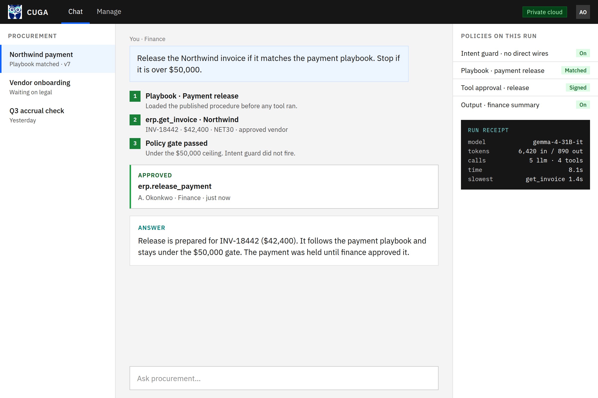
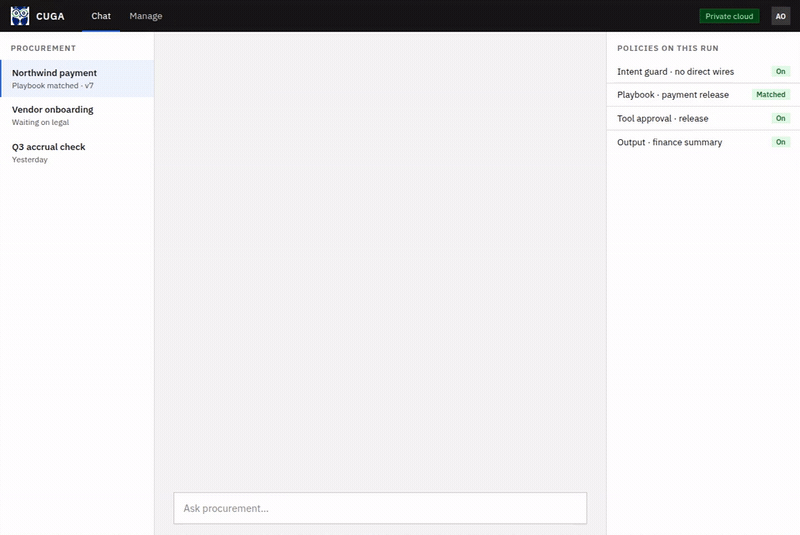
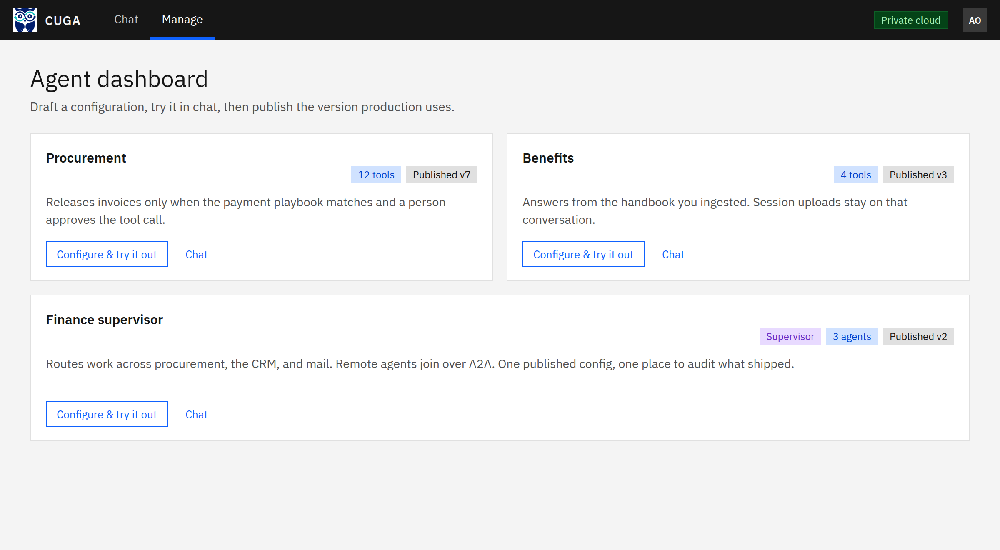
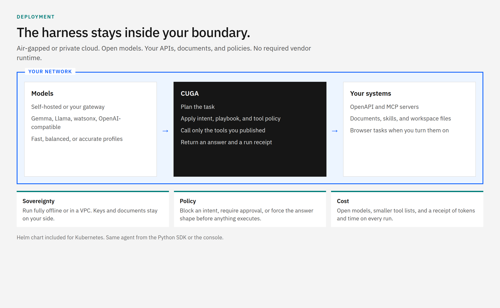

<picture>
  <source media="(prefers-color-scheme: dark)" srcset="/docs/images/cuga-dark.png">
  <source media="(prefers-color-scheme: light)" srcset="/docs/images/cuga-light.png">
  
</picture>

<div align="center">

# CUGA

### Enterprise agent harness

CUGA is an enterprise agent harness built for complete sovereignty, strict policy enforcement, and lower inference costs. Deploy fully air-gapped or in your private cloud, enforce fine-grained execution policies, and outperform leading alternatives on benchmarks like AppWorld — powered by cost-effective open models.

[Docs](https://docs.cuga.dev) · [SDK](https://docs.cuga.dev/docs/sdk/cuga_agent/) · [Policies](https://docs.cuga.dev/docs/sdk/policies/) · [Discord](https://discord.gg/aH6rAEEW)

[](https://www.python.org/)
[](https://appworld.dev/leaderboard)
[](https://docs.google.com/spreadsheets/d/1M801lEpBbKSNwP-vDBkC_pF7LdyGU1f_ufZb_NWNBZQ/edit?gid=0#gid=0)

</div>



A governed run: the playbook matches, the amount stays under the ceiling, and the payment tool waits for a person. The receipt shows the model, tokens, and time for that run.

## Why teams pick CUGA

You should not have to rebuild orchestration, guardrails, and cost control for every workflow. Bring your tools and your rules. CUGA plans, checks policy, and acts.

| | What you get |
|---|---|
| **Sovereignty** | Run fully air-gapped or in your private cloud. Your models, keys, documents, and tools stay on your side of the network. No required vendor runtime. |
| **Policy** | Five controls on every run: intent guard, playbook, tool approval, tool guide, and output formatter. A person can be required before a tool executes. |
| **Cost** | Open models, fast / balanced / accurate profiles, and tool shortlisting so the model does not see your whole catalog. Every run can return a receipt of tokens and time. |

## Watch a run



The same clip as a video: [docs/images/readme-demo.mp4](docs/images/readme-demo.mp4).

## Publish the version you trust



Draft tools, models, and policies in the console. Try the draft in chat. Publish when it is the version production should use. Published versions stay in history, so you can see what shipped.

```bash
cuga start manager
```

## Inside your boundary



The same agent is available from the Python SDK and from the console. A Helm chart under [`deployment/`](deployment/) covers local clusters and a private registry push. See the [Kubernetes guide](deployment/README.md).

## Benchmarks

CUGA is built for messy enterprise work: many APIs, long tasks, and an answer that has to be right.

| Benchmark | Result | What it measures |
|---|---|---|
| [AppWorld](https://appworld.dev/leaderboard) | **#1**, July 2025 – February 2026 | 750 real-world tasks across 457 APIs |
| [WebArena](https://docs.google.com/spreadsheets/d/1M801lEpBbKSNwP-vDBkC_pF7LdyGU1f_ufZb_NWNBZQ/edit?gid=0#gid=0) | **#1**, February 2025 – September 2025 | Autonomous web tasks across application domains |

Open models are part of the point. Fast, balanced, and accurate profiles let you spend model calls where the task needs them, not on every step.

## Start here

The quick start uses an API key so you can see a run immediately. The same harness runs against a private model endpoint, or air-gapped. Provider setup, including OpenAI-compatible gateways, watsonx, Azure, Groq, and OpenRouter, is in the [configuration guide](docs/guides/configuration.md#llm-configuration---advanced-options).

```bash
git clone https://github.com/cuga-project/cuga-agent.git
cd cuga-agent

uv venv --python=3.12 && source .venv/bin/activate
uv sync

echo "OPENAI_API_KEY=your-openai-api-key-here" > .env

cuga start demo_crm --read-only
```

Chrome opens at `https://localhost:7860`. Try: `from contacts.txt show me which users belong to the crm system`.

`cuga viz` opens a dashboard of trajectories, decisions, and tool use.

## Policy on the first call

```python
from cuga import CugaAgent
import asyncio

agent = CugaAgent(tools=[get_invoice, release_payment])

async def main():
    await agent.policies.add_intent_guard(
        name="No direct wires",
        keywords=["wire now", "send funds immediately"],
        response="Payment release must follow the playbook.",
    )
    await agent.policies.add_tool_approval(
        name="Approve releases",
        required_tools=["release_payment"],
        approval_message="Finance must approve a payment release.",
    )
    result = await agent.invoke(
        "Release the Northwind invoice if it matches the payment playbook. Stop if it is over $50,000."
    )
    print(result.answer)

asyncio.run(main())
```

[SDK guide](https://docs.cuga.dev/docs/sdk/cuga_agent/) · [Policies guide](https://docs.cuga.dev/docs/sdk/policies/)

Turn on a run receipt when you want tokens and time without standing up an observability stack. It records counts and durations, not tool arguments or results, unless you also opt in to full tool tracking. Details are in the [configuration guide](docs/guides/configuration.md#run-receipt).

## What you configure

| You bring | CUGA already does |
|---|---|
| OpenAPI specs, MCP servers, LangChain tools | Registry, planning, variable handling |
| `SKILL.md` playbooks | Discover on demand, load only when the task matches — [skills](docs/guides/configuration.md#agent-skills) |
| PDFs, Office, HTML, Markdown | Ingest with Docling, search in the run — [knowledge](docs/guides/configuration.md#knowledge-base) |
| Specialized agents | A supervisor that delegates, including remote agents over A2A — [supervisor](docs/guides/configuration.md#cugasupervisor-multi-agent) |
| Channels and triggers | Web chat, Slack, Discord, Telegram, webhooks, and scheduled flows as a service beside CUGA |
| A code sandbox | Local, Docker/Podman, or E2B — [sandbox setup](docs/guides/configuration.md#configurations) |

Hybrid browser and API tasks, task modes, and the browser extension are in the [configuration guide](docs/guides/configuration.md#cuga-in-action).

## Go deeper

| Topic | Where |
|---|---|
| LLM providers, modes, sandbox, shortlisting, Evolve | [Configuration guide](docs/guides/configuration.md) |
| Examples | [docs/examples](docs/examples) |
| Evaluation | [src/cuga/evaluation](src/cuga/evaluation/README.md) |
| Tests and lint | [Running tests](docs/guides/configuration.md#running-tests) |
| Contributing | [CONTRIBUTING.md](CONTRIBUTING.md) |
| Hosted demo | [Hugging Face Space](https://huggingface.co/spaces/ibm-research/cuga-agent) |

## Community

Use CUGA on a real workflow, ask for the capability you are missing, or file a bug with a reproduction. Issues start from [GitHub Issues](https://github.com/cuga-project/cuga-agent/issues/new/choose).

Before a pull request, follow [CONTRIBUTING.md](CONTRIBUTING.md).

[](https://star-history.com/#cuga-project/cuga-agent&Date)

[](https://github.com/cuga-project/cuga-agent/graphs/contributors)
