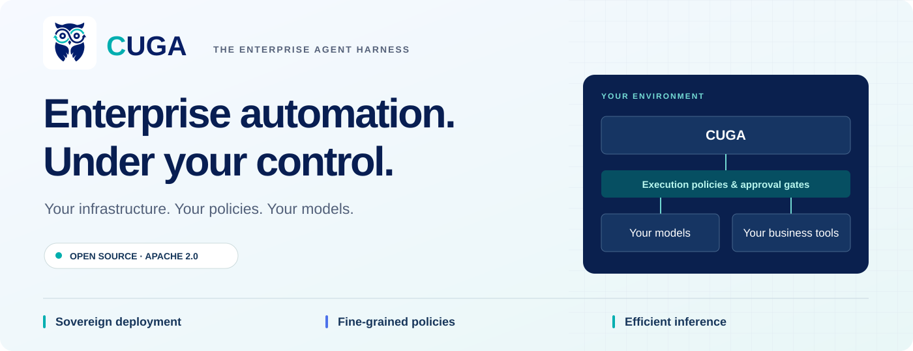
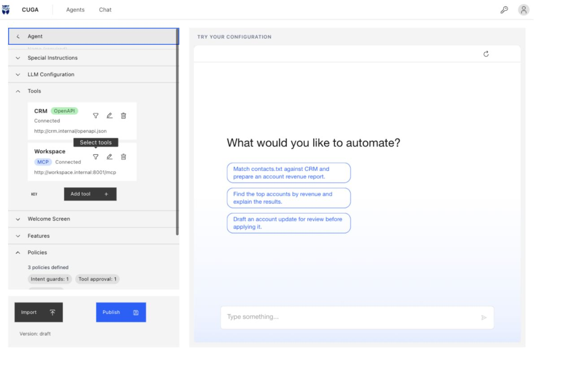
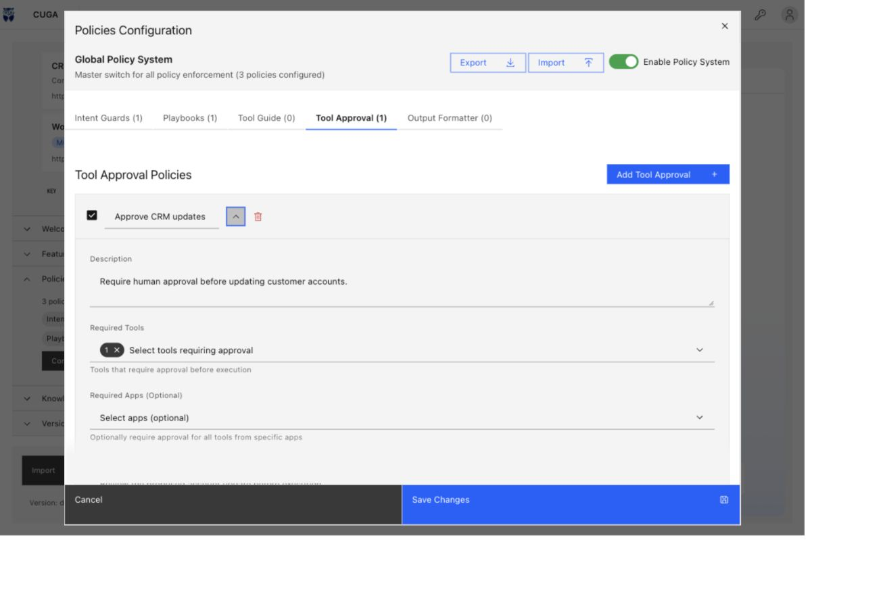
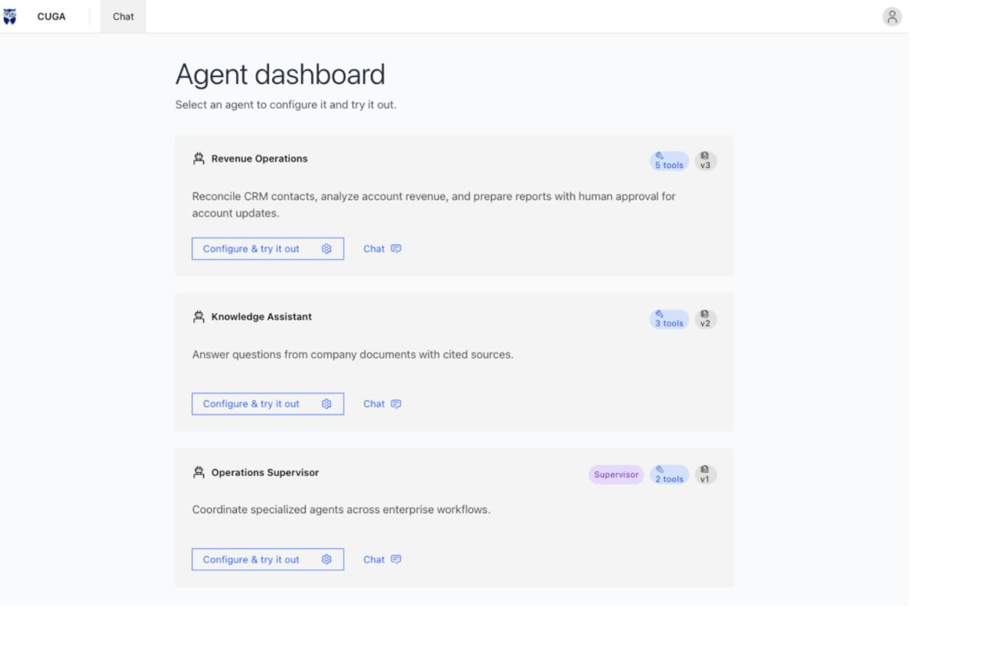
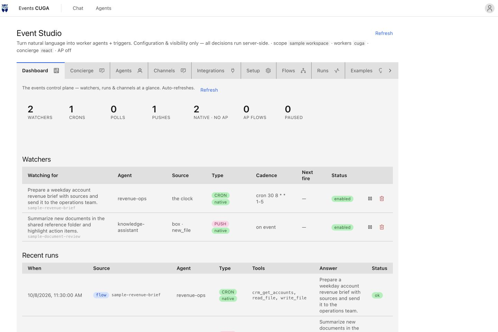
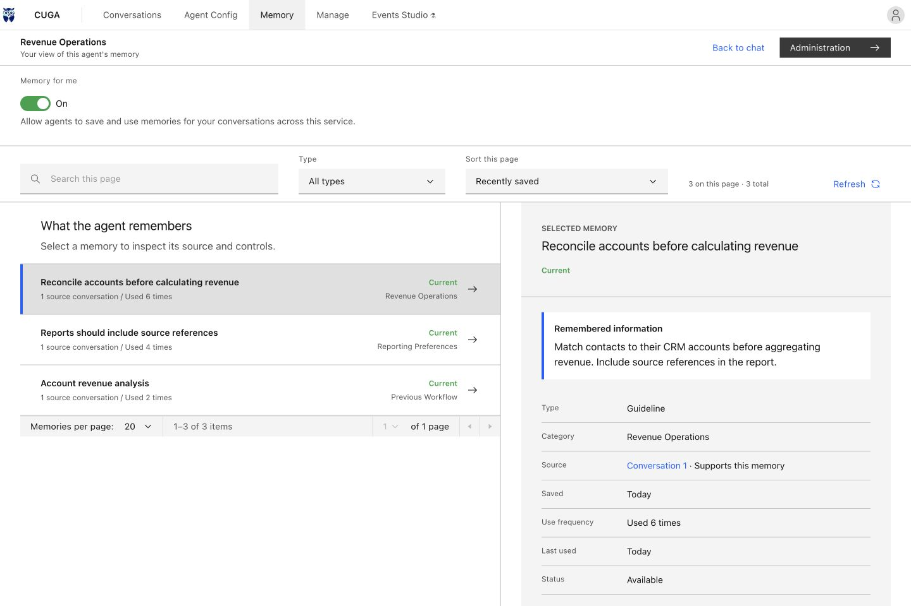

<p align="center">
  <picture>
    <source media="(max-width: 640px)" srcset="docs/images/readme/hero-mobile.svg">
    
  </picture>
</p>

# CUGA

**The enterprise agent harness for sovereign, policy-controlled automation.**

CUGA turns business requests into actions across your applications, APIs, and documents. Deploy in your private cloud or prepare an air-gapped environment, enforce fine-grained execution policies, and use open models on infrastructure you control. Connect your tools, configure your workflows, and optimize inference for your workload.

**[Get started](#quick-start)** · **[Documentation](https://docs.cuga.dev)** · **[Python SDK](#build-with-the-python-sdk)** · **[Deploy on Kubernetes](deployment/README.md)**

[Apache 2.0](LICENSE) · Configurable Generalist Agent · Built with IBM SiL

---

## Automate enterprise work. Keep control.

| Your priority | What CUGA gives you |
| --- | --- |
| **Sovereignty** | Run the harness in your environment. Connect privately hosted models and tools. Preload supporting model artifacts for disconnected deployments. |
| **Execution policies** | Block disallowed intents, require approval for selected tools, guide workflows with playbooks, and configure tool-level guards. |
| **Inference efficiency** | Choose open models, tune reasoning modes, shortlist relevant tools, set tool-call budgets, and inspect token usage with per-run receipts. |
| **Faster delivery** | Connect MCP servers, OpenAPI services, and Python tools. Configure and test an agent in the UI before publishing a version. |
| **Recurring automation** | Use the separate events service to run agents on schedules, webhooks, and application events, with run history in Events Studio. |
| **Reusable experience** | Load task-specific skills and use a configured Evolve integration to retrieve relevant guidance and user preferences. |

## See what you can build

Configure tools and policies beside a draft chat, then publish a version for users.



*Current UI, captured from this repository with illustrative Revenue Operations configuration data. Internal endpoints and version labels are examples.*

| Set approval policies | Manage specialized agents |
| --- | --- |
|  |  |
| Choose which tools need approval and show the proposed code before execution. | Configure individual agents and supervisors for different business workflows. |

### Watch the product tour

https://github.com/user-attachments/assets/cb21fd61-b04b-4188-8f3e-e33197df1b9e

*Visual tour of the current UI with sample configuration, flows, run history, and memory records. It does not show a live agent run. [Media details](docs/readme/media.md).*

## From a business request to a completed workflow

| Workflow | What an agent can do with the right tools and policies |
| --- | --- |
| **Revenue operations** | Match a contact list against CRM, join account data, calculate revenue percentiles, and draft a report. Gate account updates with Tool Approval. |
| **Knowledge assistance** | Search company documents, answer with citations, and combine shared reference material with documents uploaded to a conversation. |
| **Cross-application operations** | Use CugaSupervisor to coordinate specialized agents, each with its own tools and instructions, and prepare results for review. |
| **Browser and API automation** | Combine structured API calls with browser interactions for workflows spanning services and web interfaces. |
| **Recurring operations** | Schedule a weekday report or react to a new document through the events service, then deliver the result to a configured channel. |

Start with the [CRM demo](#quick-start), the [knowledge walkthrough](docs/examples/knowledge_demo/README.md), or the [multi-agent examples](docs/readme/configuration-guide.md#cugasupervisor-multi-agent).

### Build agents around your team's expertise

| Capability | What it enables |
| --- | --- |
| **Multi-agent coordination** | Give specialists focused tools and instructions, then route work through [CugaSupervisor](https://docs.cuga.dev/docs/build/cuga-supervisor/). |
| **Knowledge with citations** | Combine shared company documents with conversation uploads and inspect cited sources. [Knowledge walkthrough](docs/examples/knowledge_demo/README.md). |
| **Reusable agent skills** | Package procedures in `SKILL.md` files and load the relevant instructions when a task needs them. [Skills guide](docs/readme/configuration-guide.md#agent-skills). |
| **Execution visibility** | Inspect trajectories with `cuga viz` and enable per-run receipts for token usage, model calls, tool calls, and elapsed time. [Run receipts](docs/readme/configuration-guide.md#run-receipt). |
| **Access control** | Configure OIDC sign-in and enable separate chat and management role checks. [Authentication setup](docs/readme/configuration-guide.md#authentication-and-access-control). |

## Quick start

Use **Python 3.12** and [uv](https://docs.astral.sh/uv/getting-started/installation/).

```bash
git clone https://github.com/cuga-project/cuga-agent.git
cd cuga-agent
uv sync --python 3.12
cp .env.example .env
```

Edit `.env` to choose a model provider and set its credentials. For an OpenAI endpoint:

```dotenv
AGENT_SETTING_CONFIG=settings.openai.toml
OPENAI_API_KEY=your-api-key
MODEL_NAME=your-model-name
```

```bash
uv run cuga start demo_crm --read-only
```

Open the local URL printed by the CLI. Try:

> from contacts.txt show me which users belong to the crm system

For the configuration UI, open `/manage` on the same server. Connect tools, configure policies, test a draft, and **Publish** when it is ready.

| Next step | Command or guide |
| --- | --- |
| Start the manager with CRM tools | `uv run cuga start manager --crm` |
| Try document-based assistance | `uv run cuga start demo_knowledge` |
| Try supervisor orchestration | `uv run cuga start demo_supervisor` |
| Inspect execution trajectories | `uv run cuga viz` |
| Configure another model provider | [Model configuration](docs/readme/configuration-guide.md#supported-platforms) · [Environment example](.env.example) |

### Use your own inference endpoint

Point the OpenAI-compatible configuration at your private inference service:

```dotenv
AGENT_SETTING_CONFIG=settings.openai.toml
OPENAI_BASE_URL=http://your-inference-service:8000/v1
OPENAI_API_KEY=your-endpoint-key
MODEL_NAME=your-served-model-name
```

Use the model identifier exposed by your server. Hosted providers and private endpoints share the same harness; model capability, task complexity, and your configuration determine accuracy and inference spending.

## Apply guardrails before action

Require approval before updating a CRM account. Configure a ToolGuard to block a booking that exceeds the customer's membership limits. CUGA combines request policies, tool-level enforcement, and human approval so teams can define where an agent may act.

CUGA includes five policy types, configurable through the UI or Python SDK.

| Policy | Purpose |
| --- | --- |
| **Intent Guard** | Block or respond to requests matching configured intent rules. |
| **Playbook** | Supply a standard process for a matching task. |
| **Tool Approval** | Pause selected tool execution for human approval. |
| **Tool Guide** | Add domain instructions; attach ToolGuard code to enforce configured rules before a tool executes. |
| **Output Formatter** | Shape responses to match a configured output format. |

An active ToolGuard checks the applicable app/tool call before the underlying tool runs. A blocked call returns a policy violation without calling that tool. Guard enforcement requires an applicable, enabled guard; instructions alone do not create this execution check.

Combine these with sandbox isolation, tool selection, and execution budgets. Intent matching and natural-language guidance depend on their configuration; use tool guards and approval gates where execution needs explicit control.

**[Policies SDK](https://docs.cuga.dev/docs/build/policies/)** · **[Tool guards](src/cuga/backend/cuga_graph/policy/tool_guard/README.md)** · **[Sandbox configuration](docs/readme/configuration-guide.md#configurations)**

## Automate work when events happen

Turn a recurring request into a standing workflow: prepare a weekday report, summarize a newly uploaded document, or respond to a configured application event. The events service supports schedules, polling, and push triggers, with delivery to configured channels such as web chat and Slack.

Events Studio brings watchers, agents, and run history into one view. Inspect the trigger, tools, status, and captured output for a run.



*Current UI with sample workflows and run statuses. No flow was executed or message delivered for this capture.*

The events service is deployed separately beside CUGA. Studio appears when that service is reachable; connectors and delivery channels require their own configuration. See the [events deployment guide](events/deploy/README.md) and [connector setup](events/deploy/ENV.md).

## Reuse experience with memory

With Evolve configured, CUGA retrieves relevant task guidance and user preferences, then saves configured conversation trajectories for future use. Teams can inspect what the agent remembers, where it came from, and when it was used.



*Current UI with illustrative memory records, source links, and usage counts. These records were supplied as sample data.*

Memory controls let users enable or disable memory and forget records. Administrator settings include retention policies, schedules, and activity views when the backend supports them. Memory requires an enabled service, a stable service-instance identity, and a configured Evolve backend; durable retention requires PostgreSQL and the bundled Evolve HTTP service.

**[Evolve setup](docs/readme/configuration-guide.md#optional-use-evolve-with-cuga)** · **[Memory retention controls](docs/readme/media.md#memory-retention-controls)** · **[ALTK-Evolve](https://github.com/AgentToolkit/altk-evolve)**

## Deploy within your boundaries

| Deployment | Setup |
| --- | --- |
| **Local or private cloud** | Run the CLI or SDK against your chosen model endpoint and internal tools. |
| **Kubernetes** | Use the [Helm chart and deployment scripts](deployment/README.md), your image registry, and Kubernetes secrets. |
| **Air-gapped environment** | Build and transfer dependencies, images, and supporting model artifacts ahead of time. Use local inference, embeddings, tools, and observability endpoints. The [UBI image](Dockerfile.ubi) includes a [model preloader](src/scripts/preload_models.py). |

Sovereignty covers the entire deployment: configure each model provider, connector, and optional service to stay inside your boundary. The air-gapped image preloads supporting models; deploy the reasoning model and its inference server separately.

## Strong benchmark foundations

**AppWorld · IBM CUGA + GLM-5.3-Flash**

| AppWorld evaluation set | Task Goal Completion | Scenario Goal Completion |
| --- | --- | --- |
| **Test-Normal** | **93.5%** | **91.1%** |
| **Test-Challenge** | **92.8%** | **84.2%** |

**WebArena: 61.7%** overall success. [Published result](https://arxiv.org/html/2510.23856v1).

### Measure efficiency on your workload

Use open models and tune the harness to balance quality, latency, and inference spending. Enable a run receipt to inspect the tokens, model calls, tool calls, and time used by an SDK invocation:

```toml
# settings.toml
[advanced_features]
run_receipt = true
```

```python
result = await agent.invoke("Prepare an account revenue report")
print(result.receipt)
```

Receipts report usage and timing. Calculate cost using your own provider rates or hosting costs. See [run receipts](docs/readme/configuration-guide.md#run-receipt), [reasoning profiles](docs/readme/configuration-guide.md#reasoning-profiles), and [tool shortlisting](docs/readme/configuration-guide.md#strategies).

## Build with the Python SDK

Add your tools and invoke an agent from your application:

```python
import asyncio

from cuga import CugaAgent
from langchain_core.tools import tool


@tool
def get_account_revenue(account_id: str) -> dict:
    """Return account revenue from a sample data source."""
    return {"account_id": account_id, "revenue": 250000}


async def main():
    agent = CugaAgent(tools=[get_account_revenue])
    result = await agent.invoke("What is the revenue for account acc_01?")
    print(result.answer)


asyncio.run(main())
```

Configure a model before running the example. Replace the sample tool with your own service integration.

**[CugaAgent SDK](https://docs.cuga.dev/docs/build/cuga-agent/)** · **[CugaSupervisor](https://docs.cuga.dev/docs/build/cuga-supervisor/)** · **[Tool integration examples](docs/examples/cuga_with_runtime_tools/README.md)**

## Explore further

| Topic | Guide |
| --- | --- |
| Models, execution modes, and testing | [Configuration and development guide](docs/readme/configuration-guide.md) |
| Task-specific instruction packs | [Agent skills](docs/readme/configuration-guide.md#agent-skills) |
| Memory and guidance from previous runs | [Evolve integration](docs/readme/configuration-guide.md#optional-use-evolve-with-cuga) |
| Agent-level and session-level knowledge | [Knowledge demo](docs/examples/knowledge_demo/README.md) |
| MCP and OpenAPI integration | [Tool registry](src/cuga/backend/tools_env/registry/README.md) |
| Expose CUGA to other agents | [CUGA as MCP](docs/examples/cuga_as_mcp/README.md) · [A2A example](docs/examples/a2a_two_cuga/README.md) · [ACP over stdio](docs/examples/acp_stdio/README.md) |
| Event-driven automation | [Events service](events/deploy/README.md) — deployed as a separate service beside CUGA |
| Low-code workflows | [Langflow example](docs/examples/langflow/) |

## Build with us

Share an enterprise use case, report an issue, or contribute an integration.

**[Open an issue](https://github.com/cuga-project/cuga-agent/issues/new/choose)** · **[Contributing](CONTRIBUTING.md)** · **[Contributors](https://github.com/cuga-project/cuga-agent/graphs/contributors)**
