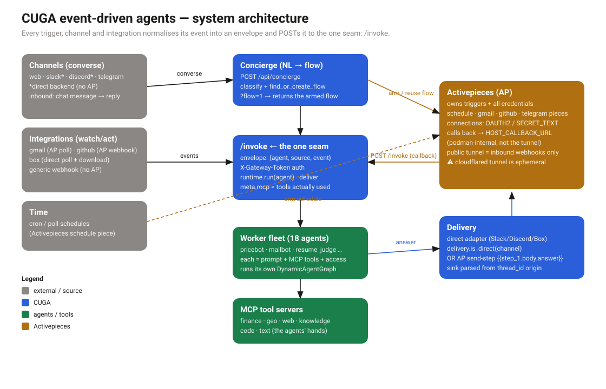

# Architecture — event-driven CUGA

Diagrams of how the event-driven agent platform actually works, generated from the code under
`src/cuga/backend/events/`. **Do not hand-edit the SVGs** — edit `gen_diagrams.py` and run
`python architecture/gen_diagrams.py`.

## The one idea

**`/invoke` is the single seam.** Every trigger, channel, and integration — a Slack message, a Gmail
poll, a cron tick, a repo webhook, a Box file, a monitoring alert — normalises its event into one
envelope (`{agent, source, event}`) and POSTs it to `/invoke`. Everything upstream is just a different
way of producing that envelope; everything downstream is the worker fleet and delivery.

Two facts that trip everyone up, made explicit in the diagrams:

- **Activepieces calls back over `HOST_CALLBACK_URL` (podman-internal DNS), not the public tunnel.**
  The public cloudflared tunnel is *inbound only* — it exists so GitHub/Slack webhooks and OAuth
  callbacks can reach CUGA. That tunnel is **ephemeral**: when it dies, every flow fails with
  `INTERNAL_ERROR` on AP's payload callback. Fix: `make ap` (fresh tunnel). This is the single most
  common "why did everything stop firing" cause.
- **Delivery is one of two paths**, chosen by `delivery.is_direct(channel)`: CUGA's own direct adapter
  (Slack, Discord, Box) or an Activepieces send-step (`{{step_1.body.answer}}`). The sink is parsed
  from the `thread_id` origin — which is why a Gmail-sourced flow can deliver to Slack.

## System overview



## Sequence diagrams — one per flow shape

The nine shapes below are genuinely distinct in the code; the other trigger/channel/integration
combinations are variants of one of these.

| Diagram | What it shows | Distinct because |
|---|---|---|
| [NOW](seq-01-now.svg) | one-shot question, answer in the HTTP response | no AP, no flow — synchronous |
| [Concierge](seq-02-concierge.svg) | English sentence → an armed AP flow | the NL→flow front door; `?flow=1` returns the flow |
| [CRON / POLL](seq-03-cron-poll.svg) | a scheduled flow fires | AP owns the trigger; callback is internal |
| [PUSH · GitHub](seq-04-push-github.svg) | a repo **webhook** trigger | inbound via tunnel; OAuth conn + `admin:repo_hook` |
| [PUSH · Gmail](seq-05-push-gmail.svg) | an app **polling** trigger | AP polls on its own clock; can't be fired out of band |
| [PUSH · Box](seq-06-push-box.svg) | direct poll + the **download step** | no AP; CUGA fetches file *content* server-side |
| [Channel · Slack](seq-07-channel-slack.svg) | direct backend, signed | no AP; signature-verified; reply in-thread |
| [Channel · Telegram](seq-08-channel-telegram.svg) | Activepieces backend | polling trigger + AP send-step (Discord = direct WS bot) |
| [Generic webhook](seq-09-webhook.svg) | any system → an agent | no AP, no piece; `?key=` guards it |

### Which real surface maps to which diagram

- **Channels** — Slack & Discord use the *direct* backend ([Slack](seq-07-channel-slack.svg));
  Telegram uses *AP* ([Telegram](seq-08-channel-telegram.svg)); web is a plain `/api/concierge` call.
- **Integrations** — GitHub = webhook trigger ([GitHub](seq-04-push-github.svg)); Gmail = polling
  trigger ([Gmail](seq-05-push-gmail.svg)); Box = direct poll ([Box](seq-06-push-box.svg)); the
  generic webhook is [its own shape](seq-09-webhook.svg).
- **Triggers** — NOW ([1](seq-01-now.svg)), CRON/POLL ([3](seq-03-cron-poll.svg)), PUSH
  ([4](seq-04-push-github.svg)/[5](seq-05-push-gmail.svg)/[6](seq-06-push-box.svg)), WEBHOOK
  ([9](seq-09-webhook.svg)).

## Regenerate

```bash
python architecture/gen_diagrams.py     # rewrites system.svg + the 9 sequence diagrams
```
