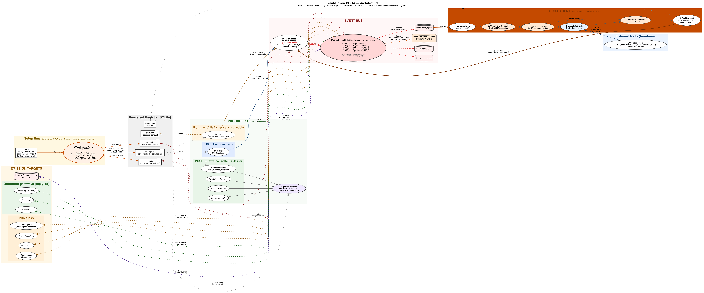
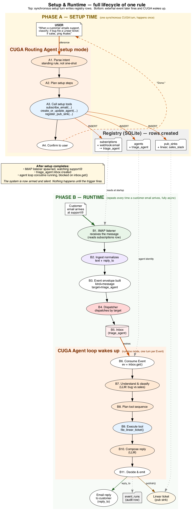
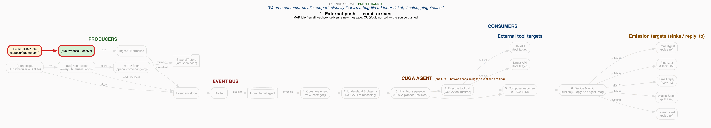
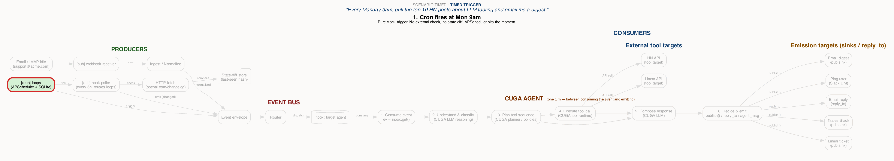
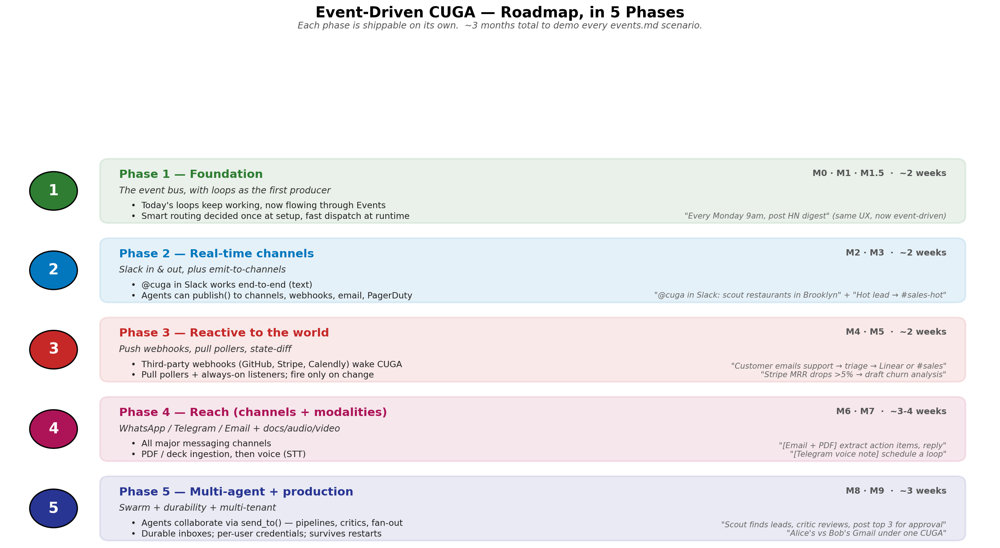

# Event-Driven CUGA — Deck

A self-contained explainer for slides. Use sections as slide breaks. Every
example is grounded in [/Users/anu/events.md](file:///Users/anu/events.md).

---

## Slide 1 — The problem

CUGA today is **request → response**. The user asks, CUGA answers. Done.

**[events.md](file:///Users/anu/events.md) lists three kinds of things CUGA can't do today:**

1. **React to external signals** — *"When a customer emails support, file a Linear ticket if it's a bug."*
2. **Wake on a clock** — *"Every Monday 9am, post an HN digest."* *(partially supported by loops)*
3. **Watch the world** — *"Watch the OpenAI changelog every 6h, ping me on a new model."*

What unifies them: **the trigger isn't the user.** Time fires, an email arrives, a webhook hits. CUGA needs to wake up, do work, and emit results — without anyone typing into a chat box.

---

## Slide 2 — The unifying primitive

> **Trigger × Agent × Emit.**
> Something triggers → CUGA does the work → CUGA emits zero or more results.

Every utterance in events.md fits this shape. The hard part is making **trigger** plural — clock, webhook, gateway, poller, another agent — and giving CUGA one consistent way to receive them.

That "one consistent way" is an **Event** envelope dropped into an **Inbox**.

---

## Slide 3 — Architecture overview



**Three columns, one CUGA:**

- **PRODUCERS** (green / orange / blue groups) — the only things that *originate* events. Three categories:
  - **Push** — external systems deliver (Slack mention, IMAP idle, webhooks).
  - **Pull** — CUGA-driven poller checks a source, emits on change.
  - **Timed** — pure clock (loops / APScheduler).
- **EVENT BUS** (red) — the Event envelope, the dispatcher, and per-agent inboxes.
- **CONSUMERS / EMISSION TARGETS** (orange / green) — pub sinks (Slack channel, Linear, webhook), outbound gateways (reply_to), and peer agent inboxes (swarm).

**CUGA itself sits twice in this picture:**

1. **At setup time** (yellow box, top-left) — the **routing agent** parses the user's utterance AND uses its LLM planner (existing `delegate_to_*` mechanism) to pick the right target agent. It writes that decision into the subscription row as `target_agent`.
2. **At runtime** (orange box, center) — the long-running agent loop drains its inbox and does the actual work on every fire: classify, plan, execute, compose, emit.

**Routing has two layers, both visible on the diagram:**

- **Smart routing** is done by the routing agent *at setup time*. One LLM call per rule.
- **Mechanical dispatch** is done by the bus Dispatcher *at runtime*. Just `match target.kind: lookup → put`. No LLM cost per event.

The Dispatcher is intentionally dumb — the smart work already happened. The exception is open-ended rules ("*@cuga in Slack: anything*"), where the subscription targets the routing agent itself and runtime delegation happens per-event.

---

## Slide 4 — First-class building blocks

Nine things you need to name:

| # | Building block | What it is | Where it lives |
|---|---|---|---|
| 1 | **CUGA routing agent** | The intelligent router. At setup time, LLM picks `target_agent` via `delegate_to_*` and bakes it into the subscription. At runtime, may also serve as fallback consumer for open-ended rules. | The existing `CugaSupervisor` class |
| 2 | **Event** | A single envelope: id, kind, source, **target**, modality, payload, reply_to, credentials | In-memory at runtime; serialized to the audit table |
| 3 | **Trigger** | Anything that decides "an Event should exist now" — push, pull, timed | Producer side |
| 4 | **Dispatcher** | Stateless, mechanical. `match target.kind → registry lookup → put in inbox/sink`. No LLM. | In-process |
| 5 | **Inbox** | One per agent. Opaque `get/put/task_done`. In-memory in Phase 1, durable later | One per registered agent |
| 6 | **Agent loop** | Long-running async coroutine that drains *one* inbox; **this is CUGA at runtime** | One coroutine per agent |
| 7 | **Subscription** | A registry row that says "when X happens, target agent Y" — Y picked by routing agent at setup. Covers cron, webhook, poll, listener | SQLite (extends today's loops table) |
| 8 | **Pub sink** | Named destination for outbound emissions (Slack channel, webhook, Linear) | Registry row + sink adapter |
| 9 | **State-diff store** | Per-subscription "last seen value" — lets pull/push fire only on a real transition | SQLite (tiny table) |

**Plus one cross-cutting concern:**

- **MCP connectors** — external tools (Box, Gmail, GitHub, etc.) used **inside a turn**. Not events. Per-thread credential binding carried on `Event.credentials`.

**Critical:** the routing agent and the Dispatcher are both sometimes loosely called "the router" — they are different things. The routing agent is a CUGA agent doing intelligent intent classification (LLM); the Dispatcher is a tiny in-process module doing mechanical lookup. See Slide 4b.

---

## Slide 4b — How routing actually works (the two layers)

**The single most common source of confusion in this design.** "Routing" is not one thing.

| Layer | When it runs | What it does | Cost |
|---|---|---|---|
| **routing agent — intelligent routing** | **At setup time**, once per rule | Reads "*Every Monday 9am, scout leads*", recognizes "scout leads" maps to `scout_agent` via existing `delegate_to_*`. Writes `target_agent=scout_agent` into the subscription row. | One LLM call per rule |
| **Dispatcher — mechanical dispatch** | **At runtime**, every event | `match ev.target.kind → registry lookup → inbox[name].put(ev)`. | A dictionary lookup |

**What this looks like for the example utterance:**

1. **Setup:** User says *"Every Monday 9am, scout leads…"* → routing agent's LLM picks `delegate_to_scout_agent` → subscription row written with `target_agent=scout_agent`.
2. **First Monday 9am, and every Monday after:** Cron fires → producer stamps `target={kind:agent, name:scout_agent}` (read from the subscription) → Dispatcher does `inbox[scout_agent].put(ev)` → scout's loop wakes up. **No LLM call in this path.**

**The fallback:** if a rule is too open-ended for the routing agent to pick at setup ("*@cuga in Slack: anything*"), the subscription's `target_agent` is the **routing agent itself**. Every event then lands in the routing agent's inbox, and runtime per-event `delegate_to_*` happens just like today's CUGA. This is exactly how loops works today — when a loop fires, the routing agent is re-invoked (`sdk.py:2343-2390`).

**Why split it this way:** the smart routing only needs to happen *once per rule*, not *once per event*. Baking the decision into the subscription is the optimization. The two-layer split is what lets event-driven CUGA scale.

---

## Slide 5 — CUGA's role explicitly

A given utterance touches CUGA **twice**:

### Setup time (sync)
The user types/says the rule. The CUGA routing agent runs a normal request/response turn. It uses CUGA as much as needed:

- Reads the utterance.
- Decides this is a *standing rule*, not a one-shot.
- Picks tools: `subscribe_*`, `create_or_update_agent`, `register_pub_sink`.
- Calls them in sequence.
- Confirms back to the user.

After this turn ends, **rows exist in the registry**, **a listener is watching**, and **an agent loop is parked on its inbox**. Nothing else fires until the trigger fires.



### Runtime (async)
When the trigger fires, the **agent loop** wakes. It uses CUGA's normal capabilities — the same LLM, the same planner, the same tool runtime — to do the actual work. Six stages every time:

1. **Consume** the Event from the inbox.
2. **Understand & classify** the payload (pure LLM).
3. **Plan** the tool sequence (planner + policies).
4. **Execute** tool calls if needed (MCP / CUGA tools).
5. **Compose** the response (pure LLM).
6. **Decide & emit** to sinks, replies, or peer agents.

That's CUGA doing the job. The eventing layer is plumbing; CUGA is the brain.

---

## Slide 6 — Trigger taxonomy

| Category | Producer mechanism | Cost profile | Examples from events.md |
|---|---|---|---|
| **Push** | External system delivers (webhook, IMAP idle, Slack events, socket-mode) | Cheap at runtime, requires public endpoints | "Customer emails support → triage", "Stripe MRR drops", "PR opened w/ label needs-design" |
| **Pull** | CUGA-driven poller + state-diff (reuses the loops scheduler) | Always works; slight lag | "Watch OpenAI changelog every 6h", "Check flight prices every 12h" |
| **Timed** | Pure clock — interval / cron / one-shot | Simplest; no external state | "Every Monday post HN digest", "Daily arxiv summary", "In 2h check PR #482" |

**Critical insight:** the three categories produce the **same Event envelope** and feed the **same dispatcher → inbox → agent-loop path.** The agent never knows which kind of trigger fired it.

This is what makes the architecture additive — adding new triggers means writing one adapter, not rewiring CUGA.

---

## Slide 7 — Flow: push trigger end-to-end

**Utterance:** *"When a customer emails support, classify it; if it's a bug file a Linear ticket; if sales, ping #sales."*



**Nine stages**, narrated:

1. **External push** — IMAP idle (or email webhook) delivers the message. CUGA did not poll.
2. **Ingest normalizes** — body → text, reply_to captured.
3. **Event envelope, route to inbox** — `kind=message`, `target={triage_agent}`.
4. **CUGA consumes** — agent loop wakes from idle.
5. **CUGA understands & classifies** — LLM reads the email, decides bug vs sales. *Pure reasoning, no external service.*
6. **CUGA plans** — planner picks `[file_linear_ticket, reply_to_customer]`.
7. **CUGA calls the Linear tool** — synchronous tool call inside the turn.
8. **CUGA composes the reply** — LLM writes the customer-facing message.
9. **CUGA emits** — `publish()` to Linear sink + `reply_to` via email gateway.

**Two narrative beats for the deck:**
- Steps 1–4 are plumbing (gateway, ingest, bus). Fast, mechanical.
- Steps 5–9 are CUGA. *This* is where the value is.

---

## Slide 8 — Flow: timed (cron) trigger end-to-end

**Utterance:** *"Every Monday 9am, pull the top 10 HN posts about LLM tooling and email me a digest."*



**Nine stages:**

1. **Cron fires at Mon 9am** — APScheduler hits the moment. No external check, no diff.
2. **Event envelope, route to inbox** — `kind=trigger`, `source=cron:loop:<id>`.
3. **CUGA consumes** — agent wakes, payload carries the prompt.
4. **CUGA understands the task** — fetch HN, filter to LLM tooling, rank, summarize.
5. **CUGA plans the tool sequence** — `[hn.top_stories, filter_relevant, summarize_top_10]`.
6. **CUGA calls the HN tool** — the fetch phase.
7. **CUGA reasons — filter & rank** — LLM picks top 10 from fetched set.
8. **CUGA composes the digest** — LLM writes the email body.
9. **CUGA emits** — `publish()` to email sink.

**Beat for the deck:** push and timed flow through the *same six CUGA stages*. The trigger differs; the work doesn't.

---

## Slide 9 — The shape test

Every utterance in events.md is one of these compositions:

```
Trigger  ×  CUGA agent  ×  Emit
```

| Utterance | Trigger | Emit |
|---|---|---|
| Support email triage | Push (IMAP) | Pub Linear + reply_to email |
| Monday HN digest | Timed (cron) | Pub email |
| OpenAI changelog watch | Pull (poller + diff) | Pub Slack DM |
| PR opens with label | Push (webhook) | Pub Slack channel |
| Stripe MRR drops >5% | Push (webhook) + diff | Pub Slack + email |
| @cuga in Slack: scout | Push (Slack events) | reply_to Slack |
| Critic-pair lead-gen | Timed + Swarm (send_to) | Pub Slack for approval |

If a future utterance breaks this shape, we've under-abstracted. So far, none does.

---

## Slide 10 — Setup vs. runtime, one more time

The single most important distinction to land in the deck:

|  | **Setup time** | **Runtime** |
|---|---|---|
| When | User says "when X, do Y" | Trigger fires |
| Shape | Synchronous CUGA turn | Asynchronous agent loop drains inbox |
| CUGA's job | Parse → call setup tools → confirm | Classify → plan → tool → compose → emit |
| Side-effect | Rows in SQLite registry | Pub sink writes + replies + audit row |
| Frequency | Once per rule | Once per Event |

**Don't conflate them.** Setup is just a CUGA conversation. Runtime is the event-driven system.

---

## Slide 11 — Deployment posture

**Phase 1 (today through M8): one host, one process.**

- The same FastAPI app that serves the UI runs:
  - The agent loops (one coroutine per agent)
  - APScheduler (loops + the pull poller)
  - In-memory inboxes
  - Webhook receiver routes (`/sub/<id>`)
- Always-on listeners (IMAP idle, Slack socket-mode) live as sibling processes on the **same host**, posting events to localhost.

**Phase 2 (M9): factor into microservices** when durability, multi-tenant credentials, or scale demand it. Four deployables:
- UI service
- Event bus (Redis Streams / Postgres durable inbox)
- Agent worker(s) — horizontally scalable
- Producer services — gateways + receivers

**Key property:** the `Inbox` interface is the seam. Swapping in-memory → durable → networked is a *one-file change*. The agent loop never learns about deployment topology.

---

## Slide 12 — Where we are vs. where we're going



Green dots = shipped, orange = partial, grey = not yet.

**Highlights:**
- `[cron]`, MCP connectors, and the loops UI are already lit up today.
- **M0** (Event envelope + per-agent inbox) is the foundation — once it lands, every later milestone is additive.
- **M1** (loops as a producer) is one line of code: [runner.py:58](../src/cuga/backend/loops/runner.py#L58) goes from `await invoke_fn(...)` to `await router.dispatch(Event(...))`.
- **M8** (swarm) falls out for free once inboxes exist.
- **M9** (durability + multi-tenant) is the productionization milestone.

Capability-wise, **~3 months of focused work** to demo every events.md scenario end-to-end.

---

## Slide 13 — TL;DR

- **CUGA's role:** the routing agent is the intelligent dispatcher at setup time (LLM picks the target agent via existing `delegate_to_*`); the dispatcher is mechanical at runtime. Same routing agent users already talk to.
- **One primitive:** `Event → Inbox → CUGA agent loop → Emit`. Triggers are push / pull / timed; they all produce the same envelope.
- **Loops is the seed.** A single mutation at `runner.py:58` turns it into the canonical timed-trigger producer; every other trigger is a sibling.
- **Direct addressing (`target=agent_name`, decided once at setup) for inbound; pub sinks (topic-shaped) for outbound** covers every utterance in events.md.
- **Phase 1 is one process on one host.** Phase 2 microservices come only when scale forces it.

---

## Appendix — Files in this design package

| File | What it is |
|---|---|
| [event_driven_full_architecture.png](event_driven_full_architecture.png) | The big architecture diagram (Slide 3) |
| [event_driven_setup_flow.png](event_driven_setup_flow.png) | How an utterance becomes a rule (Slide 5) |
| [event_flow/flow_push_support_email.gif](event_flow/flow_push_support_email.gif) | Push trigger end-to-end (Slide 7) |
| [event_flow/flow_timed_hn_monday_digest.gif](event_flow/flow_timed_hn_monday_digest.gif) | Timed trigger end-to-end (Slide 8) |
| [event_flow/flow_pull_changelog_watch.gif](event_flow/flow_pull_changelog_watch.gif) | Pull trigger end-to-end (bonus) |
| [event_driven_roadmap.png](event_driven_roadmap.png) | Capability evolution by milestone (Slide 12) |
| [event_driven_reference.md](event_driven_reference.md) | Reference doc — first-class citizens & taxonomy |
| [event_driven_roadmap.md](event_driven_roadmap.md) | Milestone plan with risks |
| [event_driven_from_loops.md](event_driven_from_loops.md) | How loops evolves into the full system |
| [event_driven_agent_proposal.md](event_driven_agent_proposal.md) | Original design rationale |
