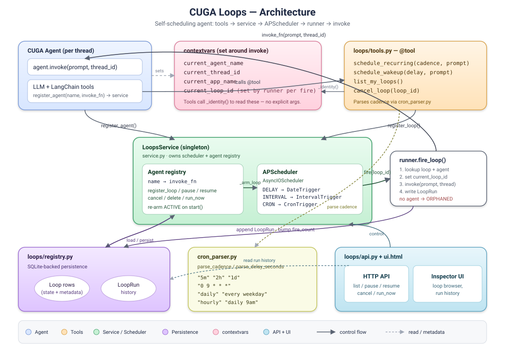
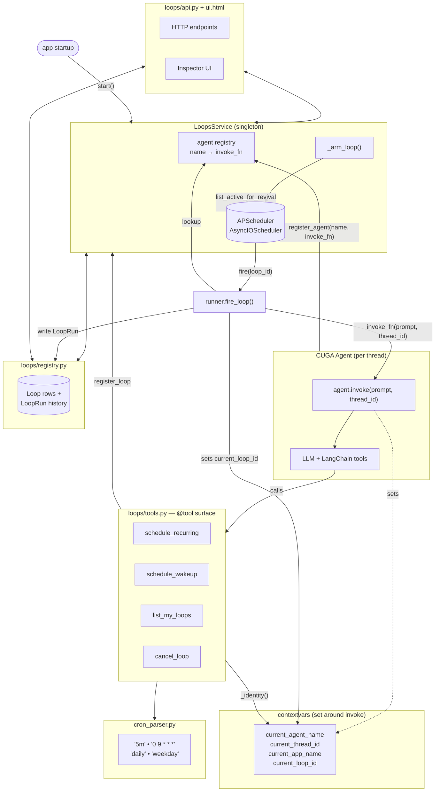
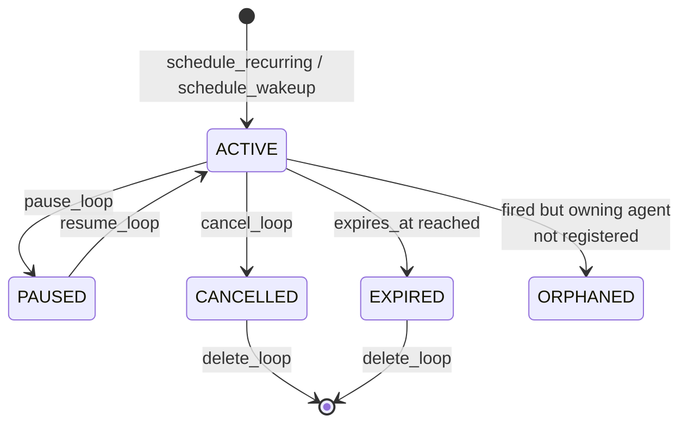
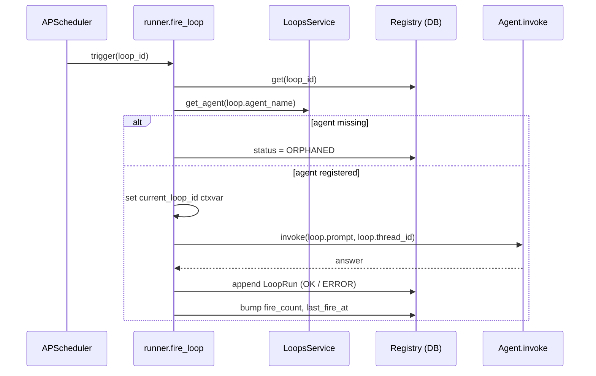

## CUGA Loops — Architecture

### Lifecycle

### Fire sequence

### Key design points

- **Singleton service** ([service.py](../src/cuga/backend/loops/service.py)) wraps a single `AsyncIOScheduler` on the app's event loop.
- **Identity via contextvars** ([service.py:28-42](../src/cuga/backend/loops/service.py#L28-L42)) — tools auto-bind the loop to the calling agent + thread; no explicit args.
- **Three trigger kinds** map to APScheduler triggers: `DELAY → DateTrigger`, `INTERVAL → IntervalTrigger`, `CRON → CronTrigger`.
- **Re-arm on startup** — `start()` reloads ACTIVE loops from the registry and refreshes each `next_fire_at`.
- **Orphan handling** — registry rows survive restarts; if no agent claims them at fire time, they're flagged ORPHANED but stay visible in the UI.
- **Default `expires_in_days=7`** keeps stray loops from accumulating cost.
