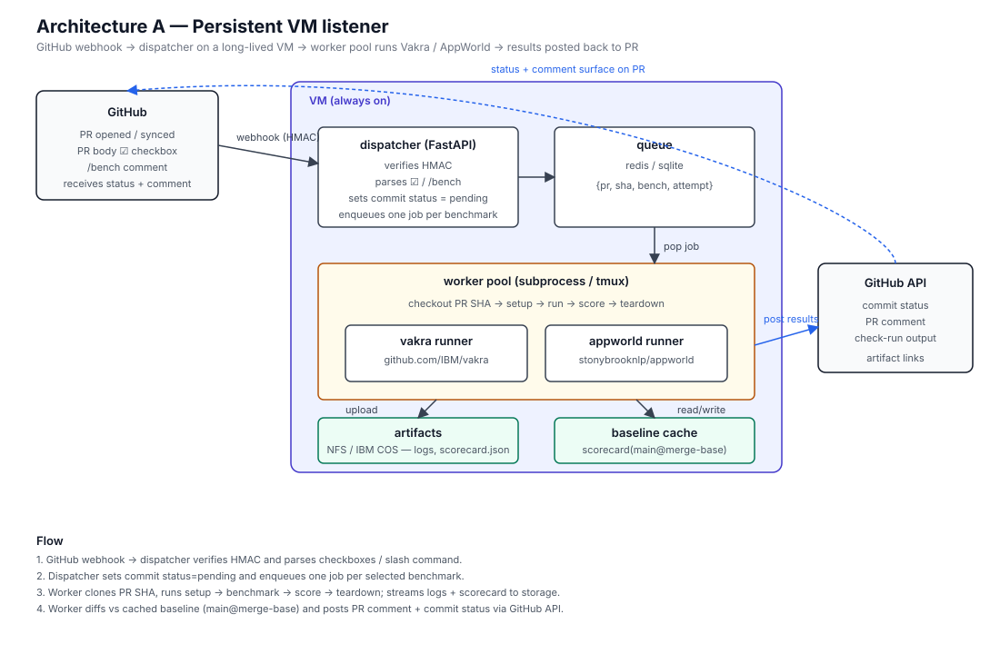
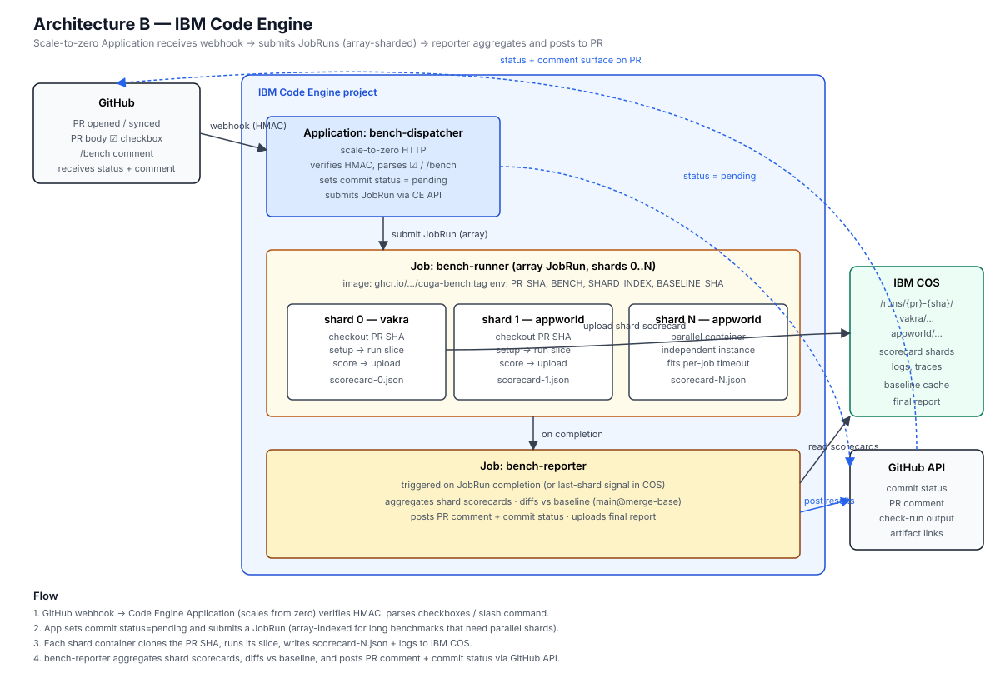
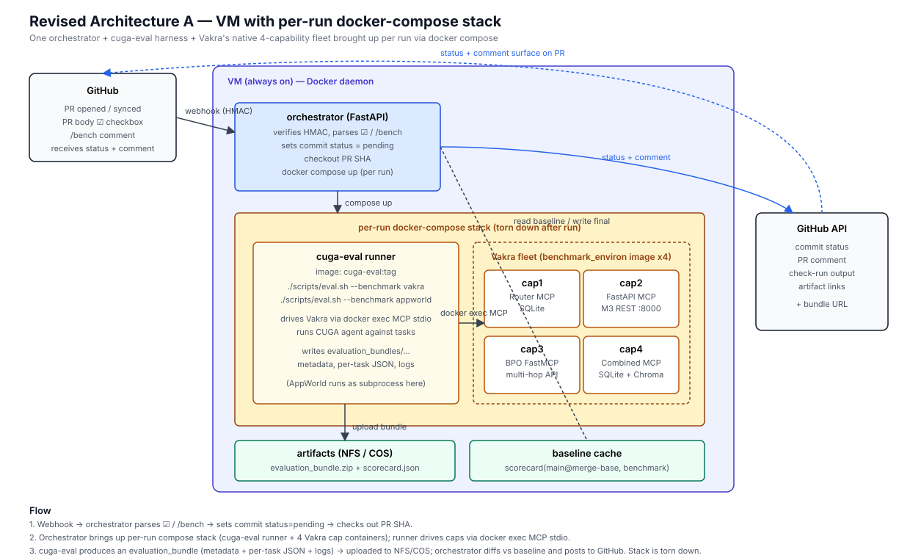
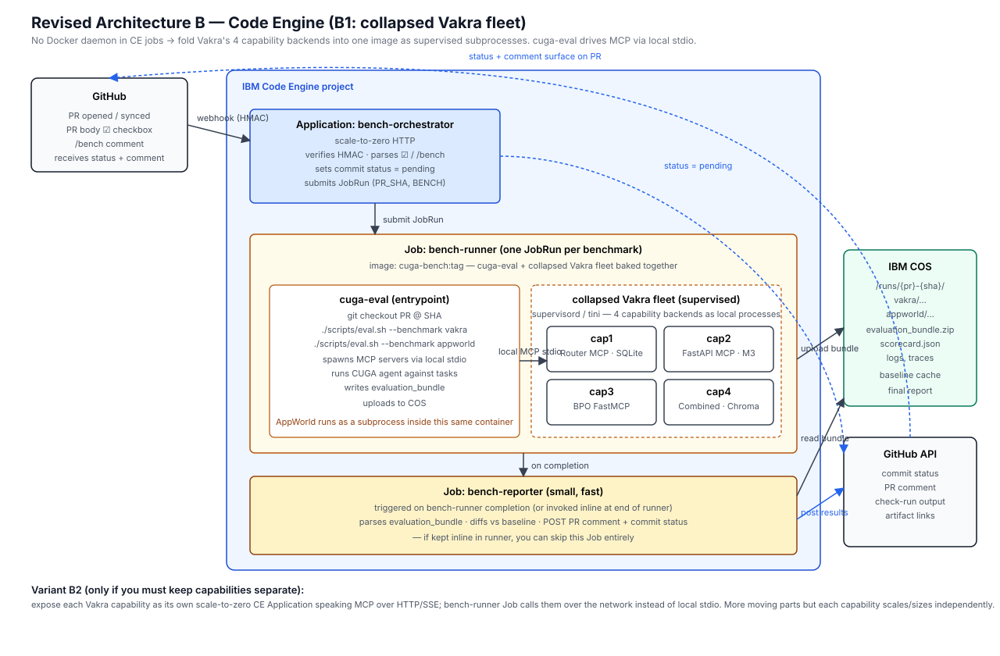

# Automated Benchmark Evaluation Framework

Trigger benchmark runs (Vakra + AppWorld) automatically when a PR is raised and a checkbox is ticked. Two deployment options: **persistent VM** or **IBM Code Engine job**.

- Vakra: https://github.com/IBM/vakra
- AppWorld: https://github.com/stonybrooknlp/appworld/

## Goals

- Zero-touch: PR author opts in by checking a box in the PR body.
- Long-running: a single benchmark may run overnight (multi-hour).
- Reproducible: each run pins to the PR's commit SHA, sets up env, runs, tears down.
- Visible: results posted back to the PR as a comment + commit status check; raw artifacts uploaded.
- Regression-safe: numbers compared against a baseline (e.g. `main` at merge-base) and the check fails on regression beyond a threshold.

## Trigger contract (shared by both architectures)

PR template includes:

```markdown
## Benchmarks
- [ ] Run Vakra
- [ ] Run AppWorld
```

GitHub webhook fires on `pull_request` (`opened`, `edited`, `synchronize`, `ready_for_review`) and on `issue_comment` (so a reviewer can type `/bench vakra appworld` to re-trigger). The dispatcher parses the checkboxes / slash command and enqueues one job per selected benchmark.

A GitHub **commit status** (`bench/vakra`, `bench/appworld`) is set to `pending` immediately so the PR shows the run is queued.

## What a single benchmark run does

```
1. checkout    git clone + checkout PR head SHA (and merge-base for baseline)
2. setup       create venv / pull container, install cuga + benchmark deps,
               provision benchmark data (AppWorld worlds, Vakra tasks)
3. run         execute benchmark harness, stream logs to object storage
4. score       parse metrics (success rate, steps, tokens, $cost, latency)
5. compare     diff against baseline run on merge-base SHA
6. report      POST PR comment + set commit status (success/failure/neutral)
               upload artifacts (logs, traces, scorecard.json) to bucket
7. teardown    drop venv / kill container / release any reserved API quota
```

Each run is identified by `{pr_number}-{sha}-{benchmark}-{attempt}`.

---

## Architecture A — Persistent VM listener



A long-lived VM (or small fleet) runs a lightweight dispatcher service that owns a job queue and a pool of workers. Good when runs are frequent, share a warm cache (model weights, AppWorld data), or need GPUs / large local disk.

```
┌──────────┐  webhook   ┌─────────────────────────────────────────────────┐
│ GitHub   │ ─────────▶ │  VM (always on)                                 │
│  PR /    │            │  ┌───────────────┐    ┌──────────────────────┐  │
│ comment  │ ◀───────── │  │ dispatcher    │───▶│ queue (redis/sqlite) │  │
└──────────┘  status +  │  │ (FastAPI)     │    └──────────┬───────────┘  │
              comment   │  │ verifies HMAC │               │              │
                        │  │ parses ☑      │               ▼              │
                        │  └───────────────┘    ┌──────────────────────┐  │
                        │                       │ worker pool          │  │
                        │  ┌───────────────┐    │  ├─ vakra runner     │  │
                        │  │ artifacts dir │◀───┤  └─ appworld runner  │  │
                        │  │  (NFS / COS)  │    │ (subprocess / tmux)  │  │
                        │  └───────────────┘    └──────────┬───────────┘  │
                        │                                  │              │
                        └──────────────────────────────────┼──────────────┘
                                                           │
                                          checkout + run + post results
                                                           │
                                                           ▼
                                                ┌────────────────────┐
                                                │ GitHub API         │
                                                │ - commit status    │
                                                │ - PR comment       │
                                                │ - check-run output │
                                                └────────────────────┘
```

**Flow**

1. GitHub → `POST /webhook` on the VM (HMAC-verified).
2. Dispatcher parses PR body checkboxes / `/bench` comment, enqueues a job per benchmark, sets each commit status to `pending`.
3. Worker picks the job, clones the PR SHA into a scratch dir, runs setup → run → score → teardown.
4. Worker streams logs to object storage and writes `scorecard.json`.
5. Worker calls GitHub API to update status (`success`/`failure`), post a PR comment with the diff vs baseline, and link to artifacts.
6. Baseline cache: if `scorecard(main@merge-base, benchmark)` is missing, schedule it first; otherwise reuse.

**Pros:** warm caches, GPU friendly, simple queue semantics, easy SSH debugging.
**Cons:** you own the VM (patching, disk, monitoring, autoscaling is manual).

---

## Architecture B — IBM Code Engine



**Short answer: yes, Code Engine fits this well.** Use two CE primitives:

- **Application** (HTTP, scale-to-zero) → webhook receiver / dispatcher.
- **Job** (batch, up to 10 hours per run by default, extendable; can be tuned with large CPU/RAM) → the actual benchmark execution.

If a single benchmark might exceed the job timeout, split it into shards (e.g. AppWorld tasks 0–99, 100–199, …) as a **JobRun with array indices**; each shard is its own container instance and they run in parallel. A final small job aggregates shard scorecards.

```
┌──────────┐  webhook  ┌─────────────────────────────────────┐
│ GitHub   │ ────────▶ │ Code Engine Application             │
│  PR /    │           │  "bench-dispatcher" (scale-to-zero) │
│ comment  │ ◀──────── │  - verifies HMAC                    │
└──────────┘  status + │  - parses ☑ / /bench                │
              comment  │  - sets commit status = pending     │
                       │  - submits JobRun(s) via CE API     │
                       └───────────────┬─────────────────────┘
                                       │ submit JobRun
                                       ▼
                       ┌─────────────────────────────────────┐
                       │ Code Engine Job: "bench-runner"     │
                       │  image: ghcr.io/.../cuga-bench:tag  │
                       │  env: PR_SHA, BENCH=vakra|appworld, │
                       │       SHARD_INDEX, BASELINE_SHA     │
                       │  array spec: 1..N shards (optional) │
                       │                                     │
                       │  entrypoint:                        │
                       │    checkout → setup → run → score   │
                       │    → upload artifacts → callback    │
                       └───────────────┬─────────────────────┘
                                       │ per-shard scorecard
                                       ▼
                       ┌─────────────────────────────────────┐
                       │ IBM Cloud Object Storage (COS)      │
                       │  /runs/{pr}-{sha}/{bench}/...       │
                       └───────────────┬─────────────────────┘
                                       │ (last shard triggers)
                                       ▼
                       ┌─────────────────────────────────────┐
                       │ Code Engine Job: "bench-reporter"   │
                       │  - aggregate shard scorecards       │
                       │  - diff vs baseline                 │
                       │  - POST PR comment + commit status  │
                       └───────────────┬─────────────────────┘
                                       │
                                       ▼
                              ┌────────────────────┐
                              │ GitHub API         │
                              └────────────────────┘
```

**Flow**

1. GitHub → CE Application URL. App handles only the webhook (seconds of work), then exits → scales back to zero.
2. App calls Code Engine API to submit a `JobRun` of `bench-runner`, passing `PR_SHA`, `BENCH`, `SHARD_INDEX`, `BASELINE_SHA` as env. For long benchmarks, submit an **array job** (`--array-indices 0-9`) so shards run in parallel.
3. Each shard container clones the PR, runs its slice, writes `scorecard-{shard}.json` to COS.
4. CE emits `JobRun` completion events → subscription triggers `bench-reporter` once all shards finish (or reporter polls/aggregates on the last-shard signal written to COS).
5. `bench-reporter` posts the GitHub comment + status.
6. Baseline: same logic — if no cached scorecard for `main@merge-base`, the dispatcher submits a baseline JobRun first (or in parallel, reporter waits for both).

**Pros**

- Scale-to-zero billing; you pay only for runtime. Good for bursty PR traffic.
- Native batch + array jobs handle multi-hour, parallel shards.
- No VM ops. Image pinned in registry = reproducible env.
- Per-job CPU/RAM/ephemeral-disk sizing per benchmark.

**Cons / things to watch**

- Per-JobRun wall-clock limit (default 10h, can be raised — confirm current quota). If a single shard can't fit, **shard harder**.
- No persistent local cache between runs. Mitigate by:
  - baking heavy assets (AppWorld worlds, model snapshots) into the container image, or
  - mounting COS / a Code Engine **persistent volume** for warm data.
- Cold start of the dispatcher app adds ~1s to webhook latency — fine for GitHub.
- GPU support on Code Engine is limited; if Vakra/AppWorld need a local GPU, prefer Architecture A or a hybrid (CE dispatches → submits to a GPU VM / IKS).

---

## Choosing between them

| Concern                              | VM (A)                    | Code Engine (B)              |
| ------------------------------------ | ------------------------- | ---------------------------- |
| Ops burden                           | You patch & monitor       | Managed                      |
| Cost when idle                       | Pay 24/7                  | Scale-to-zero                |
| Warm caches (datasets, weights)      | Easy (local disk)         | Need bake-in or volume       |
| Parallel shards                      | Manual (queue + workers)  | Native array jobs            |
| Multi-hour runs                      | Trivial                   | Fine within job timeout      |
| GPU                                  | Easy                      | Limited                      |
| Debugging a flaky run                | SSH in                    | Re-run JobRun with same env  |

**Recommendation:** start with **Code Engine (B)** for Vakra + AppWorld unless you need GPUs locally. Bake AppWorld assets into the image, shard long runs, keep a baseline scorecard cache in COS.

---

## Minimal repo layout (the eval framework, separate repo)

```
cuga-bench/
├── dispatcher/              # FastAPI app — webhook → enqueue / submit JobRun
│   └── main.py
├── runner/
│   ├── Dockerfile           # image used by CE Job or VM workers
│   ├── entrypoint.sh        # checkout → setup → run → score → upload
│   ├── benchmarks/
│   │   ├── vakra.py
│   │   └── appworld.py
│   └── score.py             # writes scorecard.json
├── reporter/
│   └── post_to_github.py    # diff vs baseline, comment, status
├── infra/
│   ├── code-engine/         # ibmcloud ce ... manifests
│   └── vm/                  # systemd unit, nginx, etc.
└── .github/
    └── pull_request_template.md   # the ☑ checkboxes
```

---

# Revised design — single orchestrator + cuga-eval harness

After looking at the actual repos, the runtime topology is more specific than generic "shards":

- **Vakra** (`IBM/vakra`) ships **one image** (`benchmark_environ`) deployed as **4 named containers**, one per capability (1..4). The Vakra runner talks to them via **`docker exec` MCP stdio**, not network sockets. Capabilities are independent → naturally parallel, no port collisions.
- **cuga-eval** (`cuga-project/cuga-eval`) is the harness. Benchmarks run via `./scripts/eval.sh --benchmark <name>` and produce a **reproducibility bundle** (metadata, git info, per-task JSON, logs) under `benchmarks/{name}/evaluation_bundles/`. Optional Langfuse traces.

So the design simplifies to:

> **One lightweight orchestrator** that listens for webhooks, checks out the PR, drives `cuga-eval`, and posts results. Vakra's 4-container fleet is the *workload* the orchestrator spins up per run, not part of the orchestrator itself.

Scaling assumption: benchmark runs are infrequent (per PR, opt-in). A single scale-on-demand orchestrator is enough — no need for a queue or worker pool.

## Per-run topology (same in both deployments)

```
orchestrator (1)
  └─ for each selected benchmark:
       ├─ checkout PR @ SHA
       ├─ bring up workload:
       │     ├─ vakra:      4 capability containers (cap1..cap4) from benchmark_environ
       │     └─ appworld:   1 appworld server container (or in-proc) + tasks volume
       ├─ run: cuga-eval ./scripts/eval.sh --benchmark <name>
       │       (eval harness drives the workload; for vakra via docker exec MCP)
       ├─ collect reproducibility bundle → object storage
       ├─ diff vs baseline scorecard (main@merge-base)
       ├─ post PR comment + commit status
       └─ tear down workload containers
```

The orchestrator is small: webhook handler + a few `subprocess.run(...)` calls + GitHub API client. It only needs to talk to CUGA via the cuga-eval CLI.

## Revised Architecture A — VM (recommended for Vakra)



The VM runs Docker. The orchestrator brings up a fresh per-run **docker compose** stack: 4 Vakra capability containers + an `eval-runner` container (cuga-eval). The runner uses `docker exec` into the cap containers exactly the way Vakra documents it. AppWorld runs as one extra container (or as a subprocess inside the runner).

**Why VM is the natural fit for Vakra specifically:** the `docker exec` MCP-stdio pattern needs sibling containers on a shared Docker daemon — that's trivial on a VM, awkward on Code Engine.

## Revised Architecture B — Code Engine



Code Engine has **no Docker daemon inside jobs** (no DinD, no `docker exec`). Two options for handling Vakra's 4-capability fleet:

**B1 — Collapse the fleet into one container (recommended for CE).** Build a single image that starts all 4 capability backends (cap1..cap4 FastAPI + MCP) as supervised processes (e.g. `supervisord` or a tiny shell). cuga-eval invokes MCP servers via local `stdio` (spawning processes inside the same container) instead of `docker exec`. Net: **one CE Job per benchmark run**, no sibling-container coordination needed. This requires a small patch to Vakra's runner config (point MCP at a local subprocess instead of `docker exec cap_i ...`), but no protocol change — MCP is the same over stdio either way.

**B2 — 4 capabilities as CE Applications (only if you must keep them separate).** Each capability becomes a scale-to-zero CE Application exposing MCP over **HTTP/SSE** (MCP supports this transport). The runner Job calls them over the network instead of `docker exec`. More moving parts, but each capability can be scaled / sized independently. Loses the `docker exec` stdio path entirely.

For AppWorld on CE, no DinD problem — it runs fine as in-process / subprocess inside the runner image.

The orchestrator stays the same as before: a **CE Application** (scale-to-zero HTTP) for the webhook + a **CE Job** for the actual run.

## Single-container simplification (your question)

> *Can this be simplified into a single container that orchestrates benchmarking?*

**Yes for the orchestrator**, with a caveat for the workload:

- **Orchestrator container**: definitely one container. Webhook listener + GitHub API client + invocation of cuga-eval. <100 LOC FastAPI app.
- **Workload (Vakra)**: can be one container if you take the B1 collapse-the-fleet approach. Otherwise it stays 4 sibling containers (VM) or 4 CE Apps (CE B2).

So the cleanest two builds are:

- **VM**: orchestrator container + per-run docker-compose stack (Vakra's native 4 containers + cuga-eval runner). Closest to upstream Vakra's expectations, easiest debugging.
- **Code Engine B1**: orchestrator CE App + one CE Job whose image bundles cuga-eval AND a collapsed Vakra (all 4 capabilities as subprocesses). Lowest ops burden, requires a one-time fork/patch of Vakra's MCP launcher.

## Comparison — operational complexity, scale, cost

| Dimension | VM (A) | Code Engine B1 (collapsed) | Code Engine B2 (4 Apps) |
| --- | --- | --- | --- |
| Matches Vakra upstream as-is | ✅ yes | ⚠️ requires patch to MCP launcher | ⚠️ requires HTTP MCP transport |
| Ops burden | medium (patch, monitor, disk) | low (managed, single image) | medium-high (4 apps + 1 job) |
| Cost when idle | pay 24/7 | scale-to-zero | scale-to-zero |
| Cost per run | included | per-second of JobRun | per-second of all components |
| Scales on demand | manual (autoscaler / cron) | native | native |
| Multi-hour runs | trivial | within per-JobRun timeout | same |
| Warm caches (datasets, model snapshots) | local disk = easy | bake into image / mount COS | same |
| GPU | easy | limited | limited |
| Debugging a failed run | SSH, `docker logs` | `ibmcloud ce jobrun logs` | logs per component |
| Time to first working version | fastest | medium | slowest |

**My recommendation given your assumptions:**

- Runs are infrequent → **scale-to-zero matters** → lean Code Engine.
- Vakra's `docker exec` pattern is the only friction → adopt **B1** (collapsed image) and accept the one-time patch.
- Use **VM** as the fallback if the Vakra patch turns out to be more invasive than expected, or if you need GPU.

Either way, the orchestrator is the same code — only its deployment target changes. Keep it portable (plain FastAPI + a `run_benchmark(name, sha)` function) so you can switch between VM and CE without rewriting.

## Open questions to nail down before building

- Auth for Code Engine → GitHub: GitHub App (preferred, fine-grained) vs PAT.
- Where baseline scorecards live and how long they're cached.
- Regression threshold policy (hard fail vs neutral check + comment).
- Concurrency caps per PR (cancel in-flight on new push?).
- Secrets management for LLM API keys used by CUGA during the run.
