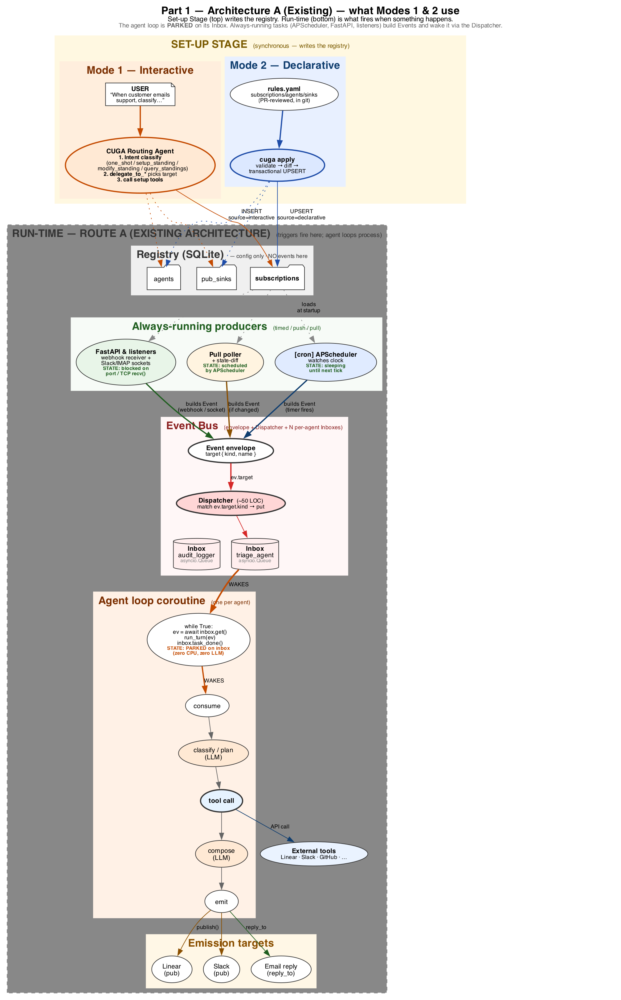
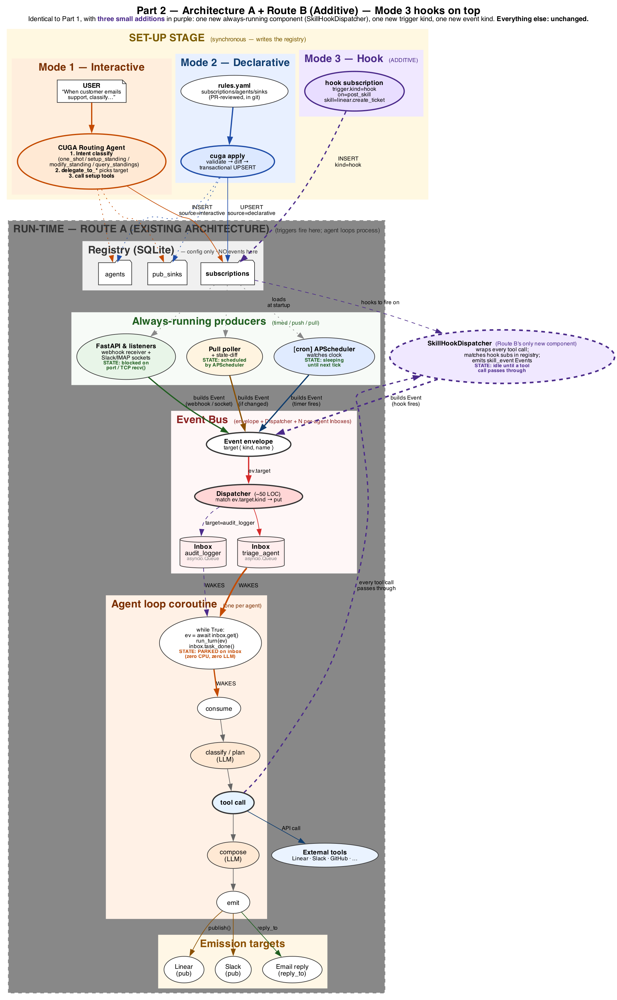
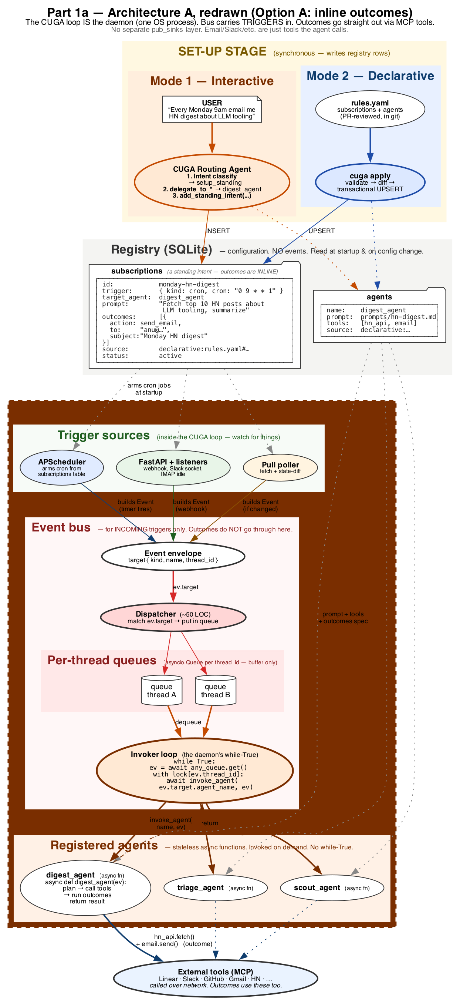
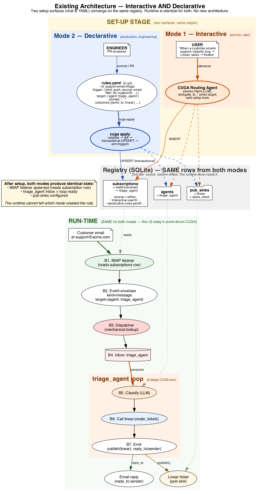

# Configuration Architecture for Event-Driven CUGA

> **New to event-driven CUGA?** Read in this order:
> 1. [design_doc.md](design_doc.md) — runtime mechanics in plain English
> 2. [intent_classification.md](intent_classification.md) — CUGA's first
>    decision: one-shot vs Set-up Stage
> 3. This doc — architecture-level framing
>
> The vocabulary below ("Set-up Stage", "Run-time", "Route A", "Route B")
> all comes from those two.

The honest framing: **two architecturally distinct paths**, not three peer
modes.

1. **The existing architecture** carries Mode 1 (interactive) AND Mode 2
   (declarative). Both are just different *front doors* to the same registry,
   the same Event bus, the same runtime. Declarative is a UX/tooling
   addition, not an architecture change.
2. **The new architecture** is required by Mode 3 (hooks). Hooks introduce
   internal trigger sources, so they need a new producer
   (`SkillHookDispatcher`), a new trigger kind, and a new event kind.

This doc leads with that distinction. Related:
[configuration_modes.md](configuration_modes.md) ·
[declarative_config.md](declarative_config.md) ·
[skill_hooks.md](skill_hooks.md)

---

## The headline

> **Mode 1 = existing architecture.**
> **Mode 2 = existing architecture + a CLI + one extra column.**
> **Mode 3 = existing architecture + ONE additive layer — `SkillHookDispatcher` wrapping the agent's tool runtime.**

That's the whole story. The rest of this doc walks through *why*.

### Does Architecture B invalidate Architecture A?

No. **B is purely additive.** When B is enabled, A keeps running unchanged.
A specialist agent that doesn't have any hooks attached doesn't notice B
exists. If you ripped the SkillHookDispatcher out tomorrow, A would still
work — you'd just lose Mode 3.

The two diagrams below make this concrete: Part 1 shows A on its own;
Part 2 shows the same picture with three small purple-dashed additions.
Every solid grey/orange/blue/red node in Part 1 is byte-for-byte identical
in Part 2.

---

### Part 1a — same architecture, redrawn honestly

Part 1 above was a useful first pass but blurred four things. Part 1a is the
**same architecture** drawn with those corrections; nothing about A actually
changes — just the picture is tighter.

What's different in Part 1a:

1. **Registry tables show concrete sample records.** `subscriptions` has a
   real row (`monday-hn-digest` with cron, target, prompt, outcomes,
   source). `agents` and `pub_sinks` likewise. The schema is no longer
   abstract.
2. **"Always-running producers" is renamed to "Trigger sources" and lives
   inside the CUGA loop.** The CUGA loop *is* the daemon (the OS process).
   APScheduler, FastAPI, listeners, and the pull poller are all parts of
   the CUGA loop process, not standalone services.
3. **The event bus is inside the CUGA loop process.** Phase 1 bus =
   in-memory, in-process. The dispatcher is ~50 LOC inside the same
   daemon.
4. **The `while True:` lives in the daemon, not per agent.** What was
   drawn before as "per-agent loop coroutines" is replaced with: a single
   **invoker loop** (the daemon's while-True) that dequeues events and
   **invokes the agent as a stateless async function**. Agents are
   `async def scout_agent(ev): ...` — no parked coroutines, no per-agent
   `while True:`. Per-thread serialization is enforced with a lock on
   `thread_id`, not by giving each agent its own coroutine.

**Why both Part 1 and Part 1a exist:** Part 1 uses the actor-model framing
(per-agent parked coroutines) that's easier to talk about for swarm/hooks
patterns; Part 1a uses the daemon-with-invoker framing that's closer to
how Python async + FastAPI actually works in this codebase. They describe
the same architecture — pick the framing that suits the audience.

---

## Part 1 — Modes 1 + 2 (Interactive and Declarative) are architecturally the same

Look at what changes when you switch from interactive setup to declarative
setup:

| Layer | Interactive | Declarative | Different? |
|---|---|---|---|
| **Setup surface** | Chat with CUGA routing agent | YAML + `cuga apply` CLI | Yes — but it's a UX/tooling difference |
| **Rows written to registry** | `subscriptions`, `agents`, `pub_sinks` | Same three tables, same row shapes | **No** |
| `source` column value | `interactive:user@…` | `declarative:rules.yaml#id` | Cosmetic — runtime never reads it |
| Triggers armed after setup | IMAP / cron / poller / webhook receivers | Same | **No** |
| **Event envelope at runtime** | Same shape | Same shape | **No** |
| **Dispatcher** | Same | Same | **No** |
| **Per-agent Inboxes** | Same | Same | **No** |
| **Agent loop & 5-stage turn** | Same | Same | **No** |
| **Emission to pub sinks / reply gateways / peer agents** | Same | Same | **No** |

Everything below the registry is unchanged. The only architectural additions
declarative mode requires are:

- A `source` column on three tables. **Provenance metadata only — never read by the runtime.**
- A `cuga apply` CLI binary. **A separate program**; the runtime doesn't know it exists.

The runtime *cannot tell* which mode created a standing intent. It just sees rows.

### The visual

Two setup surfaces (chat vs YAML+CLI) on the left and right of Set-up Stage,
both pointing INSERT/UPSERT arrows into the same registry tables. Run-time
runtime — IMAP listener, Event envelope, Dispatcher, Inbox, agent loop,
emission — is drawn once because it's identical for both modes.

**This Run-time is literally today's event-driven CUGA**
(`docs/event_driven_setup_flow.png`). Declarative doesn't add anything to
it.

### So why have Mode 2 at all?

Because the *surface* matters even when the *architecture* doesn't:

| Concern | Interactive answer | Declarative answer |
|---|---|---|
| Versioning | DB rows; no git history | Git history of `rules.yaml` |
| Review | Approval in chat | PR with code review |
| Reproducibility | Hard (chat is not replayable) | Trivial — replay the file |
| Bulk setup at deploy | One chat at a time | All-at-once |
| Cross-team contracts | Personal scope | Team-owned files |

These are real benefits, but they're benefits at the **operational layer**,
not the architectural layer. We should be honest about that distinction
when proposing the design.

---

## Part 2 — Mode 3 (Hooks) is the new architecture

Hooks need things that Modes 1 and 2 don't:

| New piece | What it is | Where it lives |
|---|---|---|
| **New `trigger.kind: hook`** | A subscription whose trigger is an internal skill execution, not an external event | Schema extension on `subscriptions` |
| **New `event.kind: skill_event`** | A new Event envelope variant carrying `{skill, args, result, invoking_agent, ...}` in `payload.context.hook` | Envelope schema extension |
| **`SkillHookDispatcher`** | A wrapper that sits **inside** the agent's tool runtime, intercepting every tool call to check for matching hooks | A new component embedded in the agent loop |
| **New producer category** | An *internal* producer — events come from inside another agent's turn | Producer list grows from 5 → 6 |
| **A new injection point** in the agent loop | Between *"plan tool call"* and *"execute tool call"*, the runtime calls into the SkillHookDispatcher | Stage 3 of the 5-stage turn gains a wrapper |

The SkillHookDispatcher is the architectural addition. Without it, there's
no way to surface "this skill just ran" as an event the bus can deliver to
other agents.

### What's still unchanged with hooks

For honesty: hooks don't rewrite the rest. Once a hook event exists, it
travels the same path as any other event:

- Same Event envelope (just with `kind=skill_event` and a richer `payload.context`)
- Same Dispatcher (routes by `target` like every other event)
- Same per-agent Inboxes (the hook event lands in `audit_logger`'s inbox or wherever)
- Same agent loop on the receiving side (audit_logger runs a normal 5-stage turn)
- Same pub sinks for outbound

The new architecture is narrow and localized to one place: **the wrapper
around the agent's tool runtime**.

### The visual

See [flow_mode3_hook.png](flow_mode3_hook.png) — the unchanged one. It
shows the new injection point clearly: inside the triage_agent's turn, the
`SkillHookDispatcher` cluster wraps `pre_skill → execute → post_skill`,
and `post_skill` emits a new Event that re-enters the bus.

---

## Putting it together — what to build, in what order

### Phase 1 — Ship Mode 2 (declarative) on top of the existing architecture

**Effort: ~750 LOC, ~1 milestone.** No runtime changes.

| Component | LOC | Where |
|---|---|---|
| `source` column migration on `subscriptions`, `agents`, `pub_sinks` | ~30 | DB migration |
| YAML/JSON schema + validator | ~150 | `cuga/backend/declarative/` (new package) |
| `cuga apply` CLI: parse → validate → diff → transactional UPSERT | ~400 | same package |
| `cuga export`, `cuga validate`, `cuga diff` | ~100 | same package |
| `--prune` by source provenance | ~70 | same package |

The runtime path **does not change at all** during this phase. You can
flip declarative mode on without touching the dispatcher, the bus, or the
agent loop.

### Phase 2 — Ship Mode 3 (hooks) as the new architecture

**Effort: ~400 LOC, ~1 milestone.** Localized runtime change.

| Component | LOC | Where |
|---|---|---|
| `SkillHookDispatcher` (wraps tool runtime; matches subs; emits skill_events) | ~200 | new `cuga/backend/events/hooks.py` |
| Schema additions for `trigger.kind=hook` (filter expressions, glob/regex match, rate limits) | ~100 | extend subscription schema |
| `subscribe_hook` setup tool (for interactive registration) | ~50 | extend `tools.py` |
| Hook depth counter on Event envelope (loop guard) | ~20 | minor envelope extension |
| Wire `SkillHookDispatcher` into the agent loop's tool-call stage | ~30 | small surgical edit in the agent loop |

This is the only milestone where runtime architecture genuinely changes,
and the change is contained to wrapping the tool runtime.

### Total

**~1,150 LOC across two milestones** — same total as before, but now
honestly described: Phase 1 is *no architecture change*, Phase 2 is *the*
architecture change.

---

## Why this reframing matters for the conversation

The original framing — *"three peer modes"* — invites the natural pushback
*"why three things?"* The honest framing answers that:

- **There are two architecturally distinct paths.** Not three.
- **One is existing, one is new.**
- **Declarative is tooling on the existing architecture.** It's not a third
  architecture. It deserves a milestone for the tooling work, but it
  doesn't deserve to be defended as a new design.
- **Hooks are the actual new design.** They're worth defending as new
  architecture because they unlock a class of rules that genuinely cannot
  be expressed without an internal event producer.

This is easier to defend in a design review and easier to plan against.
The order of work also becomes clearer: ship Phase 1 first (lower risk —
no runtime change), then Phase 2 (higher risk — runtime change, but
contained).

---

## What this means for the docs

**Hooks do not invalidate the existing architecture — they extend it.**
The cleanest way to show this is a side-by-side pair: same picture twice,
with Part 2 adding only the new pieces.

| File | What it shows |
|---|---|
| [unified_architecture_part1.png](unified_architecture_part1.png) | **Part 1 — Architecture A.** The existing event-driven CUGA. What Modes 1 and 2 use, exactly as is. |
| [unified_architecture_part2.png](unified_architecture_part2.png) | **Part 2 — Same picture + three purple-dashed additions** (Mode 3 surface, SkillHookDispatcher, new edges). Everything from Part 1 is unchanged. |

Lay them next to each other in a deck. The audience sees that Part 2 is
literally Part 1 with three small things added — the rest is byte-for-byte
identical. That's the proof that Architecture B doesn't replace A; it sits
on top of it.

### Supporting diagrams (drill-downs, optional)

| File | When to use |
|---|---|
| [flow_existing_architecture.png](flow_existing_architecture.png) | Detailed setup-vs-runtime walkthrough for Modes 1 + 2 |
| [flow_mode3_hook.png](flow_mode3_hook.png) | Detailed setup-vs-runtime walkthrough for Mode 3 |
| _(per-surface drill-downs removed — covered by `flow_existing_architecture.png`)_ | — |
| [producers_and_processors.png](producers_and_processors.png) | Reference: six producer types, bus internals, four processor types |

---

## TL;DR

- **Two architectures, not three.** Modes 1 and 2 share the existing one;
  Mode 3 introduces a new one.
- **Declarative (Mode 2) is tooling.** It needs a CLI and a provenance
  column. Runtime path: untouched.
- **Hooks (Mode 3) are architecture.** They need a `SkillHookDispatcher`
  wrapping tool calls, a new trigger kind, and a new event kind. Plumbing
  past that is unchanged.
- **Implementation order:** Phase 1 (declarative tooling, no runtime change)
  → Phase 2 (hooks, contained runtime change). ~1,150 LOC total.
- **The lead diagrams** are
  [flow_existing_architecture.png](flow_existing_architecture.png) and
  [flow_mode3_hook.png](flow_mode3_hook.png).
