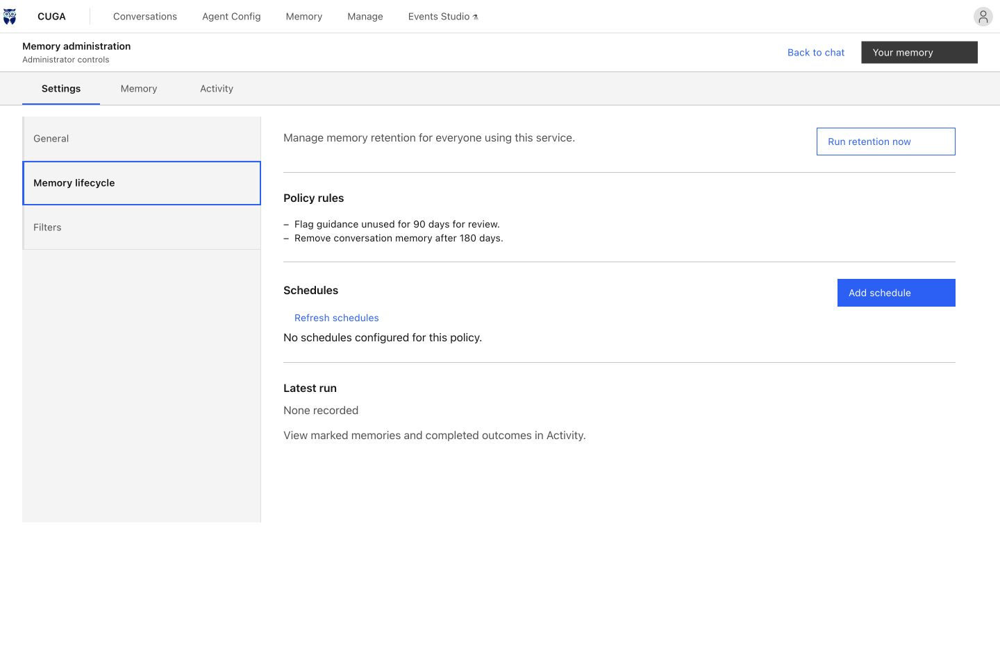

# README media

The README uses freshly captured product screens and a short visual tour to show how CUGA is configured. All media is stored in the repository so readers do not depend on the older Hugging Face demo.

| Asset | Content |
| --- | --- |
| `../images/readme/hero.svg` | Editable SVG introducing sovereignty, execution policies, and inference efficiency. |
| `../images/readme/hero-mobile.svg` | Responsive version of the opening graphic for narrow screens. |
| `../images/readme/manager.jpg` | Current manager UI: tools, policies, draft chat, and Publish. |
| `../images/readme/policies.jpg` | Tool Approval configuration for CRM updates. |
| `../images/readme/agents.jpg` | Agent dashboard with single agents and a supervisor. |
| `../images/readme/chat.jpg` | Chat welcome screen for the sample agent. |
| `../images/readme/events.jpg` | Events Studio dashboard with sample CRON and document-triggered workflows and illustrative run history. |
| `../images/readme/memory.jpg` | Memory workspace with sample guidance, preferences, source conversations, and usage. |
| `../images/readme/memory-retention.jpg` | Administrator memory lifecycle settings with sample retention rules. |
| `../images/readme/product-tour.gif` | Looping, captioned tour for Markdown renderers. |
| `../images/readme/product-tour.mp4` | Silent H.264 video of the same six screens with chapter captions and transitions. |
| [media-fixture.json](media-fixture.json) | Illustrative agent configuration, tools, dashboard entries, event flows, run statuses, and memory records used for the captures. |

Both header graphics retain the original [CUGA owl logo](../../src/frontend_workspaces/extension/src/assets/cuga-logo.png), embedded without changing its artwork.

## What these visuals represent

Screens were captured on October 8, 2026 from the frontend built at commit `ffd0c4700`, using local fixture services to supply sample data. The UI was not redesigned for the screenshots. Internal model and tool URLs, policy names, tool counts, agent descriptions, published version numbers, event flows, run statuses and outputs, memory records, usage counts, and retention settings are illustrative. No model calls, event flows, channel deliveries, retention operations, or connected business operations were executed.

The video is a visual tour assembled from six captured screens, approximately 23 seconds long. It shows agent management, configuration, approval policy settings, Events Studio, memory, and chat. It is not a recording of a completed agent task. The sample-data and no-live-inference disclosure appears in the README and every tour frame.

## Memory retention controls

This capture shows a configured memory lifecycle policy, with sample rules to flag unused guidance after 90 days and remove conversation memory after 180 days. No retention operation was run. Retention availability depends on the configured backend; durable retention uses PostgreSQL and the bundled Evolve HTTP service.

## Refresh the captures

1. Build the current frontend using the [frontend workspace instructions](../../src/frontend_workspaces/README.md).
2. Start a local manager or an isolated UI fixture service. Use sample data with no credentials or private records. The JSON fixture above documents the example values used here.
3. Capture `/manage`, `/manage/revenue-ops`, the Tool Approval configuration dialog, `/studio`, and `/chat/revenue-ops` at the desktop breakpoint. Open **Memory** from chat, then **Administration → Memory lifecycle** for retention controls. These captures used a 1440 × 960 browser viewport.
4. Confirm that loading indicators have cleared and the intended controls are visible. Preserve the product UI and label any sample data.
5. Rebuild the captioned GIF and video from the updated screens. Keep the disclosure on every frame and replace both formats together. Show agent management, tools and policies, approvals, events, memory, and chat in that order.

## A future live workflow demo

For a recording of actual automation, use an isolated CRM demo with a working model endpoint and disposable records:

| Sequence | What to show |
| --- | --- |
| Connect | The configured inference endpoint, CRM tools, and workspace files. |
| Govern | Tool Approval for a specific CRM update tool. |
| Execute | Match `contacts.txt` against CRM and prepare a revenue report. |
| Review | A real approval request, the proposed action, and the user's decision. |
| Verify | The resulting report, tool execution trace, and actual run receipt. |

Publish a live recording only after verifying the run, removing credentials, and labeling the model and environment used. For GitHub inline video playback, upload the verified video as a repository attachment and use its returned URL in the README. The checked-in MP4 remains a portable download; the GIF is the embedded preview.
