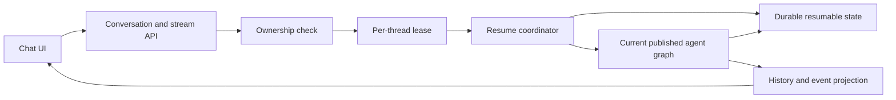

# Issue #774: Durable Session Continuity — High-Level Design

**Status:** Proposed for colleague review  
**Issue:** #774, part of #268  
**Scope:** High-level design only; this is not an implementation plan

## 1. Summary

CUGA already stores conversation messages and stream events and can replay them in the web UI. However, selecting an old thread opens it read-only. The user cannot continue the conversation, and the durable history does not currently restore the agent's execution state or variables after a server restart.

This design adds a server-controlled activation flow for historical threads. An authenticated user can activate an owned thread, continue it on the current published agent configuration, and preserve messages and variables across server restarts and replicas.

Two decisions are intentionally left open for the design review:

1. Whether durable resume stores native LangGraph checkpoints or reconstructs fresh state from durable CUGA history.
2. Whether selecting a thread only displays it until the user clicks **Continue this conversation**, or activates it immediately.

## 2. Goals

- Continue a historical conversation from the web UI.
- Preserve conversational context and agent variables across server restarts.
- Support continuation on another server replica using shared durable storage.
- Address both completed conversations and conversations paused for human-in-the-loop input.
- Use the current published agent configuration for future turns.
- Enforce tenant, service-instance, agent, and user isolation.
- Prevent concurrent turns from mutating the same thread.
- Keep visual transcript replay faithful to the events already stored by [`ConversationHistoryDB`](../../../src/cuga/backend/server/conversation_history.py).

## 3. Non-goals

- A detailed implementation plan, task breakdown, or file-by-file change list.
- Durable continuation for the standalone SDK. Existing SDK continuation remains process-local.
- A CLI resume command.
- Conversation branching or merging concurrent turns.
- Running ordinary future turns indefinitely on an old published agent configuration.
- Reconstructing expired remote sandbox processes or other external ephemeral resources. Durable agent state may retain references and user-visible history, but external runtimes must follow their own recovery behavior.

## 4. Current State

The current system has two forms of state with different purposes:

- [`ConversationHistoryDB`](../../../src/cuga/backend/server/conversation_history.py) durably stores messages and stream events for listing and visual replay.
- The server graph created by [`CugaEntryGraph.build_graph()`](../../../src/cuga/backend/cuga_graph/entry_graph.py) uses an in-memory LangGraph checkpointer. It can continue a thread while that graph instance remains alive, but its checkpoint is lost on restart and is not shared across replicas.

The web UI tracks selected and active thread IDs separately in [`ChatLanding.tsx`](../../../src/frontend_workspaces/frontend/src/ChatLanding.tsx). A selected historical thread becomes read-only when it differs from the active thread. [`customLoadHistory()`](../../../src/frontend_workspaces/frontend/src/carbon-chat/customLoadHistory.ts) rebuilds the visual transcript from stream events, with basic messages as a fallback.

Agent variables already live in graph state through `AgentState.variables_storage`. This means in-memory continuation preserves variables today, but durable conversation history by itself does not.

The existing `POST /api/conversations` handler returns a generated object but does not create an authoritative durable conversation lifecycle record.

## 5. Agreed Design Principles

### 5.1 Server-owned activation

The browser does not make a thread writable merely by changing local state. It asks the server to activate the thread. The server validates access and resumability before input is enabled.

### 5.2 Strict ownership scope

A conversation is identified within this scope:

- tenant
- service instance
- agent
- authenticated user
- thread ID

Possession of a thread ID is not authorization. Unknown and unauthorized thread IDs should produce the same not-found behavior so the API does not reveal another user's data.

### 5.3 One active turn per thread

Only one turn may execute for a thread at a time across all replicas. A competing request receives a conflict response with retry guidance. The system does not branch the conversation and does not silently queue an unbounded second turn.

### 5.4 Current configuration for future turns

A continued conversation uses the current published agent configuration. Durable thread metadata records the configuration fingerprint or version associated with the previous state so the resume coordinator can detect changes and report them to the user.

### 5.5 Safe handling of pending HITL after configuration change

A pending human-in-the-loop operation may refer to nodes, tools, policies, or arguments from an older graph. If the published configuration changed, the system cancels that pending operation instead of executing it against the changed graph. It records and displays an explicit cancellation notice, then allows a normal new turn under the current configuration.

### 5.6 Transcript is a read model

Messages and stream events remain the source for history display. They are not automatically assumed to be a complete execution checkpoint. The distinction is important for variables, graph position, summarized context, policy state, and pending interrupts.

## 6. Proposed Shared Architecture

Both persistence alternatives use the same surrounding architecture.

### 6.1 Chat UI

The UI distinguishes the thread being displayed from the thread that is active for sending. It represents activation explicitly with states such as:

- viewing or loading history
- activating
- active
- conflict
- unavailable

The exact user interaction remains an open decision in section 8.

### 6.2 Conversation lifecycle record

A durable server-owned record represents the conversation independently of whether it already has messages. At a high level it contains:

- scoped conversation identity
- lifecycle status
- latest committed state revision
- last configuration fingerprint or version
- whether pending human input exists
- created and updated timestamps

This replaces the current stub behavior with an authoritative lifecycle boundary. The exact schema is an implementation concern for a later plan.

### 6.3 Resume coordinator

The coordinator is the single server-side entry point for activating or continuing an existing thread. It:

1. Resolves the authenticated ownership scope.
2. Finds the conversation without leaking unauthorized existence.
3. Acquires a short, renewable per-thread lease.
4. Loads durable resumable state using the selected persistence alternative.
5. Compares the saved and current configuration fingerprints.
6. Restores, cancels, or rejects pending work according to the rules in this design.
7. Returns a typed activation result to the UI.

The coordinator keeps ownership, concurrency, configuration compatibility, and resume semantics out of frontend state transitions.

### 6.4 Durable resumable state

The exact form is the main unresolved architecture decision:

- Option A uses a native durable LangGraph checkpoint.
- Option B uses CUGA-owned messages, variables, and lifecycle metadata to construct a fresh graph state.

### 6.5 History and stream-event projection

[`ConversationHistoryDB`](../../../src/cuga/backend/server/conversation_history.py) continues to support:

- thread listing
- conversation titles and timestamps
- basic message loading
- detailed stream-event replay

Execution-state persistence and history projection must expose a shared revision or equivalent consistency marker. The system must not claim that a turn is durably resumable when only its visual projection was committed.

## 7. Main Architecture Decision: Option A or Option B

### 7.1 Simple explanation

#### Option A — save the agent's exact place

This is like saving a game. CUGA stores the conversation, the agent's variables, the exact graph step, and whether the agent is waiting for approval. After a restart, the agent can return to the same place.

This requires more infrastructure and makes CUGA depend on LangGraph's checkpoint model. In return, it is the only option here that can accurately keep a pending approval executable after a restart.

#### Option B — rebuild from the conversation notes

This is like giving a new agent the transcript and saved notes. CUGA loads the old messages and variables, creates a fresh graph state, and continues with the current configuration.

This is simpler for normal, completed conversations. It cannot safely return to the exact graph step where an earlier process paused. A pending approval can be shown in history, but after process loss it must be cancelled before a new turn starts.

#### The deciding question

If a pending approval or user-input request must remain executable after restart when the configuration has not changed, choose Option A.

If it is acceptable to cancel pending work after restart and continue only with a fresh user turn, Option B is smaller and simpler.

### 7.2 Detailed comparison

| Concern | Option A: durable native checkpoint | Option B: reconstruct from history |
|---|---|---|
| Completed messages | Restores the graph's exact retained state, including summarized or trimmed context | Rebuilds from saved canonical messages; reconstructed context may differ from what the graph retained |
| Variables | Restored as part of graph state | Requires explicit durable variable serialization and lifecycle management |
| Pending HITL | Preserves pending node, interrupt payload, and continuation position | Cannot faithfully restore execution position after process loss |
| Restart and replica support | Natural fit with a shared checkpointer | Works for reconstructed data, not exact execution continuation |
| Consistency model | One execution-state authority; history remains a projection | Messages, variables, and pending metadata are separate records that must be coordinated |
| Configuration changes | Requires compatibility detection before using a saved checkpoint | Fresh state naturally uses current configuration, but old execution position is lost |
| Initial change size | Larger infrastructure change | Smaller for completed chats; complexity grows as variables and lifecycle correctness are added |
| Framework coupling | Coupled to LangGraph checkpoint formats and saver behavior | Coupled to CUGA-owned reconstruction rules and migrations |

### 7.3 Option A: durable native LangGraph checkpoints

The server replaces its in-memory-only checkpointer with a storage-backed implementation shared by replicas. Checkpoints are scoped by the full conversation identity rather than a globally trusted thread ID.

The durable checkpoint is the execution source of truth. It includes messages, variables, graph position, interrupt state, and other graph-owned continuation data. Conversation history remains a separate UI projection.

Behavior:

- Completed thread: load the checkpoint and append the new turn.
- Pending HITL with matching configuration: restore the interrupt and keep its approval or input action executable.
- Pending HITL with changed configuration: cancel it, record a notice, and accept only a normal new turn.

Primary advantages:

- Exact execution semantics.
- Correct pending-HITL continuation.
- Avoids designing a second checkpoint format.

Primary costs and risks:

- More substantial persistence integration.
- Checkpoint schema compatibility and migrations must be understood.
- Graph compilation and dynamic agent caching must use the same durable saver correctly.
- Stored checkpoints may contain sensitive tool outputs or variable values and therefore require the same isolation and retention controls as conversation history.

### 7.4 Option B: reconstruct fresh state from CUGA-owned history

CUGA durably stores canonical messages, variables, configuration metadata, and limited lifecycle status. On activation after process loss, the coordinator creates a fresh `AgentState` under the current graph and seeds it with those values.

Behavior:

- Completed thread: reconstruct a fresh state and append the new turn.
- Pending HITL while the original process state still exists: existing process-local behavior may still work, but it is not the durable contract.
- Pending HITL after process loss: mark it cancelled, record a notice, and accept only a normal new turn.
- Changed configuration: the same cancellation rule applies before the fresh turn.

Primary advantages:

- Smaller conceptual change for completed-turn continuation.
- CUGA owns the durable schema.
- Naturally starts future work on the current graph.

Primary costs and risks:

- Does not provide exact execution continuation.
- Requires new variable serialization and migration rules.
- Reconstructed message context may differ from graph-retained state after summarization or sliding windows.
- Coordination among history, variables, pending status, and revisions can grow into a second custom checkpoint system.

### 7.5 Alternative considered but not carried forward

A third option was considered: persist the entire serialized CUGA `AgentState` plus custom pending-control metadata after every graph transition, independent of LangGraph checkpoints. It offers CUGA control over the schema but duplicates checkpoint responsibilities, tightly couples storage to internal state, and requires custom atomicity and migration logic. It is not retained as a primary review option because it combines much of Option A's complexity with more custom machinery.

## 8. Open UI Decision

The backend activation contract supports either interaction.

### UI-1 — view first, then continue

Clicking a sidebar thread loads its history read-only. A **Continue this conversation** action requests server activation. Input becomes available only after activation succeeds.

Advantages:

- Preserves passive history browsing.
- Makes user intent explicit.
- Provides space to show configuration changes, cancelled HITL, conflicts, or unavailable state before the user types.

Tradeoff:

- Adds one click to the common continuation flow.

### UI-2 — activate immediately on selection

Clicking a sidebar thread immediately requests activation. On success, the displayed conversation becomes the active writable thread.

Advantages:

- Faster and familiar for chat applications.
- Reduces frontend distinction between selecting and continuing.

Tradeoffs:

- Users cannot passively inspect history without attempting activation.
- Loading, conflict, configuration-change, and cancellation feedback must be handled inline during selection.

### UI decision criterion

Choose UI-1 if read-only browsing and explicit intent are important. Choose UI-2 if a sidebar click is expected to mean “make this my current conversation.”

## 9. Main Flows

### 9.1 Activate and continue a completed thread

1. The user selects or explicitly continues a historical thread.
2. The UI requests activation using the thread ID and active agent context.
3. The server derives tenant, service-instance, and user identity from trusted server/authentication context.
4. The coordinator resolves the owned conversation or returns not-found.
5. The coordinator acquires the per-thread lease or returns conflict.
6. It loads the checkpoint under Option A or reconstructs state under Option B.
7. It compares saved and current configuration fingerprints.
8. The UI receives an activation result containing active status, configuration-change information, resumability mode, and notices.
9. The user sends a new message on the activated thread.
10. Durable execution state and the history/event projection advance under a new revision.
11. The lease is renewed while the turn is running and released at a terminal state.

### 9.2 Activate a thread with pending HITL

#### Matching configuration under Option A

The coordinator restores the checkpoint. The UI renders the pending approval or input control, and the user can continue the interrupted operation.

#### Matching configuration under Option B after process loss

The coordinator cannot restore the exact interrupted execution. It marks the pending operation cancelled, persists an explicit notice, and activates the thread for a fresh turn.

#### Changed configuration under either option

The coordinator cancels pending work, persists an explicit notice explaining that the agent configuration changed, and activates the thread only for a normal new turn.

### 9.3 Concurrent activation or send

The first request acquires the thread lease. A second request for the same scoped thread receives conflict. The client explains that the conversation is active elsewhere and may retry after the lease is released or expires.

## 10. API-Level Contract

Exact routes and payload fields are deferred to implementation planning. The high-level contract requires:

- A real server-owned conversation creation/lifecycle operation.
- An activation or resume-validation operation that has no agent side effect.
- The existing message stream to reject unowned, inactive, or concurrently leased thread mutations.
- Typed outcomes for activated, conflict, not-found, unavailable, and activation-with-notice.
- Activation metadata that tells the UI whether configuration changed, whether pending work was cancelled, and which resumability semantics apply.
- Idempotent cancellation notices so retries do not append duplicates.

The client must not be allowed to supply trusted tenant, service-instance, or user ownership values.

## 11. Consistency and Concurrency

### 11.1 Thread revision

A monotonically increasing state revision, checkpoint version, or equivalent durable token links execution state to its transcript projection. This supports stale-write detection, recovery, and clear diagnostics.

### 11.2 Lease behavior

The lease is scoped to the full conversation identity and includes an expiry. Active server work renews it. A crashed worker eventually loses it, allowing another replica to recover from the latest committed state.

### 11.3 Commit ordering

The selected design must define a recoverable ordering between execution state and the history projection:

- If execution-state persistence fails, the server must not report the turn as durably complete.
- If execution state commits but projection writing fails, the system must repair or retry the projection and must not rerun the agent turn.
- A visual history record must not be mistaken for proof that all execution state was committed.

A single database transaction is ideal when the selected storage technologies permit it. Otherwise, revisioned idempotent writes and projection repair are required.

## 12. Failure Behavior

| Failure | Required behavior |
|---|---|
| Unknown or unauthorized thread | Return not-found without revealing ownership details |
| Thread already running | Return conflict with retry guidance |
| Corrupt or incompatible durable state | Keep history readable, mark continuation unavailable, and never silently start from empty state |
| Configuration changed with pending HITL | Cancel pending operation, persist a clear notice, and allow only a fresh turn |
| Execution-state write fails | Do not acknowledge the turn as durably completed |
| Projection write fails after state commit | Preserve committed state and repair the projection without rerunning the turn |
| Client disconnects during streaming | Server work owns lease renewal; latest committed state determines the next resume point |
| Lease holder crashes | Lease expires; another replica can resume from latest committed state |
| External sandbox/resource expired | Report resource recovery limitations; do not pretend that durable graph state restored an external process |

## 13. Security and Privacy

- Apply tenant, instance, agent, user, and thread scope to every state and history lookup.
- Derive ownership from authenticated context, not request-controlled identity fields.
- Use non-enumerating not-found behavior for unauthorized access.
- Treat variables, checkpoints, tool results, approval payloads, and stream events as potentially sensitive.
- Apply consistent retention and deletion to the conversation record, history projection, resumable state, pending HITL data, citations, uploads, and other thread-scoped artifacts.
- Deleting a conversation must invalidate active leases and prevent subsequent continuation.

## 14. Validation Strategy

This is a design-level validation outline, not an implementation task list.

- Completed conversation continues after a server restart with prior messages and variables.
- A second replica can continue a thread created by the first replica.
- A thread always uses the authenticated owner's scope and the selected agent.
- Unauthorized and nonexistent thread IDs are indistinguishable to callers.
- Two simultaneous sends result in one accepted turn and one conflict.
- Matching-configuration HITL behavior demonstrates the defining difference between Option A and Option B.
- Changed-configuration HITL is cancelled exactly once with a visible notice.
- Completed turns continue on the current published configuration.
- Corrupt durable state never causes a silent blank continuation.
- Execution/projection partial failures recover without duplicating an agent turn.
- Both UI alternatives correctly represent loading, activation, conflict, unavailable, and notice states.
- New or changed tests must use the appropriate registered pytest marker and be placed in a CI-collected test directory.

## 15. Decisions Already Made

| Topic | Decision | Alternatives considered |
|---|---|---|
| Durability target | Server/UI continuation survives restart and replica changes | Same-process-only continuation; durable messages with best-effort variables |
| Future configuration | Use the current published agent configuration and disclose changes | Pin to original config; default to original with an explicit upgrade |
| Changed-config pending HITL | Cancel with an explicit notice, then allow a fresh turn | Reject continuation; reconstruct the original graph to finish the pending operation |
| Ownership | Strict tenant, instance, agent, user, and thread isolation | Thread ID as sufficient capability |
| Same-thread concurrency | Reject a competing turn with conflict | Queue/serialize waiting callers; allow branches |
| SDK | Keep process-local for this issue | Shared durable SDK storage; route SDK through server |
| CLI | Excluded | Server-backed resume command; process-local resume command |
| Transcript role | UI read model, not automatically execution truth | Reuse stream events alone as complete execution state |

## 16. Open Review Decisions

### Decision 1: execution persistence

- **Option A:** durable native LangGraph checkpoints.
- **Option B:** reconstruct fresh state from durable messages and variables.

The primary question is whether an unchanged-config pending HITL operation must remain executable after process loss. If yes, choose A. If no, B is the simpler completed-conversation design.

### Decision 2: UI activation

- **UI-1:** select to view, then click **Continue this conversation**.
- **UI-2:** select and activate immediately.

The primary question is whether the sidebar must support passive read-only browsing.

## 17. Review Exit Criteria

The design review is complete when colleagues agree on:

1. Option A or Option B and the resulting pending-HITL guarantee.
2. UI-1 or UI-2.
3. The shared ownership, configuration-change, concurrency, and failure rules.
4. Whether the proposed server-owned conversation lifecycle and resume coordinator are the correct boundaries.

Only after these decisions should the team create a detailed implementation plan.