# Architecture

The event-driven layer turns CUGA from a request/response agent into one that reacts to the world —
a message in Slack, a new email, a cron tick, a repo webhook, a file in Box. It is **additive**:
everything lives behind `EVENTS_ENABLED`, and vanilla CUGA is byte-for-byte unchanged when it is off.
The whole layer is self-contained under `src/cuga/backend/events/` (one flat package; the only core
touch points are three `EVENTS_ENABLED`-guarded hooks: two at server startup — the events-routes
mount and the background-watcher launch — plus one in the `/stream` request handler that reroutes an
events slash-command to the concierge).

## The two pieces

The whole system is **create a flow** (arm-time) and **fire a flow** (run-time).

- **CREATE** — connect a credential, then turn an English sentence into a standing flow. The concierge
  builds the flow and bakes in a *reference* to the credential, never the secret.
- **FIRE** — a trigger fires, `/invoke` runs the agent, the answer is delivered.

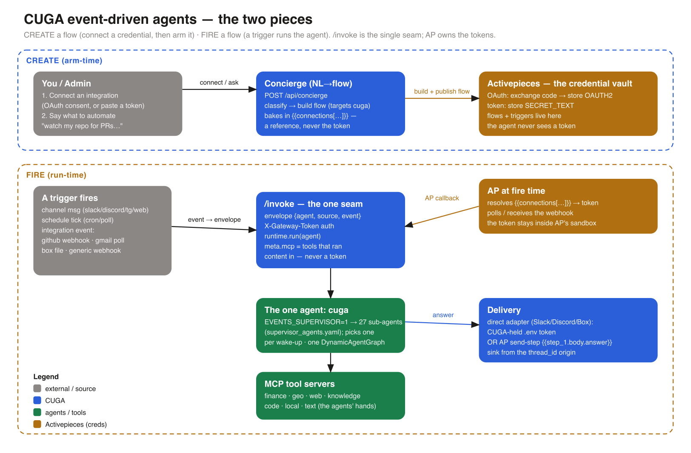

**`/invoke` is the single seam.** Every fire path normalises its event into one envelope —
`{agent, source, event}` — and POSTs it to `/invoke`. Learn this one endpoint and the rest follows.

## Credentials — set up, transferred, resolved

The agent never sees a token. There are three credential models, and the sequence diagrams below make
each explicit:

1. **OAuth via AP** (gmail · github · box-AP) — you consent in the browser; the provider redirects to
   CUGA's callback with an authorization **code**; CUGA hands AP the *code* (not a token); **AP
   exchanges it and stores an `OAUTH2` connection** and owns the refresh lifecycle.
2. **Token via AP** (telegram · discord-AP) — you paste a secret; AP stores it as a `SECRET_TEXT`
   connection.
3. **Direct env token** (box-direct · slack · discord) — the token lives in CUGA's `.env`
   (`BOX_DEV_TOKEN`, `SLACK_BOT_TOKEN`); CUGA's own adapter uses it. Still never handed to the agent.

For (1) and (2), the armed flow references the connection as `{{connections['ea::tenant::user::app']}}`.
**At fire time, AP resolves that reference to the real token inside its own sandbox** and uses it to
poll/receive — the token never crosses to CUGA or the agent. This is the security boundary
([ADR-0001](decisions/0001-ap-as-the-event-engine.md), [ADR-0006](decisions/0006-auth-connection-model.md)).

Two other facts that trip everyone up:

- **Activepieces calls back over `HOST_CALLBACK_URL` (podman-internal DNS), not the public tunnel.**
  The public cloudflared tunnel is *inbound only* — it exists so GitHub/Slack webhooks and OAuth
  callbacks can reach CUGA. That tunnel is **ephemeral**: when it dies, every flow fails with
  `INTERNAL_ERROR` on AP's payload callback. Fix: `make ap`. (See [GAPS.md](GAPS.md).)
- **Delivery is one of two paths**, chosen by `delivery.is_direct(channel)`: CUGA's own direct
  adapter (Slack, Discord, Box) or an Activepieces send-step (`{{step_1.body.answer}}`). The sink is
  parsed from the `thread_id` origin — which is why a Gmail-sourced flow can deliver to Slack.

## The pieces

| Component | Role |
|---|---|
| **`/invoke`** | the seam. Envelope in → agent runs → answer out. `X-Gateway-Token` auth. `meta.mcp` = the tools that actually ran. |
| **Concierge** | the NL→flow **compiler** (`POST /api/concierge`). A deterministic **pre-router** (`events/flowspec.py`) tries first: a high-confidence utterance arms without the LLM, a missing required slot becomes a question the next message answers (*ask-till-legit*); anything ambiguous falls to the LLM. Both doors **validate the trigger against the registry** and reuse-or-create through the same tool. It does **NO agent routing** — every flow and every hand-off targets the ONE agent, `cuga`. Full walkthrough: [nl_to_flow.html](nl_to_flow.html). |
| **The one agent — `cuga`** | the only addressable agent (**single-agent world**, [plans/SUPERVISOR_REFACTOR.md](plans/SUPERVISOR_REFACTOR.md)). `EVENTS_SUPERVISOR=1` → a **supervisor** whose sub-agents come from [`supervisor_agents.yaml`](../supervisor_agents.yaml) (CUGA-main's canonical schema): it picks the right specialist **per wake-up** and the answer bubbles up; sub-agents are not user-visible or addressable. Unset → the plain classic CUGA agent, as main ships it. Add a sub-agent = edit the YAML + `make reload`. |
| **Trigger registry** | **`events/triggers.py` — one row per `(app, event)`**: its AP piece trigger *or* direct transport kind, the payload map, required slots, classifier phrases, a synthetic fire payload, and the provider's delivery header. The single source of truth (below). |
| **The sub-agents (roster)** | 27 specialists in [`supervisor_agents.yaml`](../supervisor_agents.yaml), each = prompt + MCP tools + the **HANDLES trigger hints the supervisor routes on**. They are skills of the one `cuga` agent — not addressable, no channels, no credentials of their own. (`seed.py`'s fleet is retired; `scripts/gen_supervisor_roster.py` did the one-time conversion.) |
| **MCP tool servers** | the agents' hands: `cuga-finance · geo · web · knowledge · code · local · text`. Attached per agent by name (see [MCP notes](#mcp-tools)). |
| **Activepieces (AP)** | owns AP-backed triggers **and all credentials** (the agent holds none). Connections are OAUTH2 or SECRET_TEXT. |
| **Direct watchers** | Slack/Discord/Telegram/Box triggers CUGA receives *itself* (`events/direct_events.py`). No AP flow, no AP connection — the subscription row has `ap_flow_id = NULL`. |
| **Delivery** | direct adapter or AP send-step; sink from the `thread_id` origin. |
| **Studio UI** | a *dumb* React console — it renders exactly what the read endpoints report, no client-side business logic. |

## The trigger registry — one row per `(app, event)`

Every integration exposes **many** triggers, not one. GitHub alone has 14 (PR, issue, star, push,
release, commit, branch, milestone, collaborator, label, discussion, discussion-comment,
review-request, mention). The layer used to hard-code exactly one per app — `create_push_flow` took an
`event` argument and *ignored* it — so a second trigger on an app was structurally impossible.

[`events/triggers.py`](../src/cuga/backend/events/triggers.py) now holds **33 triggers across 7
integrations**, and everything else derives from it:

```
                        ┌──────────── triggers.py ────────────┐
                        │  (app, event) →                     │
                        │    piece + ap_trigger | direct_kind │
                        │    payload map   (curated {{…}})    │
                        │    slots         (repo/label/emoji) │
                        │    phrases       (NL classifier)    │
                        │    synth         (machine fire)     │
                        │    hook_event    (X-GitHub-Event)   │
                        └──┬────┬────┬────┬────┬────┬─────────┘
       flows.build_push_flow │    │    │    │    │  envelope.EVENT_KINDS
        ap_engine.create_push_flow │    │    │  classify (NL → trigger)
            concierge.validate ────┘    │    └── docs (examples feasibility)
                                        └─────── tests (parametrized per trigger)
```

Adding a trigger is **one row** plus an agent that declares it. An unknown `(app, event)` now **raises
at build time** — the old code silently fell back to a nonexistent `new_item` trigger and armed a flow
that could never publish.

**How each trigger can be fired** is a property of the trigger, not a limitation of the code:

| | Fire | Why |
|---|---|---|
| **GitHub** (14) | **by machine** | WEBHOOK triggers — `POST /subscriptions/{id}/run` replays the piece's real payload *with its `X-GitHub-Event` delivery header*. All 14 verified live end-to-end. |
| **Gmail** (4) | real email | POLLING triggers — Activepieces will not run one out of band. Arm-verified by design. |
| **Box** (3) | real action | the CUGA-side poller (files · folders · comments). Drop a file to fire it. |
| **Slack** (8) · **Discord** (2) | real action + setup | direct watchers; the Slack app must be *subscribed* to the event, Discord member events need the privileged intent. |
| **Webhook** | by machine | the inbound endpoint is always live (pinned or concierge-routed). |

**Agents declare triggers, not just apps.** An `integrations` entry may carry
`"triggers": ["new_pr", "new_review_request"]`, so `pr_reviewer` gets PR-shaped events while
`repo_watcher` takes repo lifecycle and `incident_triage` takes issues and `:bug:` reactions. Without
a list, the agent handles all of that app's triggers (legacy declarations are unchanged).

## What is reused vs added vs delegated

The layer is deliberately thin. It **reuses** CUGA's graph/agent machinery (a worker *is* a
`DynamicAgentGraph`), **adds** only the events package + two guarded startup hooks, and **delegates**
all triggers and credentials to Activepieces. It builds **no** connection/OAuth framework of its own —
AP owns that. That is why merging it is non-breaking.

## Backends — two per concern

- **Worker backend** (`EVENTS_WORKER_BACKEND`, default `cuga`): how an agent runs. `cuga` = a full
  CUGA graph per agent; `react` = a lighter loop. The concierge itself is `react`.
- **Channel backend**: how a chat channel connects. **Slack + Discord = direct** (no AP — Slack via
  its Events API, Discord via a Gateway WebSocket bot). **Telegram = AP** (polling trigger + send
  step). Web is a plain `/api/concierge` call. See [ADR-0008](decisions/0008-direct-backends-for-channels.md).
- **Box backend** (`EVENTS_BOX_BACKEND`): `direct` (CUGA polls Box with a token and **downloads file
  content** server-side, inlining text / base64-ing binary into the prompt) vs the AP push trigger.

## Sequence diagrams

Grouped by the two pieces. Credentials (🔑) are called out in every one.

### CREATE — arm-time

**① Connect a credential** — the OAuth handshake, and where the token ends up (AP, forever).

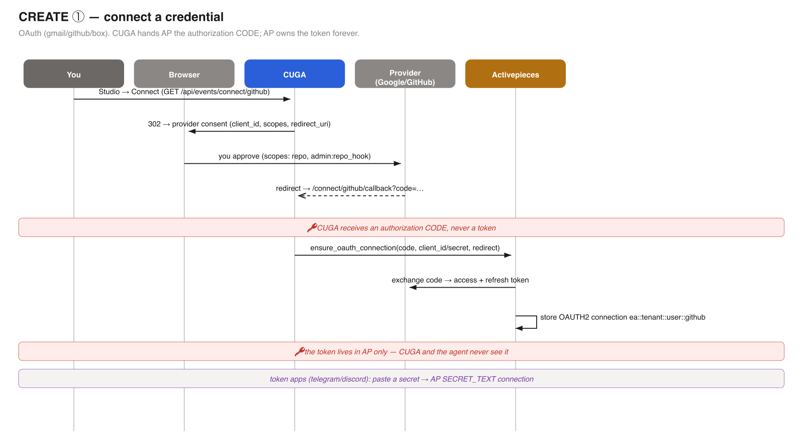

**② Arm a flow** — the concierge turns a sentence into a flow and bakes in the *connection reference*.

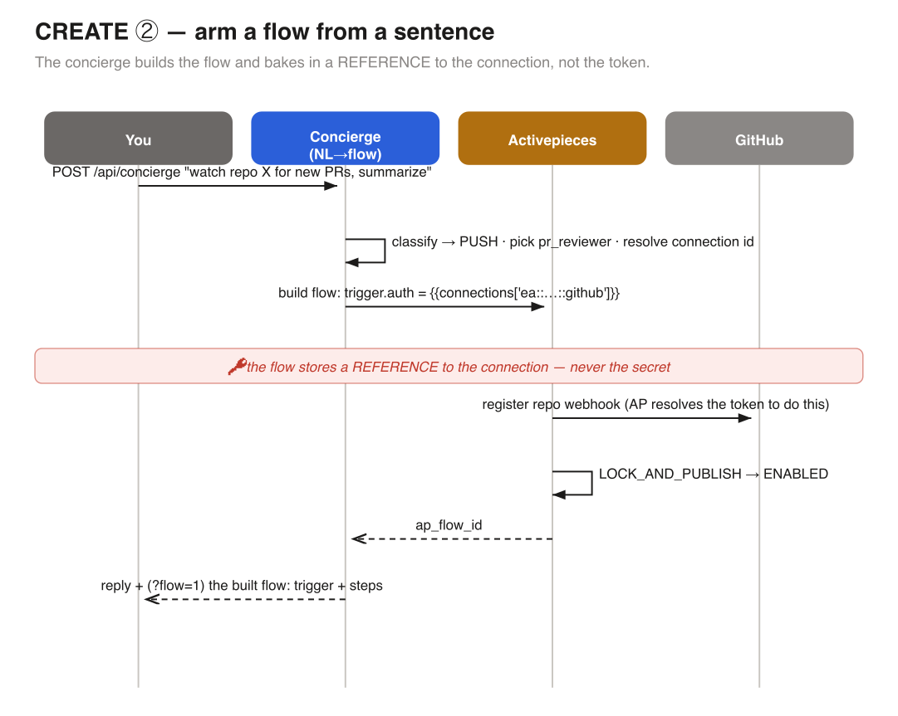

**②a NL→Flow resolution** — how the sentence itself is decided: the deterministic pre-router
(fast path · ask-till-legit) in front of the LLM, with the registry gate disposing of every
proposal. Prose walkthrough: [nl_to_flow.html](nl_to_flow.html).

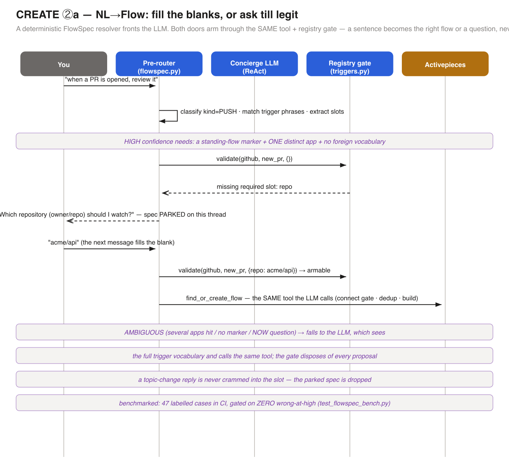

### FIRE — run-time

The eight distinct fire shapes. Every other trigger/channel/integration combination is a variant of
one of these.

| Diagram | Shows | Credential |
|---|---|---|
| 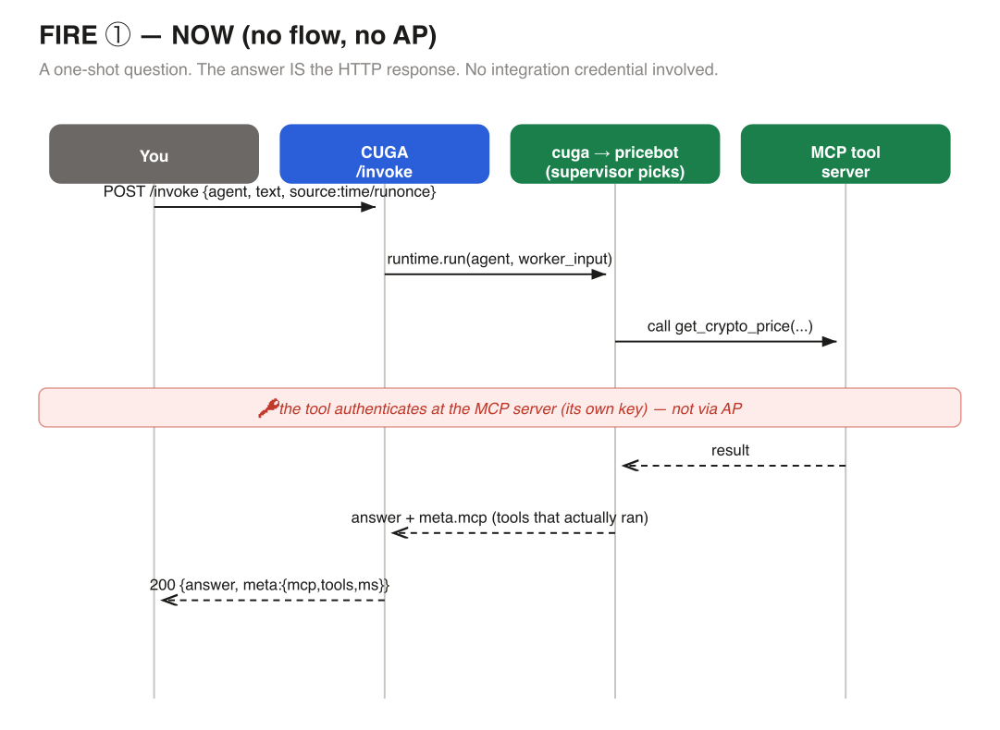 | **① NOW** — one-shot question, no flow | none (the tool authenticates at the MCP server) |
| 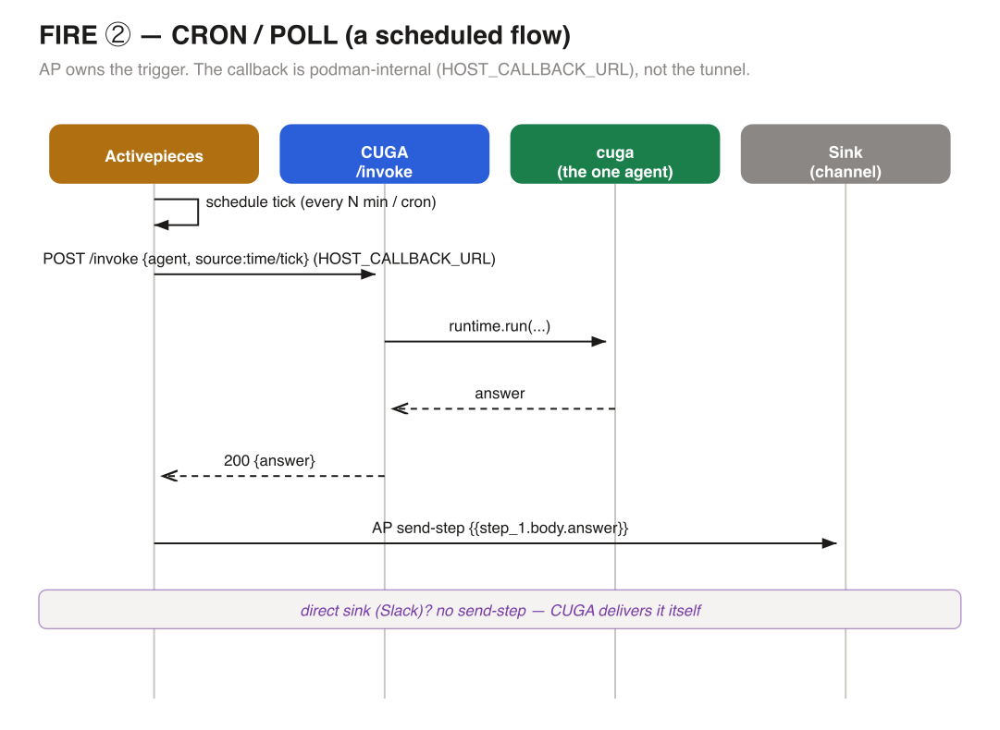 | **② CRON / POLL** — scheduled fire | none (a pure schedule; agent uses MCP tools) |
| 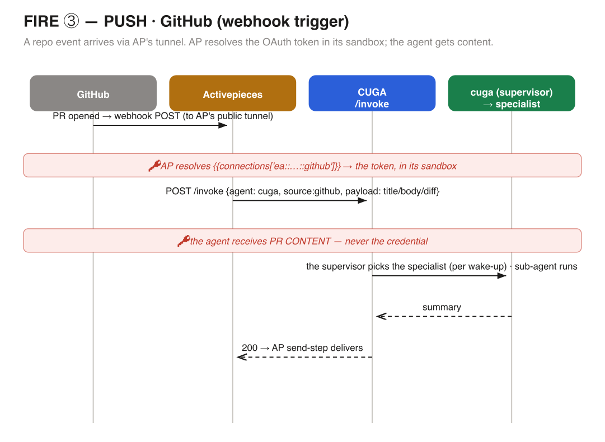 | **③ PUSH · GitHub** — webhook trigger | AP resolves the OAuth connection in its sandbox |
| 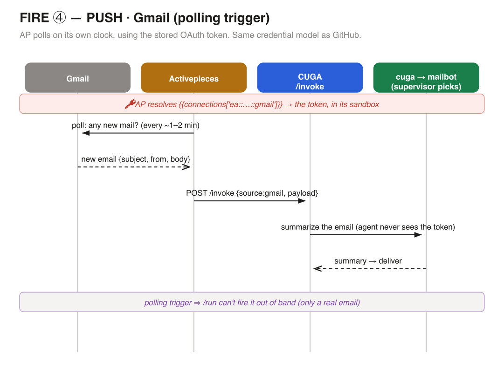 | **④ PUSH · Gmail** — polling trigger | AP resolves the OAuth connection (same model) |
| 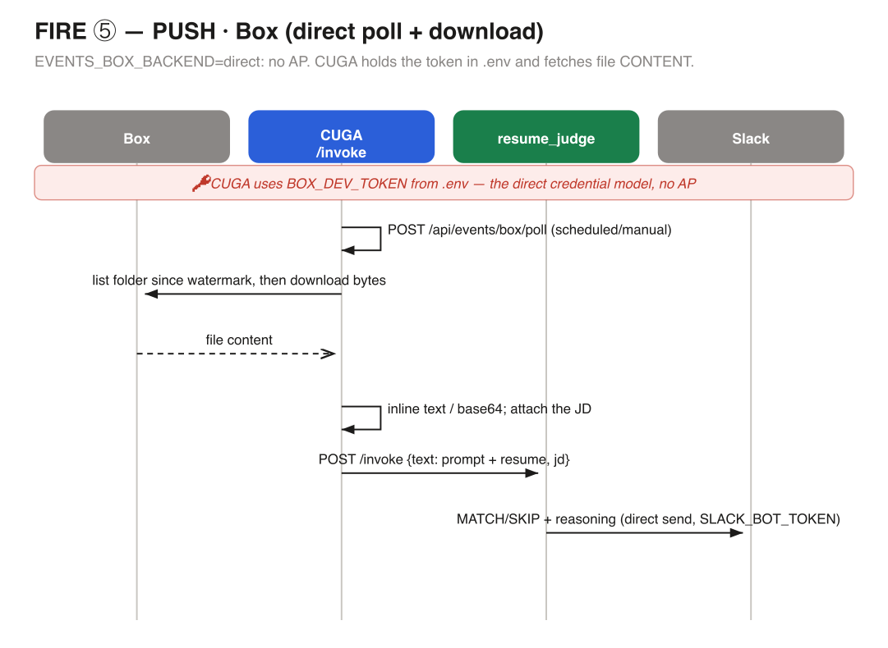 | **⑤ PUSH · Box** — direct poll + download | CUGA-held `BOX_DEV_TOKEN` (direct model, no AP) |
| 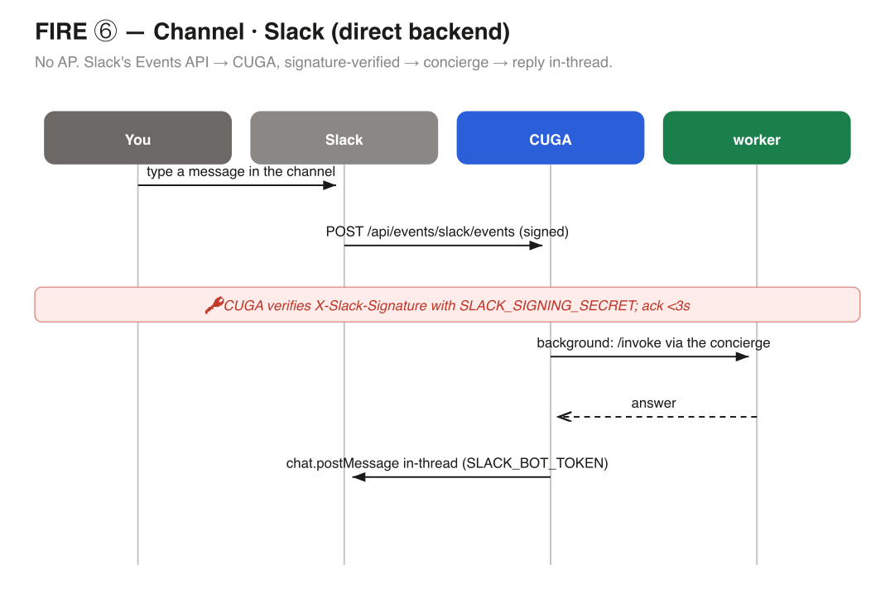 | **⑥ Channel · Slack** — direct, signed | CUGA-held `SLACK_*` (signing secret + bot token) |
| 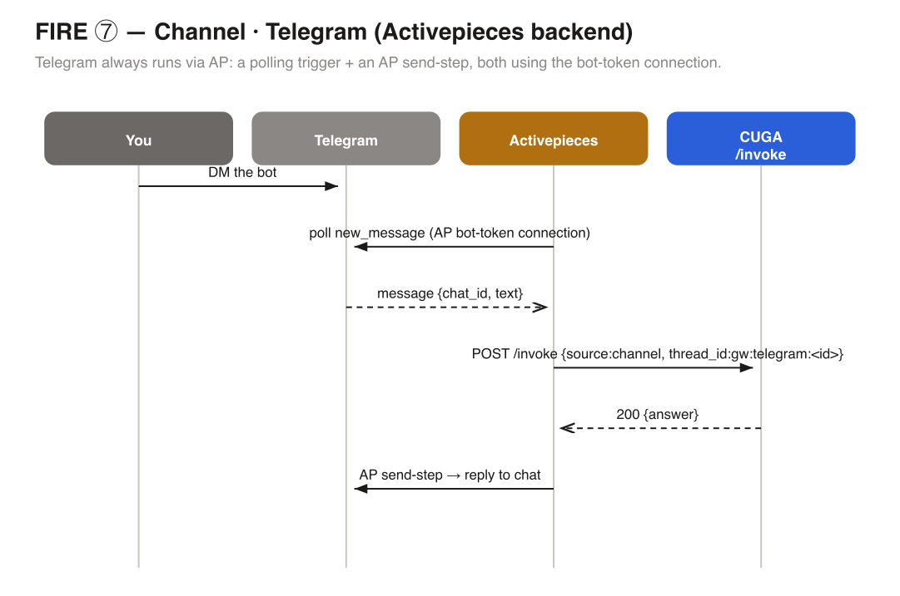 | **⑦ Channel · Telegram** — AP backend | AP bot-token connection (Discord = direct WS bot) |
| 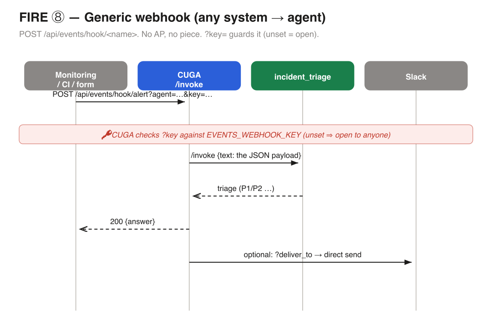 | **⑧ Generic webhook** — any system → agent; the agent is either **pinned** (`?agent=`) or **routed** (`?route=1`, the concierge picks it by capability, like chat) | `EVENTS_WEBHOOK_KEY` (unset = open) |

SVG sources + the generator live in [architecture/](architecture/); regenerate with
`python events_docs/architecture/gen_diagrams.py`.

## Invariants (the non-negotiables)

- **Additive.** Behind `EVENTS_ENABLED`; vanilla CUGA unaffected when off.
- **CUGA-graph machinery preserved.** The one `cuga` worker *is* a full CUGA graph (its supervisor
  fans out to the roster internally); `thread_id` keys per-thread memory. One addressable agent, not a fleet.
- **AP owns credentials.** The agent never sees a token. This is the security boundary.
- **Reuse before create.** The concierge de-dupes on
  `dedup_key = agent·source·cadence·cfg_tag·sink·owner` (`cfg_tag` = the per-watch config, e.g.
  `repo=…,label=…`).
- **The UI is dumb.** It renders backend state; all logic is server-side.

## MCP tools

Workers reach the world through MCP servers registered in `mcp_catalog.py` and bridged in
`_cuga_bridge.py`. An agent lists servers by name (`mcp_servers=["cuga-finance"]`); the runtime
attaches them. One gotcha: MCP tool names hyphenate on the wire and underscore in code
(`cuga-web` → `cuga_web`), handled by the bridge. The Studio's agent editor reads the live catalog
from `GET /api/events/mcp-servers`, so it never hardcodes the list.

## Studio UI (the dumb console)

The Studio reads only these endpoints and renders them verbatim: `status`, `channels`,
`integrations`, `agents`, `mcp-servers`, `subscriptions` (+ `/flow`, pause/resume/delete), `runs`,
`examples`, `setup-guides`, `me`, `connections`, `admin/*`. Writes it performs: `POST /api/concierge`
(chat), agent create/edit, and `connect/{app}` (OAuth window) vs `connect/{app}/token` (paste). The
connect button branches on the integration's `auth` field — `oauth` opens a consent window, anything
else prompts for a token. See the full API in [api/](api/).

## Further reading

Design rationale and trade-offs: the [ADRs](decisions/). Phase plan: [PHASES.md](PHASES.md). Known
limitations and sharp edges: [GAPS.md](GAPS.md). Testing: [TESTING.md](TESTING.md).
