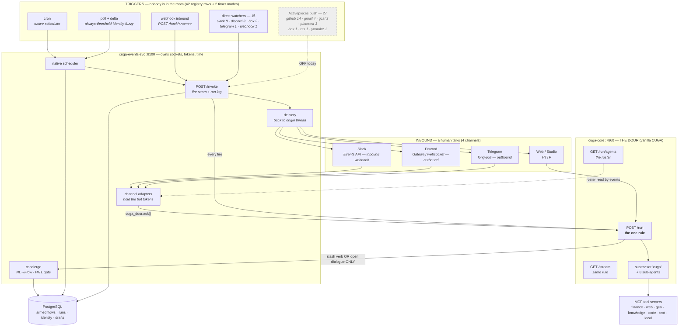
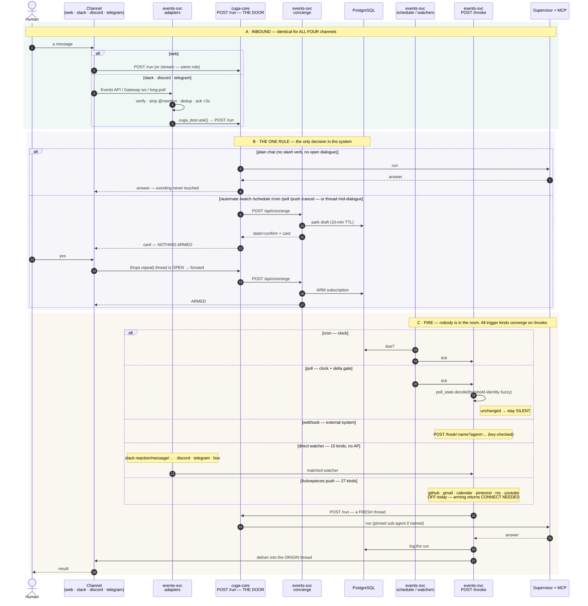
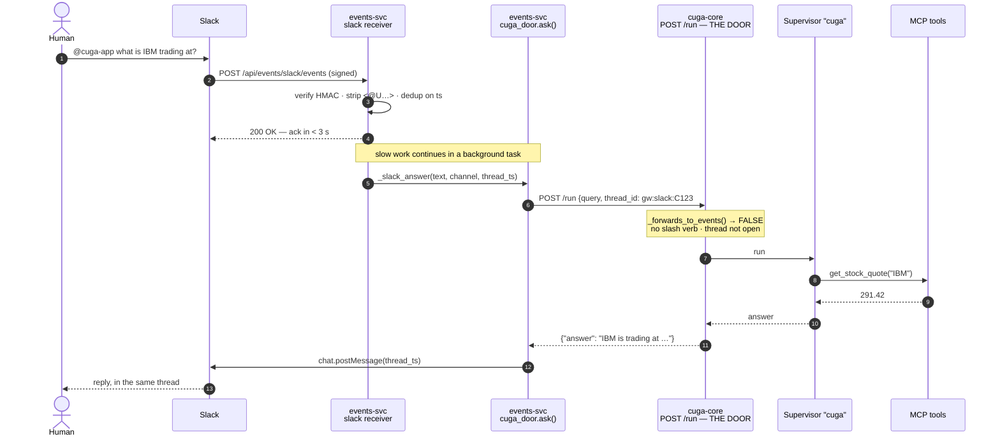
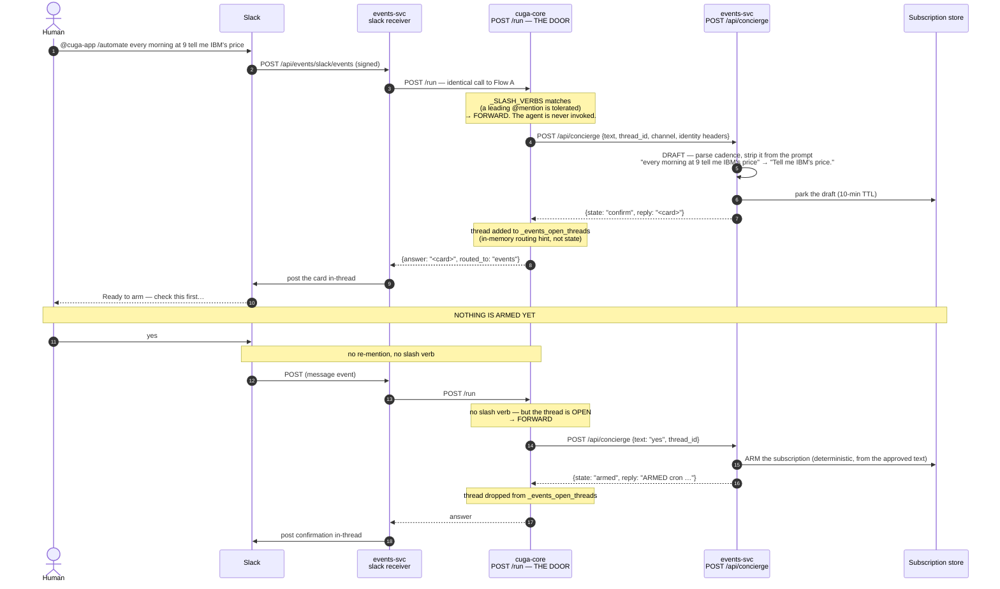
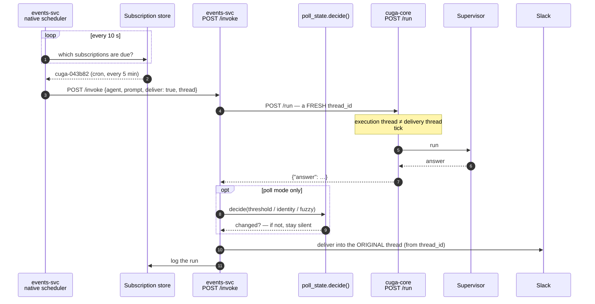
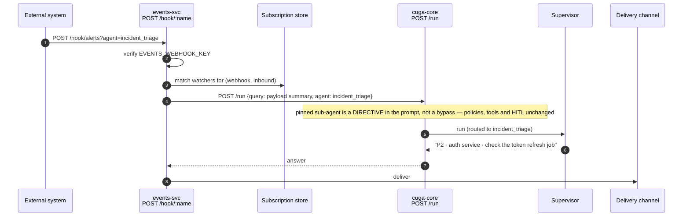
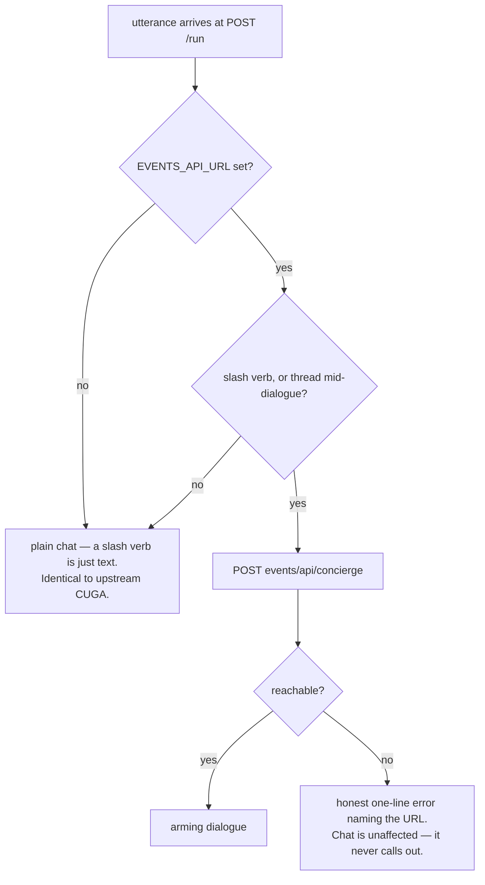
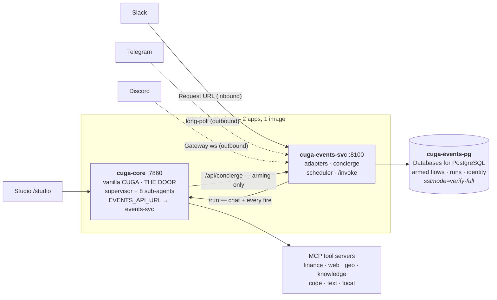
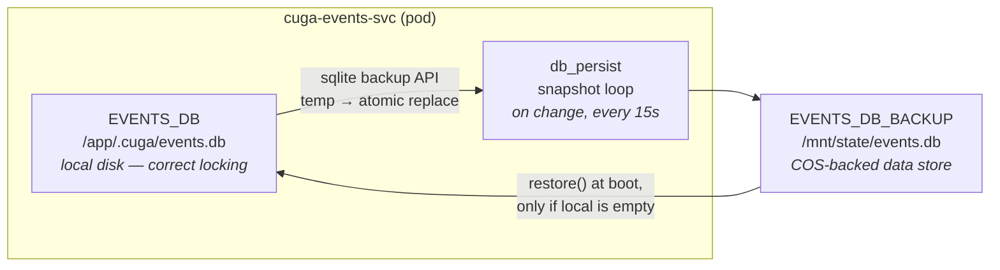

# Architecture — the door, the blocks, and the four flows

> **The one rule.** Every message from every channel lands on CUGA's `POST /run`. CUGA — not the
> eventing service — decides whether this one is ordinary chat or an attempt to arm something.
> An explicit slash verb, or a thread with an arming dialogue already open, goes to the eventing
> service. **Everything else is ordinary chat and never touches it.**

This document is the architectural record. For a narrative version see [DECK.html](DECK.html); for
step-by-step instructions see [RUNBOOK_TRY_IT.md](RUNBOOK_TRY_IT.md); for what to *type* see
[AUTOMATION_COOKBOOK.md](AUTOMATION_COOKBOOK.md).

---

## 0. The whole system, in one diagram

Every channel, every trigger, both processes, the database. **If you print one picture, print this
one.** The numbered flows in §2–§5 are close-ups of the paths shown here.



**Read it in one sentence:** humans enter on the left and always reach **`/run`**; time and external
systems enter on the right and always reach **`/invoke`**, which also calls `/run`. Everything that
outlives a request is in Postgres. The dashed box is Activepieces — present, switched off.

---

## 1. Two processes

Everything lives in exactly one of two processes. The split is not cosmetic — it is what lets CUGA
ship without any of this.

### `cuga-core` · :7860 — vanilla CUGA

Imports **nothing** from `cuga.backend.events` (a test fails if that regresses). Holds no bot token,
runs no scheduler.

| Block | Owns | Decides |
|---|---|---|
| **The door** — `POST /run` | The single entry point for every utterance from every channel. Non-streaming sibling of `/stream`. | **Chat or eventing** — one regex + one set lookup |
| `GET /stream` | SSE for the Studio UI. Applies the *same* rule. | Same one rule |
| Supervisor `cuga` | 8 sub-agents, the graph, model credentials, HITL, policies | Which sub-agent answers |
| `GET /run/agents` | The roster, machine-readable. **The roster belongs to whoever executes.** | — |
| MCP tool clients | finance · web · geo · knowledge · code · text · local | — |

### `cuga-events-svc` · :8100 — the eventing service

Its own process, its own deploy, its own lifecycle. Depends on CUGA (it cannot execute anything
itself). **CUGA does not depend on it.**

| Block | Owns | Decides |
|---|---|---|
| **Channel adapters** slack · discord · telegram | The sockets, and therefore **the bot tokens** | *nothing* — pure transport |
| `cuga_door.ask()` | Turns a channel message into `POST cuga-core/run`. Builds `thread_id = gw:<channel>:<native>#<locus>` — memory locus *and* delivery address in one string. | *nothing* |
| **Concierge** — `POST /api/concierge` | NL → Flow. The HITL state machine. Returns a `state` the door uses to keep the dialogue routed. | What gets armed — **only after a human confirms** |
| Subscription store | `events.db`, tenant-scoped. Armed flows + parked drafts (10-min TTL). | — |
| Native scheduler | cron + poll, in-process. Poll state answers *"did it actually change?"* | When to fire |
| `POST /invoke` · `POST /hook/<name>` | The fire seam and the inbound-webhook seam. Run logging, then delivery. | — |
| Activepieces engine | Present, **off**. One trigger backend for push on SaaS we don't own. | — |

**The shape of it:** the eventing service talks to CUGA **twice** — once *inbound* as a transport (a
human's message, via `/run`) and once *outbound* as an executor (a fired tick, via `/invoke` →
`/run`). CUGA talks to the eventing service exactly once, in one function, guarded by one
environment variable (`EVENTS_API_URL`).

### Triggers-only — a deliberate boundary

The events layer arms **triggers** and delivers the agent's answer. It does **not** run connector
*actions* (a Gmail reply, a GitHub comment). Anything the agent should *do*, it does through its own
tools — which keeps credentials and side-effects inside the agent rather than spread through the
event plumbing. The action half was built and then deleted (2026-07-30, ~2,640 LOC) rather than
gated, because a half-present feature is worse than an absent one.

**Legacy escape hatches**, both off by default: `EVENTS_SCHEDULER=ap` routes recurrence through an
Activepieces schedule instead of the native scheduler, and `EVENTS_<CHANNEL>_BACKEND=ap` routes a
channel through an AP webhook flow. Native and direct are the defaults everywhere.

---

## 1b. Every channel and every trigger, in one sequence

The companion to §0: the same coverage, but ordered in time. **This is the second diagram to print.**



Three things the diagram is meant to make obvious:

1. **Box A is the same for every channel.** The adapter differs; what reaches CUGA does not.
2. **Box B is the only decision.** One regex plus one set lookup, in one file, in one process.
3. **Box C converges.** Five different trigger kinds, one seam (`/invoke`), one execution path
   (`/run`) — so a new trigger type never touches the agent, and the agent never learns about time.

---

## 2. Flow A — plain chat (no slash verb)

The eventing service carries the message and carries the answer back. **The concierge, the scheduler
and the store are never touched.** Nothing is persisted.



---

## 3. Flow B — arming (`/automate`), with the human gate

Hops 1–3 are **byte-identical** to Flow A. The adapter never looks at the text. The fork is hop 4.



**Why the gate exists.** The risky part of "turn this sentence into a standing job" is not the
schedule — it is the **prompt the agent is handed on every fire**, forever, with nobody watching.
So a human reads it first. Arming is deterministic from the approved text; there is no second LLM
pass free to arm something you never read.

---

## 4. Flow C — the fire (nobody is in the room)

A tick is already-decided work aimed at a known agent, and it needs delivery + run-logging, so it
goes through `/invoke` rather than the door.



The delivery address rides on `thread_id` (`gw:<channel>:<native>#<locus>`), so a flow armed from
Slack fires back into that Slack thread without anyone passing a "reply to" anywhere.

---

## 5. Flow D — inbound webhook (an external system starts it)



---

## 6. What happens when the eventing service is absent

CUGA is a microservice that works on its own. This is the property the whole split exists to
protect.



| Scenario | What happens |
|---|---|
| Eventing never deployed (`EVENTS_API_URL` unset) | Forward disabled. `/run` and `/stream` behave exactly as upstream CUGA. |
| Eventing deployed but **down** | Chat unaffected. Arming returns an honest sentence naming the unreachable URL. No stack trace, no hang. |
| Eventing turned off | Same as never deployed — unset one variable. |

---

## 7. Deployment topology

Two Code Engine apps, one image, `min-scale 1` (the scheduler and channel loops are process-wide
singletons).



The database is reached **only by the eventing service** — `cuga-core` neither knows nor needs it,
which is the same one-directional coupling as everything else here. Local dev runs the identical
engine (`make pg`), so the storage path is exercised before it ships.

**Slack's Request URL points at `cuga-events-svc`, never at `cuga-core`.** "CUGA is the door"
describes where the *decision* happens — one hop later, invisible to Slack. The receiver did not
move.

### The events database — one engine everywhere

**`EVENTS_DB` takes a PostgreSQL URL**, and that is what local dev *and* Code Engine run:

```
EVENTS_DB=postgresql://cuga:…@host:5432/cuga_events   # local dev AND deployed — same engine
EVENTS_DB=/abs/path/events.db                          # SQLite, quickstart only
EVENTS_DB=:memory:                                     # SQLite, tests
```

**Why this changed.** Local dev used to be a SQLite file that survives everything, while Code Engine
ran SQLite on an ephemeral disk. Two different durability stories — and the fragile one was the only
one nobody exercised while developing. No local test could have caught the 2026-08-05 data loss,
because locally the failure mode did not exist. Same engine everywhere means local testing means
something.

| | |
|---|---|
| Start it locally | `make pg` — Postgres 16 in a container, prints the DSN |
| Test the deployed SQL path | `make test-pg` — 20 store tests against real Postgres |
| Inspect | `make pg-psql` · reset with `make pg-reset` |

SQLite is retained deliberately for the **hermetic offline suite** (360 tests that must not need a
database server) and for a zero-infrastructure quickstart. It is not the deployed configuration.
One seam — [`db.py`](../src/cuga/backend/events/db.py) — hides the three differences that matter:
`?` vs `%s` placeholders, `PRAGMA table_info` vs `information_schema`, and rows that must support
both `r["col"]` and `r[0]`. The SQL itself was already portable: `ON CONFLICT … DO UPDATE SET …
excluded.col` is Postgres syntax that SQLite adopted, and the schema uses only `TEXT`/`REAL`/`INTEGER`.

With Postgres, **durability is a property of the database** — no snapshot loop, no restore step, no
mount to configure. A new pod simply connects and the flows are there.

---

### Legacy: SQLite snapshot/restore (superseded by Postgres)

**The failure this fixes.** The container filesystem is ephemeral, and it is worse than "lost on
redeploy": Code Engine can replace the instance at any time — new revision, node drain, reschedule
— and the new pod starts with an empty disk. **No restart is recorded**; `ibmcloud ce app get`
still reads `Restarts: 0`, because that counter tracks crash-restarts of the *current* pod, not pod
replacement. Observed 2026-08-05: a cron armed from Slack at 11:12 was gone when a new pod started
at 11:24, and nothing in the logs said so.

**Why not simply put `EVENTS_DB` on the mounted volume.** Code Engine's persistent data store is
backed by a **COS bucket** — object storage, mounted via s3fs. SQLite on object storage is a
corruption hazard: POSIX advisory locking is not honoured, and a page write becomes a whole-object
rewrite. So the live database stays on local disk where locking behaves, and we copy consistent
snapshots to the mount.



Snapshots use SQLite's **online backup API**, not a file copy — consistent even mid-write — and are
written temp-then-`os.replace`, so an interrupted snapshot can never replace a good backup with a
truncated one. Restore refuses to overwrite a local DB that already has data.

| | |
|---|---|
| Turn it on | `./deploy/ce/3_state_store.sh` then `EVENTS_STATE_STORE=cuga-events-state ./2_deploy.sh` |
| Check it | `GET /api/events/status` → `.durability` — `{"durable": true, "subscriptions_in_snapshot": N}` |
| Worst-case loss | one snapshot interval (15 s) of changes |
| Correct for | **exactly one writer** — which is what we deploy (`min-scale 1 / max-scale 1`) |

> **Superseded.** This whole mechanism exists only for the SQLite configuration. Point `EVENTS_DB`
> at a Postgres URL and none of it runs — no `EVENTS_DB_BACKUP`, no mount, no snapshot loop. Keep
> it only if you are deliberately running SQLite somewhere durable-ish.

---

## Sources

`src/cuga/backend/server/main.py` (`_SLASH_VERBS`, `_forwards_to_events`, `_forward_slash_to_events`,
`run_sync`, `/run/agents`) · `src/cuga/backend/events/cuga_door.py` ·
`src/cuga/backend/events/app.py` (channel receivers, `/invoke`, `/hook`) ·
`src/cuga/backend/events/concierge.py` · `src/cuga/backend/events/native_scheduler.py` ·
`src/cuga/backend/events/poll_state.py` · `deploy/ce/2_deploy.sh`
