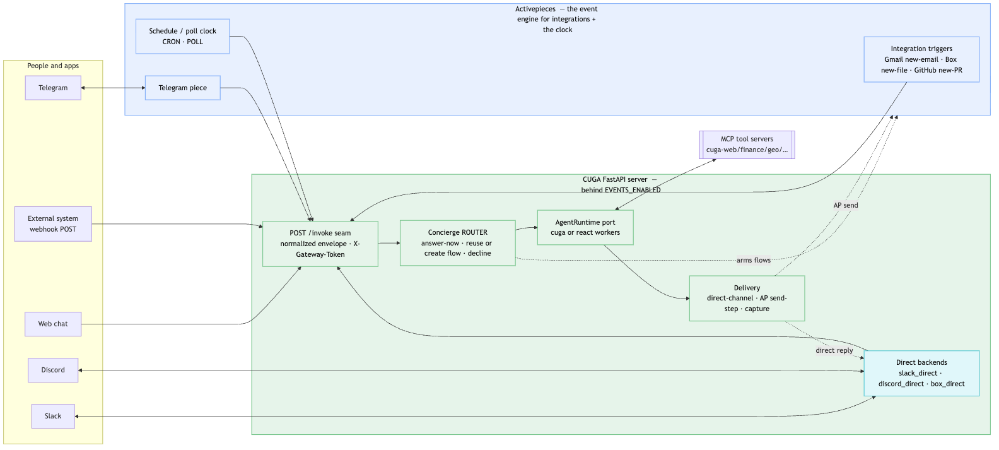

# DESIGN — event-driven concierge on CUGA (the goal)

**Status: the architecture doc.** Everything here is built and verified — channels (web/Telegram +
direct Slack/Discord), integrations on AP (Gmail/Box/GitHub), and all trigger modes
(NOW/CRON/POLL/PUSH/webhook). For the live status table see [README.md](README.md); for the model of
record see the ADRs in [decisions/](decisions/) (0005 the router, 0007 identity, 0008 direct
backends). This doc is the durable "why it's shaped this way"; [KNOWN_GAPS.md](KNOWN_GAPS.md) has the
deferred items.

Build target: an **event-driven agent platform** on CUGA's FastAPI server — a **concierge**
turns natural language into **worker agents** + **Activepieces (AP) flows**; AP owns every
connection, trigger, credential, and delivery.

---

## 1. Principles (the non-negotiables)
1. **Reuse CUGA, don't duplicate** — agent CRUD, tools/MCP config, secrets, the `/stream`
   runtime, and `thread_id`/memory are all reused (see [ARCHITECTURE.md](ARCHITECTURE.md)).
2. **AP owns the event plane** — connections (channels + integrations), triggers, delivery,
   integration credentials, run history. CUGA has none of this today (by design).
3. **Additive + opt-in = non-breaking** — everything behind `settings.events.enabled`
   (default off). Vanilla CUGA is byte-for-byte unchanged when off. `/stream` is never modified.
4. **Two agent backends, behind one port** — every worker runs as either a **CUGA agent** or a
   **LangGraph ReAct agent**, through a single `AgentRuntime` interface (§4). This is both a
   feature (choose per worker) and the portability guarantee.
5. **Preserve multi-agent + thread_id by using them** — workers are real `agent_id`s;
   `thread_id` flows end-to-end into per-thread memory (§8).
6. **Triggers are inferred, not declared** — the user says what they want; the concierge
   derives the trigger `(source × cadence)` from the utterance against what's wired.
7. **Testable by default** — deterministic flow builders, a **dry-run** mode, an end-to-end
   **trace id**, and an eval over the conformance utterances make every path inspectable (§12).

## 2. Conceptual model (brief; full version in refactor/)
- **Connector** = a link to an external system, seen two ways: **Channel** (converse-with:
  web/telegram/slack — a human on the other end) and **Integration** (watch/act-on:
  gmail/box/github/outlook — an app). One `connector` idea, two UI views.
- Every wiring is **Source → Agent → Sink**. A **trigger** = a source at a cadence
  (NOW/CRON/PUSH/POLL). **Connections live in AP**, not CUGA.
- **Agent = skill (prompt) + tools (MCP) + wiring (connectors).** Its **capability envelope** =
  the set of `source → skill → sink` utterances every leg of which is wired.

## 3. Architecture



*Channels reach CUGA directly (Slack/Discord) or via AP (Telegram); integrations always go through
Activepieces; every trigger converges on `/invoke`. Source: [architecture.mmd](architecture.mmd).
The detailed component view:*

```
              ┌─────────────────── CUGA FastAPI server (opt-in: settings.events.enabled) ──────────────────┐
  web chat ──►│  /stream (existing, untouched)      ➕ POST /invoke   (AP seam; normalized envelope)        │
  Telegram ──►│  /api/manage/* (reuse: agent CRUD)  ➕ POST /api/concierge (NL → flow; reuses SSE)          │
  (via AP)    │  /api/secrets/* (reuse: encrypted)                                                          │
              │                                                                                             │
              │         CONCIERGE (a runtime ROUTER over pre-built agents; never answers directly)          │
              │           list_capabilities · answer_now · find_or_create_flow · decline                    │
              │                         │                         │                                          │
              │                         ▼ (port)                  ▼ (REST)                                   │
              │              ┌──────────────────────┐   ┌───────────────────┐                               │
              │              │   AgentRuntime port   │   │  AP engine client │                               │
              │              │  ├ CugaAgentRuntime   │   │  (build/arm flows)│                               │
              │              │  └ LangGraphReactRT   │   └─────────┬─────────┘                               │
              │              └───────────┬──────────┘             │                                          │
              │        reuse: config_store · DynamicAgentGraph    │  subscription index (thin, new table)    │
              └───────────────────────────────────────────────────┼──────────────────────────────────────────┘
                                                                   │ create/arm flows      ▲ POST /invoke (every fire)
                                                                   ▼                       │
                                        ┌──────────────── ACTIVEPIECES (the one engine) ───┴────────┐
                                        │ connections (channels+integrations) · triggers · delivery │
                                        │ cron · webhook · poll · run-once · connector send-steps    │
                                        └───────────────────────────────────────────────────────────┘
                                          ▲ webhooks/messages        ▲ app events
                                     channels (tg/slack)         integrations (gmail/box/github)
```
Net-new on CUGA: **two endpoints** (`/invoke`, `/api/concierge`), the **concierge** agent, the
**AgentRuntime port** (2 adapters), an **AP engine client**, and a **thin subscription index**.

## 4. The `AgentRuntime` port — two backends
The single seam between the event plane and "an agent." Everything agent-related goes through
it; the concierge/AP/channels never call a framework directly.

```
interface AgentRuntime:
    upsert_agent(spec) -> agent_id
    get_agent(agent_id) -> spec | None
    list_agents() -> [spec]
    run(agent_id, thread_id, input, *, deliver_to=None) -> answer     # per-thread memory
```

**Adapter A — `CugaAgentRuntime` (backend = "cuga")**
- `upsert_agent` → `config_store.save_config(agent_id, config)` (reuse; versioned, multi-agent).
- `run` → `get_or_build_agent_graph(agent_id)` (LRU-cached `DynamicAgentGraph`, built from
  `config_store.load_config(agent_id)`) → `event_stream(agent=graph, thread_id=…)` (reuse).
  **No `/stream` change** — `event_stream` already accepts a pre-built graph (`main.py:1286`).
- Memory: CUGA's LangGraph `MemorySaver` keyed by `thread_id` (reuse).
- Gets CUGA's supervisor/sub-agents, policies, knowledge, tools for free.

**Adapter B — `LangGraphReactRuntime` (backend = "react")**
- `upsert_agent` → store the spec (prompt + MCP tools) in the subscription/agent index.
- `run` → `create_react_agent(model, tools, prompt, checkpointer=MemorySaver())` with
  `config={"configurable":{"thread_id": thread_id}}` (the proven event-agent-ap executor).
- Lighter, framework-independent, no CUGA runtime dependency — the **portability proof** and
  the default for simple workers.

**Why both:** (1) you can pick the right engine per worker (CUGA for rich policy/knowledge/
supervisor work; ReAct for lightweight reactors); (2) two live implementations prove the port
is real, so **moving off CUGA later = writing a third adapter, not a rewrite**.

> **Default backend (decided): the CONCIERGE is react, the WORKERS are cuga.** The concierge
> (NL → flow) is a lightweight react tool-caller; the **workers do the hard work of answering**,
> so they run on **CUGA** by default (`EVENTS_WORKER_BACKEND=cuga`) to get policies / knowledge /
> supervisor / tools (MCP tools via the CUGA registry — [MCP_SETUP.md](MCP_SETUP.md)).
> `CugaRuntime` uses the shared `AgentStore` for storage + isolation. **No silent react
> fallback** — if the CUGA stack is absent or a build/run fails, `run` **raises**; a react
> fallback exists only with `EVENTS_CUGA_FALLBACK_REACT=1`. Set `EVENTS_WORKER_BACKEND=react` to
> force react workers.

## 5. The two new endpoints
**`POST /invoke`** — the one seam AP calls back through, for every trigger. Machine auth via
`X-Gateway-Token`. Normalized envelope:
```json
{ "source": {"type":"channel|integration|time","name":"telegram|gmail|…","thread_id":"…"},
  "event":  {"kind":"message|new_email|new_pr|tick|runonce","payload":{…}},
  "text":   "<utterance if source is a channel>",
  "agent":  "<target agent_id, when the subscription names one>",
  "deliver": true }
```
Handler → `AgentRuntime.run(agent, thread_id, text/payload)` → return answer (and deliver if asked).

**`POST /api/concierge`** — NL → decision. Reuses the `/stream` SSE machinery. Runs the
concierge agent. **UPDATED (decisions [0005](decisions/0005-runtime-router-over-prebuilt-agents.md)
/ [0006](decisions/0006-auth-connection-model.md)):** agents are **pre-built by a builder**; the
concierge is a **runtime ROUTER**, not an agent factory. Meta-tools: `list_capabilities` (pre-built
agents + their connectors) → `answer_now(agent)` (NOW) **or** `find_or_create_flow(agent,…)` (reuse
a matching flow, else create) — and **decline** if nothing fits. Per-user integrations trigger a
just-in-time **connect** (CUGA hosts OAuth, AP holds the token). `provision_agent` is removed.

The concierge also accepts **slash commands** (parsed in `concierge.py`, from any surface — web chat
*or* channels, all via `concierge.run`). **`/automate <what>`** is the router-driven one: a heuristic
classifier picks the trigger mode (**push / cron / poll**) from the phrasing, so the user never picks
a mode (`/automate summarize new emails and message me` → PUSH · `/automate the market brief every
weekday at 8am` → CRON · `/automate check bitcoin every 5 min on a move` → POLL). Reliability is
hybrid: the *mode* is always deterministic (the classifier); the *agent* resolves deterministically
for PUSH (filtered by the source's integration) and via the LLM for CRON/POLL (with the mode FORCED).
Five hidden power-user overrides force a mode: `/watch` (smart, = `/automate`), `/push`, `/schedule`,
`/cron`, `/poll`.

## 6. NL → Flow: reason vs. build (how the concierge translates)
**Decision:** the flow is **not** figured out by hardcoded rules, and **not** by an LLM emitting
raw AP JSON. The **model reasons; deterministic code builds.**

```
NL ─► CONCIERGE (LLM/agent)  — fuzzy, adaptive
        interprets intent · reuse-or-create · classify NOW/CRON/PUSH/POLL
        identifies source connector · sink(s) · worker prompt · cadence
     ─► calls a meta-tool with TYPED args
        create_subscription(mode, source, event, cron, target_agent, deliver_to, prompt)
     ─► FLOW BUILDER (code)  — structural, safe
        parameterized template per shape → valid AP flow JSON (trigger ▸ /invoke ▸ router ▸ send)
     ─► AP
```
The LLM fills the **slots**; code renders the **structure**.

**Why not the extremes**
- *Hardcoded rules* ("contains 'every morning' → cron") — brittle; intent phrasings are infinite. ❌
- *LLM emits raw AP JSON* — hallucinated piece names/fields, invalid/unsafe flows. ❌ (not the default)
- *LLM-planner + typed tools that build* — adaptive understanding **and** guaranteed-valid flows. ✅

**What "the code" is:** a small library of **flow builders**, one per shape (NOW / CRON / PUSH /
POLL / router / fan-out), each taking typed args and emitting AP JSON (templated versions of the
`sample_flow.*.json` files). Benefits: **schema-validated before publish** (fail cleanly, never a
half-broken flow) and **unit-testable** (you can't unit-test an LLM's JSON).

**Escape hatch & scaling:**
- Exotic flows → the LLM drops to a generic **HTTP / Custom API Call** step (schema-validated).
- Compound requests ("brief me AND review PRs AND…") → an optional **CUGA planner sub-step**
  decomposes into a *sequence* of typed tool calls — where CUGA's planning beats a thin ReAct loop.

Net: **intent by the model, structure by code, validated before it ships.**

## 7. Model choice (concierge vs. workers)
**Decision:** the concierge is *an agent*, so its model is a **config value, not hardwired** —
reuse each stack's provider abstraction (CUGA `llm: {provider, model}` supporting
`rits|anthropic|openai|watsonx|litellm|ollama`; event-agent-ap `create_llm()` /
`LLM_PROVIDER`+`LLM_MODEL`, default watsonx `gpt-oss-120b`). But choose **by plane**:

| Plane | Needs | Tier |
|---|---|---|
| **Concierge** (control) | reliable **tool/function-calling** + classification/planning | a **strong instruction/tool-following model** |
| **Workers** (data) | do the task; often simple | **cheaper/faster**, per agent |

**Recommendation**
1. **Default** to the deployment's configured LLM (a CUGA install "just works").
2. **Concierge** → favor a frontier tool-caller for reliability: **Claude (Sonnet 4.x)** or a
   GPT-4-class model; if staying **in-house IBM**, watsonx's **strongest** tool-caller
   (Granite-3.x instruct or Llama-3.x-70B) — **not** a small model.
3. **Workers** → cheapest that does the job, set per-agent.

**Why it's low-stakes (but one thing to verify):** the §6 builders shrink the model's job to
picking **typed slots**, not emitting valid JSON — so a mid-tier model can drive the concierge
*if its tool-calling is reliable*. **Validate that empirically:** ship a small **eval** (the
conformance utterances → expected tool sequence `list_capabilities → answer_now |
find_or_create_flow`) as the **acceptance test**, so models can be swapped and measured rather
than guessed. Test the current `gpt-oss-120b` default there first; bump the concierge to a
stronger model if it's flaky at chaining tools (workers can stay cheap).

## 8. Preserving multi-agent + thread_id (invariants)
- **Multi-agent (our layer adds meaning (a)):** each worker is a distinct top-level `agent_id`,
  executable on demand via `get_or_build_agent_graph`. This **complements** CUGA's existing
  supervisor/sub-agents (meaning (b)) — a worker's config may itself be a supervisor.
- **thread_id:** the envelope's `thread_id` → CUGA's `X-Thread-ID` / `configurable.thread_id` →
  the LangGraph checkpointer. A chat's thread = the chat id (follow-ups keep context); a
  standing trigger (CRON/PUSH) gets a **stable per-subscription thread_id** so each watcher
  accrues its own context. **No parallel memory** — CUGA's conversation store stays the truth,
  and its `/api/conversation-*` endpoints keep working for these threads.

## 9. Data model (minimal — reuse first)
- **Agents** → CUGA `agent_configs` (reuse; no new table).
- **Connections** (channels + integrations) → **AP** (list/read via AP; CUGA doesn't store creds).
- **Secrets** → CUGA secrets subsystem (Fernet/Vault) for CUGA-side creds; AP for integration creds.
- **Runs / history** → **AP run history** (one observability pane).
- **New table — `subscription`** (thin index of what we armed):
  `id · mode[NOW|CRON|PUSH|POLL] · source_type · source_connector · ap_flow_id · target_agent ·
   backend[cuga|react] · deliver_to[] · thread_id · status`.

## 10. Security (two-tier)
- **Integration creds** (Gmail/Box OAuth, GitHub PAT) → **AP** connection store (encrypted,
  OAuth-refreshed — the thing CUGA lacks).
- **CUGA-side creds** (LLM keys, MCP tokens, `X-Gateway-Token`) → CUGA **secrets** (Fernet at
  rest / Vault). Configs reference them by `db://` / `vault://`. **Nothing plaintext in config.**

## 11. Build status
All of it is built and verified — the agent seam (`/invoke` + both runtimes), the timer watchers
(CRON/POLL via AP), integrations & PUSH (Box/Gmail/GitHub), channels inbound (Telegram via AP +
direct Slack/Discord), delivery (AP send-step + direct-channel), and the Studio. The live
per-connector status table is in [README.md](README.md); the test coverage matrix and the exact
runnable checks are in [TESTING.md](TESTING.md); deferred items are in [KNOWN_GAPS.md](KNOWN_GAPS.md).

## 12. Testability, tracing & the acceptance test
The system is testable **by construction**; this section makes that explicit (Principle 7).

**Easy local test loop**
- Run CUGA with `settings.events.enabled=1`. For pure agent tests you don't even need AP —
  hit `POST /invoke` directly with a hand-written envelope (curl).
- For the event plane, a local AP (Docker on :8081) + a tunnel only when a real inbound
  webhook is needed. **CRON/POLL** are testable with **fast intervals** (every 1–2 min).

**Dry-run (no side effects)** — `POST /api/concierge?dry_run=1`: the concierge classifies +
**builds the AP flow JSON but does NOT publish** it or create connections. Returns the decision
(reuse/create, mode, source, sink) + the would-be flow. Lets you test **NL→Flow** with zero side
effects and diff the output against `sample_flow.*.json`.

**Echo / test channel & test backend** — a `channel=echo` sink that **logs instead of
delivering** (no real Telegram/Gmail needed), and the `react` backend with a stub model for
deterministic runs. So an end-to-end test needs no external accounts.

**End-to-end trace id** — every request carries a **`trace_id`** (generated at the inbound edge
or passed as `X-Trace-Id`), threaded through and stamped on every log line at each seam:
```
[trace=abc123] inbound        source=channel/telegram thread=gw:telegram:42 text="…"
[trace=abc123] concierge      decision=CREATE agent=resume_judge mode=PUSH source=box/new_file
[trace=abc123] flow.build     shape=push+router ap_flow_id=… (dry_run=false)
[trace=abc123] invoke         agent=resume_judge backend=cuga  thread=sub:resume_judge-… 
[trace=abc123] worker.done    ok=true ms=1840 verdict="MATCH …"
[trace=abc123] deliver        via=gmail ok=true
```
Grep one `trace_id` → the whole life of a request across CUGA **and** AP.

**Three observability panes (reuse what exists):**
| Pane | Shows | Source |
|---|---|---|
| **Langfuse** | the agent's LLM reasoning + tool calls (concierge & workers) | CUGA already wires a `langfuse_handler` (`main.py`) |
| **AP run history** | trigger fired · flow steps · delivery | Activepieces (the one flow pane) |
| **`/api/runs` + trace logs** | our seam-level structured log, keyed by `trace_id` | the concierge layer |

**Acceptance test (the eval)** — the **conformance utterances → expected outcome**
(`{mode, agent action, source, sink, tool sequence}`), run in **dry-run** so it's fast and
side-effect-free — the **model swap harness** (§7): change the model, rerun, compare pass-rate.
The eval oracle lives in `classify.py` and is exercised by the offline suite.

**Real e2e tests (not mocks).** Beyond dry-run, a full suite runs the watchers against **live
MCP servers + real AP + real triggers**, with deliveries captured on a real HTTP sink. The
coverage matrix and the exact runnable checks are in [TESTING.md](TESTING.md).

## 13. Scope & parity with event-agent-ap (must-work checklist)
The port must make **all** of event-agent-ap's use cases work, not just the resume watcher.
Grounded in an inventory of that repo:

- **7 MCP servers**, auto-registered by name (known URL pattern):
  `cuga-web · cuga-knowledge · cuga-geo · cuga-finance · cuga-code · cuga-local · cuga-text`
  (`https://cuga-apps-mcp-<app>.1gxwxi8kos9y.us-east.codeengine.appdomain.cloud/mcp`).
  ⚠️ scale-to-zero → **warm before demos/tests**.
- **14 agents, pre-seeded** (`seed.py`; the concierge ROUTES to them, never creates them — see
  decision 0005): `pricebot`, `geobot`, `weatherbot`, `papers`, `market_briefer`, `research_compass`,
  `city_briefing`, `code_auditor`, `mailbot`, `resume_judge`, `support_digest`, `pr_reviewer`,
  `github_trending`, `incident_triage`, + the `concierge` router.
- **Full example set** (from `catalog.py` / the Examples tab): NOW · follow-ups
  (per-thread memory) · CRON · POLL · PUSH · multi-channel fan-out.
- **The 3 watchers** (the headline e2e targets):
  | Watcher | Mode | Agent · MCP | Trigger | Delivery |
  |---|---|---|---|---|
  | **Stock** | POLL | pricebot · cuga-finance | timer + emit-on-change (`get_state`/`set_state`) | Telegram |
  | **arXiv/papers** | CRON | papers · cuga-knowledge | schedule (e.g. weekdays 9am) | Telegram |
  | **Resume** | PUSH | resume_judge · box tools+mcp-text | Box `new_file` (folder) | Gmail/Telegram (router on MATCH) |
- **Cross-cutting:** reuse-first routing · per-thread memory · web chat + Telegram · fan-out ·
  run history — all covered by the offline + live suites ([TESTING.md](TESTING.md)).

## 14. UI changes — CUGA Studio (additive) — ✅ BUILT
CUGA serves a React frontend (catch-all route). We **add** views behind the events flag; the
Channels/Integrations split mirrors the connector model (Decision 6 — two views, one concept).
The UI is **dumb**: config + visibility only, all decisions server-side. Full details in
[STUDIO_UI.md](STUDIO_UI.md). Built into `src/frontend_workspaces/frontend/src/StudioPage.tsx`
(+ `ConciergeChat.tsx`), route `/studio`, gated on `GET /api/events/status`.
| View | Shows | Talks to | Status |
|---|---|---|---|
| **Concierge** | NL chat → reuse/create + arm; **Preview** toggle = dry-run plan | `POST /api/concierge` (+`?dry_run=1`) | ✅ |
| **Channels** (converse-with) | web · telegram · discord · slack — real status (token present?) | `GET /api/events/channels` | ✅ |
| **Integrations** (watch/act-on) | gmail · box · github — real connection status (AP connection or direct token), **CUGA-hosted Connect/Reconnect** (`/api/events/connect/*`) | `GET /api/events/integrations` | ✅ |
| **Agents** (build) | the worker fleet + **Add/Edit** an agent (skill · tools · connectors · access) | `GET`/`POST`/`PUT /api/events/agents` | ✅ |
| **Flows** | armed subscriptions (NOW/CRON/PUSH/POLL badges) + backend + delivery | `GET /api/events/subscriptions` | ✅ |
| **Examples** | click-to-load catalog (event-agent-ap set) → loads into the Concierge tab | `GET /api/events/examples` | ✅ |
| **Agents** | the pre-built worker fleet + tools/channels/integrations/access | `GET /api/events/agents` | ✅ |
Existing CUGA UI is untouched when the flag is off (the Studio nav + route hide themselves).
Descriptors/catalog are server-side (`connectors.py`, `catalog.py`) so the UI can't drift from
what the backend supports.

## 15. Open items
The current deferred list lives in [KNOWN_GAPS.md](KNOWN_GAPS.md) (the reviewer's list). Durable
architectural follow-ups: `get_or_build_agent_graph` cache eviction + concurrency (LRU + per-agent
build lock); AP piece coverage per integration (verify the trigger/action shapes before promising a
new flow); unifying the two flow-builder paths (`flows.py` dry-run vs `ap_engine.py` live REST).
