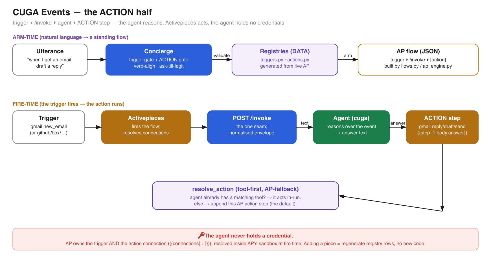
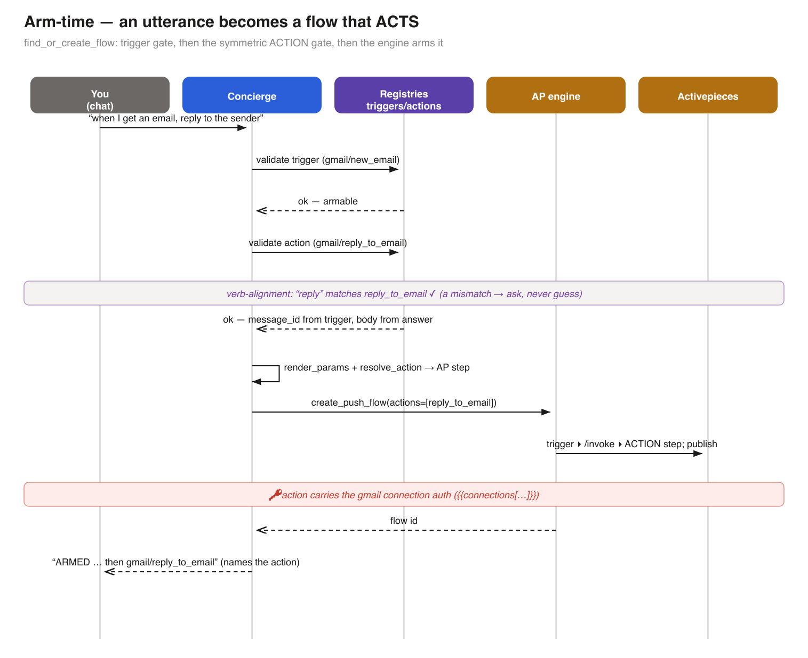
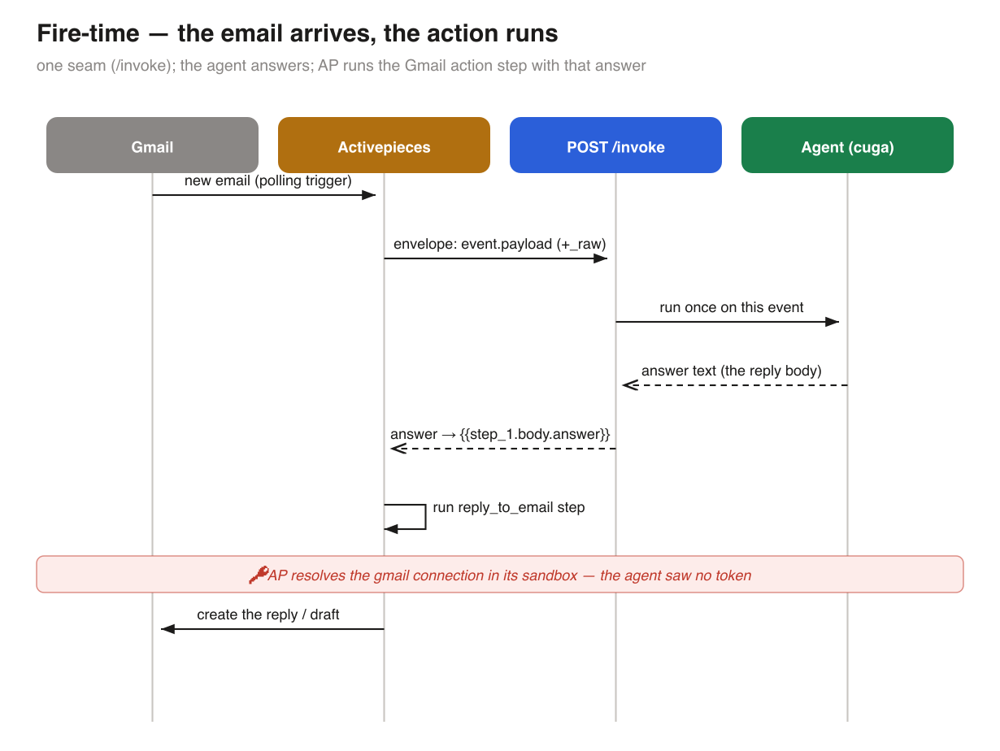
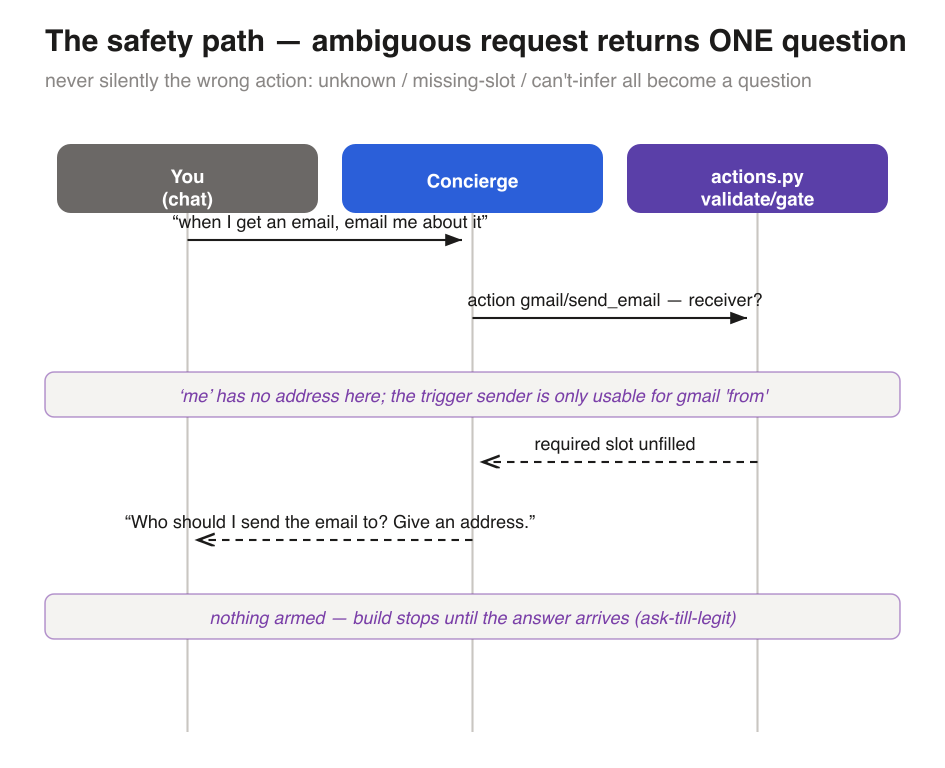

# CUGA Events — the Action half

The **trigger half** answers *"what can we watch?"* (`triggers.py`). This is the **action half**:
*"what do we DO when it fires?"* After the agent answers, the flow runs a connector **action**
(Gmail send / reply / draft) as a step. Full design + build status:
[`../plans/TRIGGERS_ACTIONS_DESIGN.md`](../plans/TRIGGERS_ACTIONS_DESIGN.md). Set-up:
[`../setup_action.md`](../setup_action.md). Acceptance checklist:
[`../checklist_actions.html`](../checklist_actions.html).

Diagrams are generated from the code — edit `gen_action_diagrams.py` and rerun, never hand-edit the
SVGs:

```
uv run python events_docs/actions/gen_action_diagrams.py
```

## Architecture

The agent **reasons**; Activepieces **acts**; the agent **never holds a credential**. Adding a new
piece's actions is DATA (regenerate registry rows), not code.



## Arm-time — an utterance becomes a flow that acts

`find_or_create_flow` runs the **trigger gate**, then the symmetric **action gate** (validate →
verb-align → render params → `resolve_action`), then the engine arms `trigger ▸ /invoke ▸ action`.
The confirmation **names the action**, so a mis-mapped action is visible before it goes live.



## Fire-time — the email arrives, the action runs

One seam (`/invoke`). The agent's answer flows into the action step as `{{step_1.body.answer}}`; AP
resolves the acting app's connection inside its own sandbox and runs the action.



## The safety path — an ambiguous request returns one question

Never silently the wrong action. Unknown action, a missing required slot, or a recipient we can't
infer all become **one question** and build nothing (`ask-till-legit`, extended to actions).



## Where it lives in the code

| Concern | File |
|---|---|
| Action registry (Gmail: send/reply/draft) + `validate` + `render_params` + `resolve_action` | `src/cuga/backend/events/actions.py` |
| `action_step` renderer, Option-B `router_step`, `build_action_tail`, `approval_step` | `src/cuga/backend/events/flows.py` |
| Concierge action gate (`find_or_create_flow`: `action`, `action_to`) | `src/cuga/backend/events/concierge.py` |
| Live arming (`create_push_flow(actions=…)`, `_action_op`) | `src/cuga/backend/events/ap_engine.py` |
| Generator (drafts rows from live AP) | `scripts/gen_actions.py` |
| Tests | `tests/events/test_events_actions.py`, `test_events_action_gate.py`, `live_gmail_action_e2e.py` |
