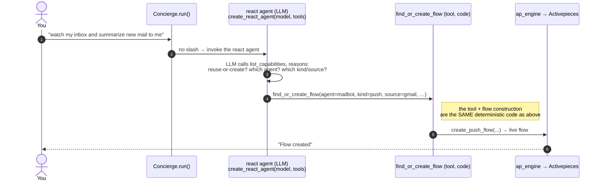

# `/automate` — how a natural-language command becomes a live flow

Two phases: **ARM** (when you type the command) and **FIRE** (when an email actually lands).
For a `/automate` **push** command, arming is **pure deterministic code — no LLM**.

## Phase 1 + 2 — the `/automate` (push) path

```mermaid
sequenceDiagram
    autonumber
    actor You as You (Slack)
    participant CX as Concierge.run()
    participant SP as slash router<br/>(_slash_parse + _resolve_agent)
    participant FF as find_or_create_flow<br/>(concierge tool)
    participant APE as ap_engine
    participant AP as Activepieces
    participant INV as CUGA /invoke
    participant MB as mailbot<br/>(CUGA worker)

    rect rgb(235,245,255)
    Note over You,APE: PHASE 1 — ARM  ·  "/automate summarize new emails and message me"  ·  PURE CODE
    You->>CX: "/automate summarize new emails and message me"
    CX->>SP: leading "/" → slash router (LLM skipped)
    Note right of SP: classifier reads words → NOW<br/>/automate forces STANDING → PUSH<br/>source detector → gmail / new_email<br/>filter agents by gmail integration → mailbot
    SP->>FF: find_or_create_flow(agent=mailbot, kind=push,<br/>source=gmail, event=new_email, prompt=…)
    FF->>FF: sink = the Slack channel you asked from;<br/>wire your gmail OAuth connection
    FF->>APE: create_push_flow(...)
    APE->>AP: build flow: [gmail new_email trigger] → [HTTP → CUGA /invoke]
    AP-->>FF: ap_flow_id
    FF-->>You: "Flow created: push-gmail-mailbot"
    end

    rect rgb(235,255,235)
    Note over AP,MB: PHASE 2 — FIRE  ·  a new email lands (minutes/hours later)
    AP->>AP: gmail trigger polls, sees a new email
    AP->>INV: POST /invoke {source:gmail,<br/>event:{kind:new_email, payload:{subject,from,snippet}},<br/>agent:mailbot, deliver:true}
    INV->>INV: validate + normalize envelope
    INV->>MB: run mailbot on the email payload
    MB-->>INV: summary
    INV-->>You: deliver summary → your Slack channel
    end
```

## Contrast — plain natural language (no slash) uses the LLM



## Who does what — code vs LLM

| Step | `/automate` push | `/automate` cron/poll | plain natural language |
|---|---|---|---|
| Detect it's a standing request | code (slash) | code (slash) | **LLM** |
| Pick the **mode** (push/cron/poll) | **code** (classifier) | **code** (classifier) | **LLM** |
| Pick the **agent** | **code** (integration filter) | **LLM** (mode forced) | **LLM** |
| Build the **flow** (AP JSON) | **code** (`flows.py`/`ap_engine`) | code | code |
| Run the worker on a fire | CUGA agent | CUGA agent | CUGA agent |

**Key invariant:** the LLM only ever *selects parameters* (which agent, which mode) and *calls* the
`find_or_create_flow` tool. It **never writes the flow** — flow construction is always fixed,
deterministic code. The concierge is a *runtime router*, not an agent/flow factory
([decisions/0005](decisions/0005-runtime-router-over-prebuilt-agents.md)).
