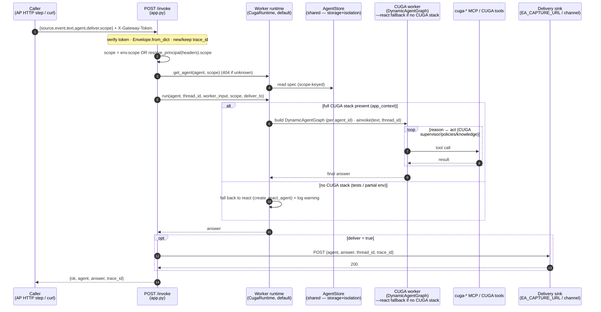

# 01 — NOW worker via `POST /invoke` (the agent seam)

The one seam every trigger (and any direct caller) uses to run an arbitrary agent. This is the
core of Phase 1: a normalized envelope in → the **worker does the hard work** (a **CUGA** agent by
default) → an answer out (and an optional delivery). Code:
[`app.py`](../../src/cuga/backend/events/app.py) `invoke`,
[`runtime.py`](../../src/cuga/backend/events/runtime.py) `CugaRuntime.run` (→ react fallback).

**Verified by:** the **CUGA** worker path is **live-verified** — `live_cuga_worker_check.py`
(full `.venv`) provisions a `backend=cuga` worker → builds a `DynamicAgentGraph` on demand →
runs it via CUGA's real `AgentLoop` → returns an answer (`executed via: CUGA DynamicAgentGraph`).
The **react** fallback path is verified by `live_react_check.py` + `live_phase2_watchers.py`
(focused venv). Memory is per `thread_id` either way. (Next: attach the worker's MCP servers to
the CUGA graph so cuga workers get tools — see [../TODO.md](../TODO.md).)
