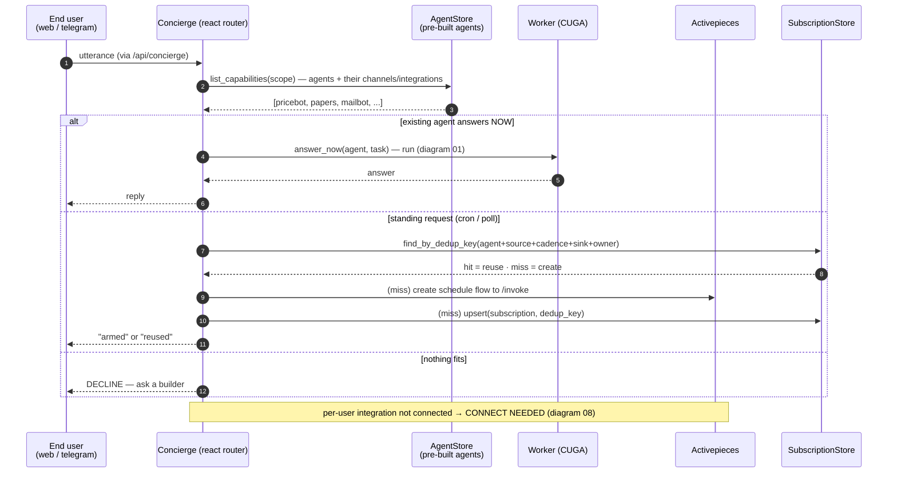

# 02 — Concierge = runtime ROUTER over pre-built agents

Agents are **pre-built by a builder** (skill + tools + bound channels/integrations). At runtime
the concierge ([`concierge.py`](../../src/cuga/backend/events/concierge.py)) is a **router**, never
an agent factory: it lists what exists and routes the utterance to **answer-now**, **reuse/create
a flow**, or **decline**. Decision: [0005](../decisions/0005-runtime-router-over-prebuilt-agents.md).

**Verified live** (`live_server_e2e_check.py`, 6/6 over HTTP): answer-now → real BTC price via the
pre-built `pricebot`; a standing request → an AP flow; the **same** request again → **reuses** it
(dedup); "book me a flight" → **declines**. The concierge never creates an agent.

**Dry-run** (`/api/concierge?dry_run=1`) still returns the deterministic plan with no side effects.
