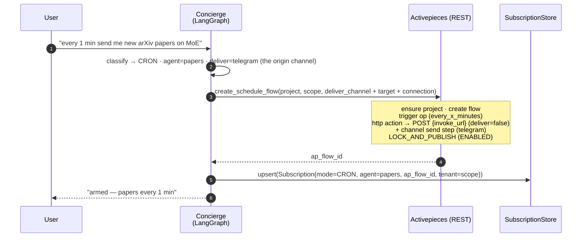
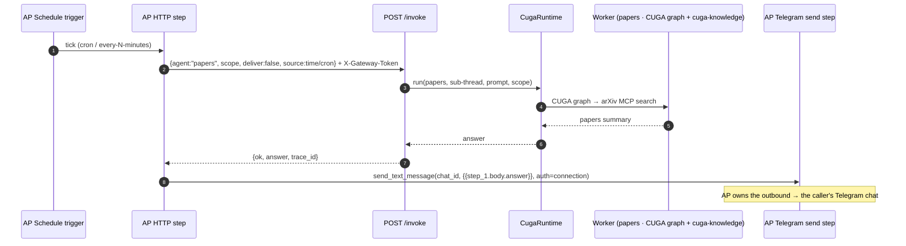

# 03 — CRON / POLL watcher via Activepieces (Phase 2)

Two phases in time: **(A) arm** — the concierge builds a real AP schedule flow; **(B) fire** —
minutes later AP's clock triggers, POSTs the envelope back through `/invoke`, the worker runs, and
**AP delivers** the answer via a channel send step. Code:
[`ap_engine.py`](../../src/cuga/backend/events/ap_engine.py) `create_schedule_flow`,
[`concierge.py`](../../src/cuga/backend/events/concierge.py) `find_or_create_flow`,
[`subscriptions.py`](../../src/cuga/backend/events/subscriptions.py).

> **Delivery (now wired):** `create_schedule_flow` appends a **channel send step** (cron/interval →
> `/invoke(deliver=False)` → channel·send) so the reply lands on the caller's native channel id. The
> concierge infers the delivery channel from the origin thread `gw:<channel>:<native>`. When there's
> no channel target it keeps `deliver=True` (web/capture-sink delivery, as drawn below). **Only the
> Telegram send is live-verified.** (Earlier versions had no outbound step — that bug is fixed.)

## A — Arm the watcher

## B — AP fires (every tick)

**POLL variant:** identical shape; the concierge appends an *emit-on-change* instruction to the
run prompt ("only report if it changed since last time; else say nothing changed"), so the worker
itself suppresses no-change ticks. (Prompt-driven today — there is no stored per-subscription
"last value" yet; that would be the robust upgrade.)

**Verified by:** `live_phase2_watchers.py` — arms an arXiv CRON watcher (every 1 min) on live AP,
waits for the real fire → `/invoke` → worker → capture-sink delivery, then cleans up. Flows land
in the caller's scope (isolation → diagram 04).
