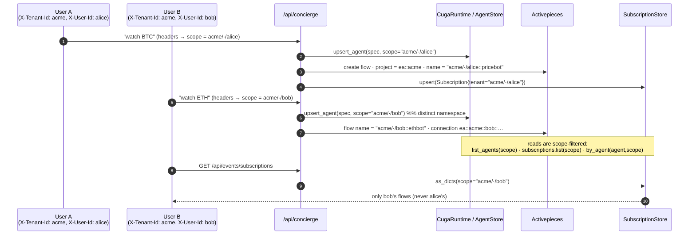

# 04 — Isolation: how `scope` threads end to end

Every request carries a **`Principal = (tenant_id, instance_id, user_id)`** →
[`principal.py`](../../src/cuga/backend/events/principal.py) → a `scope` string. That scope keys
agents, subscriptions, memory threads, and AP flow/connection names, so two tenants (or two users)
never see or touch each other's automations. Decision: [0002](../decisions/0002-tenancy-and-isolation.md).

**Two levels:** **hard at the tenant** (AP project per tenant when the plan allows, else
scope-prefixed flow names in the shared project) + **soft per-user** inside (naming +
scope-filtered queries). `EVENTS_AP_PROJECT_GRAIN=tenant|user|shared`; auto-degrades to shared if
the AP plan caps projects. Unset everything → canonical `DEFAULT_SCOPE = "default/default/local"`.

**Verified by:** `live_isolation_check.py` (alice/bob flows scope-isolated; cross-tenant read → `[]`).
