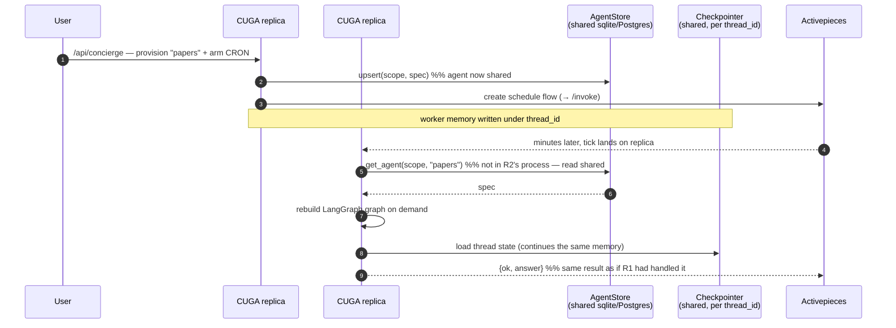

# 05 — Statefulness: one shared AP, many stateless CUGA replicas

An AP callback can land on **any** CUGA replica. So nothing agent-related may live only in one
process: agents go to a shared **`AgentStore`** ([`agent_store.py`](../../src/cuga/backend/events/agent_store.py),
`EVENTS_DB`) and memory to a persistent **checkpointer**
([`runtime.py:205`](../../src/cuga/backend/events/runtime.py) `make_sqlite_checkpointer` →
`AsyncSqliteSaver`; Postgres in prod). Any replica can rebuild any `(scope, agent)` on demand.

**Net:** the CUGA side is **stateless** — scale replicas horizontally behind one AP. With
`EVENTS_DB=:memory:` (dev) it's single-process; point it at a file/Postgres for the fleet.

**Verified by:** `live_statefulness_check.py` — a **fresh** runtime on the same stores sees the
agent *and* continues its memory, while a different scope still sees nothing (isolation holds
across the restart).
