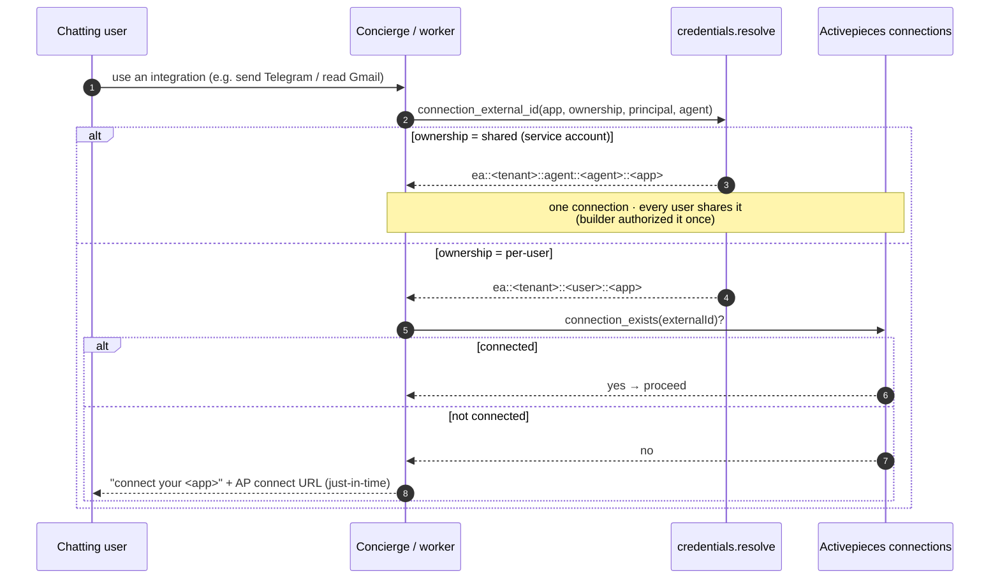

# 06 — Credentials: shared (service account) vs per-user

Each integration on an agent declares a **`credential_ownership`**. The events layer resolves it
to a concrete AP **connection externalId** at runtime.
[`credentials.py`](../../src/cuga/backend/events/credentials.py) `connection_external_id`;
AP CRUD in [`ap_engine.py`](../../src/cuga/backend/events/ap_engine.py). Decision:
[0003](../decisions/0003-credentials-ownership.md). AP owns + refreshes the creds (§10).

**OAuth vs token:** OAuth apps (Gmail/Box) are authorized in AP's connect UI (can't be minted
headlessly); token apps (GitHub PAT, Telegram) can be created via the API
(`ensure_secret_connection`, SECRET_TEXT).

**Verified by:** `live_credentials_check.py` — `shared` → alice & bob resolve to the **same**
connection; `per-user` → **distinct** (`…::alice::…` ≠ `…::bob::…`); an unconnected user →
**needs a connect**. The Studio **Integrations** tab renders this status (diagram 07).
