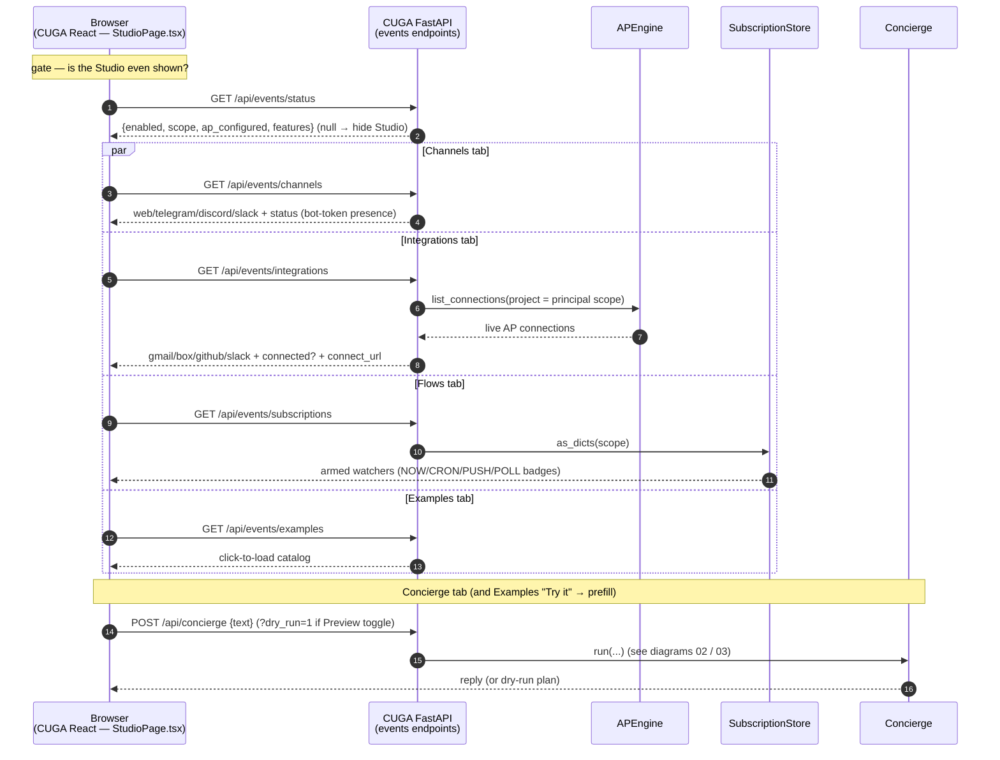

# 07 — Studio UI (dumb): reads + concierge chat

The Studio is added into CUGA's existing React frontend. It is **dumb**: each tab is a
`GET /api/events/*` fetch → render; the Concierge tab POSTs text. No client-side logic — status,
catalog, and decisions all come from the server. Full detail: [../STUDIO_UI.md](../STUDIO_UI.md).
Endpoints in [`app.py`](../../src/cuga/backend/events/app.py); descriptors in
[`connectors.py`](../../src/cuga/backend/events/connectors.py) / [`catalog.py`](../../src/cuga/backend/events/catalog.py).

**Gated + additive:** the Studio nav + route only appear when `GET /api/events/status` is ok
(i.e. `EVENTS_ENABLED=1`). Flag off → vanilla CUGA, byte-for-byte unchanged. All reads are
scope-filtered, so the UI shows only the caller's own channels/integrations/flows.

**Verified by:** the four read endpoints return `200` with correct payloads via FastAPI
TestClient (`.venv-events`); offline core 14/14. The `.tsx` is a **pre-built** bundle — rebuild via
`scripts/frontend_build.sh` (pnpm) after any change and restart the server; the Studio serves at
**http://localhost:8100/studio** (see [../STUDIO_UI.md](../STUDIO_UI.md)).
