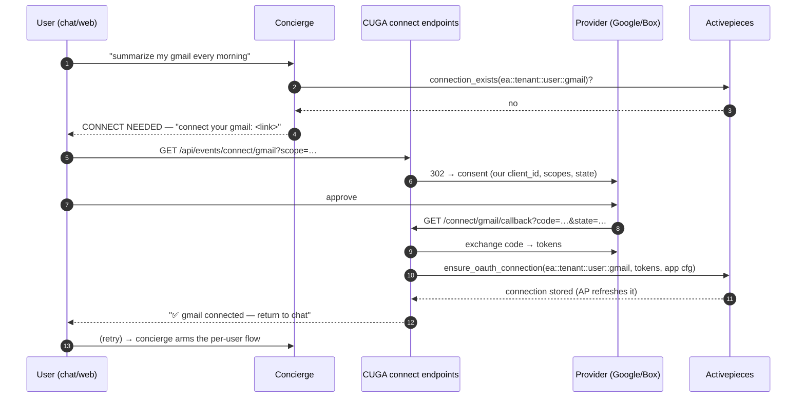
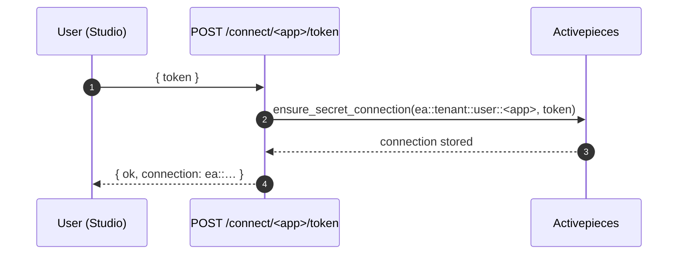

# 08 — Per-user connect: CUGA hosts OAuth, AP holds the token

The **builder enables** an integration on an agent (capability + ownership); the **user logs in**
with their own account at first use. CUGA hosts the connect UX; Activepieces stores + refreshes the
token. Decision: [0006](../decisions/0006-auth-connection-model.md). Code:
[`oauth.py`](../../src/cuga/backend/events/oauth.py), connect endpoints in
[`app.py`](../../src/cuga/backend/events/app.py), `ensure_oauth_connection` /
`ensure_secret_connection` in [`ap_engine.py`](../../src/cuga/backend/events/ap_engine.py).

## OAuth app (gmail/box/slack) — just-in-time

## Token app (github PAT / telegram bot) — no redirect

**Verified:** token path **live against real AP** (real Telegram bot token →
`ea::default::local::telegram`, listed by `GET /api/events/connections`). OAuth path: registry +
authorize-URL + state unit-tested; endpoints degrade cleanly when an OAuth app isn't configured.
Real Gmail/Box consent needs the platform's OAuth app (`EVENTS_OAUTH_<APP>_CLIENT_ID/_SECRET`).

**Grain:** the resulting connection externalId (shared = tenant-level, per-user = user-level) is
what makes a flow tenant-wide or per-user — the flow grain **follows the credential** (diagram 04,
decision 0006).
