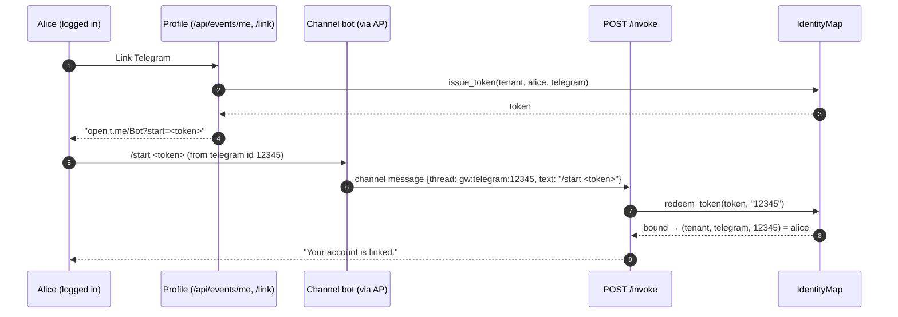
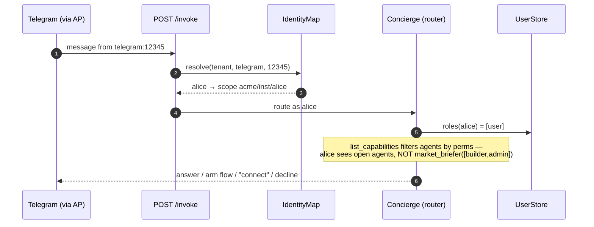

# 09 — Identity, profiles & permissions (making channel isolation real)

The builder enables channels/integrations; the **user profile is the identity anchor**. Linking a
channel from the authenticated profile makes the `native_id → principal` binding trustworthy.
Decision: [0007](../decisions/0007-identity-profiles-permissions.md). Code:
[`users.py`](../../src/cuga/backend/events/users.py), [`identity.py`](../../src/cuga/backend/events/identity.py),
[`perms.py`](../../src/cuga/backend/events/perms.py), `principal.resolve_channel`, endpoints in
[`app.py`](../../src/cuga/backend/events/app.py).

## Channel account-linking (Telegram/Discord)

## Runtime resolution + permissions (per message)

**Verified live (8/8, `live_identity_check.py`):** alice=user vs admin profiles; **alice can't see
the restricted `market_briefer`, admin can**; a Telegram `/start <token>` binds `telegram:12345 →
alice`, and `/me` then shows the linked channel. Offline: `test_events_dimensions` covers
UserStore, IdentityMap + link tokens, perms, agent_scope vs per-user scope, and channel resolve.

**Key split:** agents are **tenant-shared** (`Principal.agent_scope`); threads/subscriptions/
connections are **per-user** (`Principal.scope`). Grain still follows credentials (0006).
