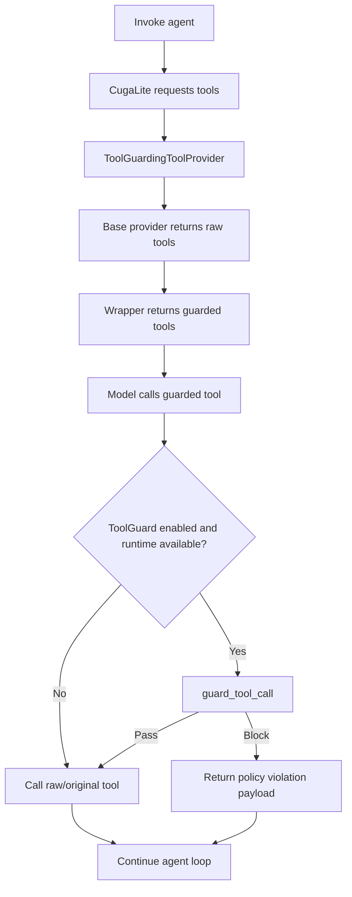

# ToolGuard Integration Plan

## Goal

Integrate ToolGuard into the main SDK/Lite runtime path behind [`CugaAgent.invoke()`](src/cuga/sdk.py) so that:

1. [`ToolGuide`](src/cuga/backend/cuga_graph/policy/models.py) policies continue enriching tool descriptions.
2. If a `ToolGuide` also contains a tool-specific guard in `tool_guards`, that guard is executed at runtime before the actual tool call.
3. The tool call is allowed or blocked based on [`ToolGuardRuntime.guard_tool_call()`](src/cuga/backend/cuga_graph/policy/tool_guard/tool_guard_runtime.py).
4. Enforcement works seamlessly for:
   - direct SDK LangChain tools passed via `CugaAgent(tools=[...])`
   - registry/API tools
   - tracker/runtime tools
   - future custom `ToolProviderInterface` implementations, when wrapped

This replaces the earlier registry-only seam with a provider-level ToolGuard decorator.

---

## Key Revision From Original Plan

The original plan focused on:

- initializing ToolGuard inside [`CombinedToolProvider`](src/cuga/backend/cuga_graph/nodes/cuga_lite/providers/combined.py)
- enforcing guards inside [`create_tool_from_api_dict()`](src/cuga/backend/cuga_graph/nodes/cuga_lite/providers/registry.py)

That is not sufficient for the SDK example in [`test_toolguard_flights.py`](test_toolguard_flights.py), because:

```python
agent = CugaAgent(tools=[book_flight, get_membership])
```

uses [`DirectLangChainToolsProvider`](src/cuga/backend/cuga_graph/nodes/cuga_lite/providers/langchain.py), not `CombinedToolProvider`.

Therefore, the revised plan is to create a dedicated provider wrapper:

```python
ToolGuardingToolProvider(base_provider)
```

Its only job is to wrap another `ToolProviderInterface` with ToolGuard enforcement.

---

## Current State Summary

### What already exists

#### Build-time support

- Tool guide authoring via `PoliciesManager.add_tool_guide()` in [`sdk.py`](src/cuga/sdk.py)
- Tool guard updates via `PoliciesManager.update_tool_guard()` in [`sdk.py`](src/cuga/sdk.py)
- Example generation via `PoliciesManager.generate_tool_guard_examples()` in [`sdk.py`](src/cuga/sdk.py)
- Guard code generation via `PoliciesManager.generate_tool_guard_code()` in [`sdk.py`](src/cuga/sdk.py)

#### Persistence support

- `ToolGuide.tool_guards` exists in [`models.py`](src/cuga/backend/cuga_graph/policy/models.py)
- Tool guard config is serialized to markdown frontmatter in [`filesystem_sync.py`](src/cuga/backend/cuga_graph/policy/filesystem_sync.py)
- Tool guards are reloaded from markdown in [`policy/utils.py`](src/cuga/backend/cuga_graph/policy/utils.py)
- ToolGuard domain files are saved by [`ToolGuardManager`](src/cuga/backend/cuga_graph/policy/tool_guard/manager.py)

#### Runtime scaffolding

- [`ToolGuardRuntime`](src/cuga/backend/cuga_graph/policy/tool_guard/tool_guard_runtime.py) can load guarded policies.
- `ToolGuardRuntime.initialize()` builds the runtime mapping.
- `ToolGuardRuntime.guard_tool_call()` validates a tool call.
- [`ToolGuardInvoker`](src/cuga/backend/cuga_graph/policy/tool_guard/tool_invoker.py) bridges ToolGuard delegate calls into Cuga tools.

### Main gap

Runtime enforcement is not currently connected to every actual tool execution path.

Specifically:

- `create_tool_from_api_dict()` still executes registry tools directly through `call_api()`.
- `DirectLangChainToolsProvider` returns the original LangChain tools directly.
- The SDK `CugaAgent(tools=[...])` path therefore has no ToolGuard runtime enforcement.

---

## Chosen Integration Seam

Use a new provider decorator:

```python
src/cuga/backend/cuga_graph/nodes/cuga_lite/providers/toolguard.py
```

containing:

```python
class ToolGuardingToolProvider(ToolProviderInterface):
    ...
```

The wrapper should sit around any real provider:

```text
CugaAgent
  └── ToolGuardingToolProvider
        └── DirectLangChainToolsProvider / CombinedToolProvider / custom provider
```

For server/registry paths:

```text
DynamicAgentGraph / server graph
  └── ToolGuardingToolProvider
        └── CombinedToolProvider
```

This makes ToolGuard a single seamless runtime enforcement layer.

---

## Responsibilities of `ToolGuardingToolProvider`

`ToolGuardingToolProvider` should be intentionally small and focused.

Its responsibilities:

1. Delegate provider discovery to the wrapped provider:
   - `initialize()`
   - `get_apps()`
   - reset if supported
2. Fetch raw tools from the wrapped provider.
3. Return guarded wrappers from public `get_tools()` / `get_all_tools()`.
4. Preserve raw unguarded tools for `ToolGuardInvoker`.
5. Lazily initialize and cache one `ToolGuardRuntime`.
6. Invalidate/reload that runtime when policies change.
7. Preserve LangChain tool metadata and schemas.

Its non-responsibilities:

- It should not know how registry APIs are called.
- It should not know how direct LangChain tools are stored.
- It should not generate ToolGuard code.
- It should not own policy authoring APIs.

---

## Proposed Wrapper Interface

```python
class ToolGuardingToolProvider(ToolProviderInterface):
    def __init__(
        self,
        base_provider: ToolProviderInterface,
        *,
        policy_storage=None,
        cuga_folder: str = ".cuga",
        enabled: bool = True,
    ):
        self.base_provider = base_provider
        self.policy_storage = policy_storage
        self.cuga_folder = cuga_folder
        self.enabled = enabled
        self._runtime = None
        self._runtime_initialized = False
        self._runtime_lock = asyncio.Lock()
        self._guarded_tools_cache = {}
```

Recommended methods:

```python
async def initialize(self) -> None:
    await self.base_provider.initialize()
```

```python
async def get_apps(self) -> list[AppDefinition]:
    return await self.base_provider.get_apps()
```

```python
async def get_tools(self, app_name: str) -> list[StructuredTool]:
    raw_tools = await self.get_raw_tools(app_name)
    return [self._wrap_tool(tool, app_name) for tool in raw_tools]
```

```python
async def get_all_tools(self) -> list[StructuredTool]:
    apps = await self.get_apps()
    all_tools = []
    for app in apps:
        all_tools.extend(await self.get_tools(app.name))
    return all_tools
```

Raw-tool APIs for ToolGuard internals:

```python
async def get_raw_tools(self, app_name: str) -> list[StructuredTool]:
    return await self.base_provider.get_tools(app_name)
```

```python
async def get_all_raw_tools(self) -> list[StructuredTool]:
    apps = await self.base_provider.get_apps()
    all_tools = []
    for app in apps:
        all_tools.extend(await self.base_provider.get_tools(app.name))
    return all_tools
```

Runtime lifecycle APIs:

```python
def set_policy_storage(self, policy_storage) -> None:
    self.policy_storage = policy_storage
    self.invalidate_toolguard_runtime()
```

```python
def invalidate_toolguard_runtime(self) -> None:
    self._runtime = None
    self._runtime_initialized = False
    self._guarded_tools_cache.clear()
```

---

## Runtime Flow

```text
CugaAgent.invoke()
  -> CugaLite prepares/binds tools
    -> ToolGuardingToolProvider.get_tools(app)
      -> base_provider.get_tools(app)
      -> wrap raw tools
  -> model calls tool
    -> guarded tool wrapper starts
      -> merge/normalize tool call args
      -> ToolGuardRuntime.guard_tool_call(app_name, tool_name, args)
      -> if blocked: return structured policy violation payload
      -> if allowed: call original tool
```



---

## Guarded Tool Wrapper Behavior

For each returned tool, the wrapper should create a guarded `StructuredTool` preserving:

- `name`
- `description`
- `args_schema`
- `response_schemas` metadata, if present
- `_operation_id`, if present
- `_app_name`
- `_param_constraints`, if present
- any important runtime metadata used by CugaLite/tool tracking

Pseudo-code:

```python
async def guarded_tool_func(*args, **kwargs):
    all_kwargs = merge_tool_call_args(args, kwargs, param_names)

    runtime = await self._get_or_create_toolguard_runtime()
    if runtime is not None:
        error = await runtime.guard_tool_call(
            app_name=app_name,
            function_name=tool.name,
            arguments=all_kwargs,
        )
        if error:
            return {
                "error": f"Tool call blocked by policy: {error}",
                "blocked_by_policy": True,
                "policy_violation": True,
                "tool": tool.name,
                "app": app_name,
            }

    return await original_tool.ainvoke(all_kwargs)
```

Important details:

- If ToolGuard is disabled, return raw tools or transparent wrappers.
- If no guard exists for a tool, `guard_tool_call()` returns `None` and the original tool executes.
- If a guard exists and blocks, the original tool must not execute.
- If an applicable guard exists but the guard runtime/domain cannot be loaded, block the call.

---

## Raw Tool Access and Recursion Prevention

This is required.

`ToolGuardInvoker` currently calls:

```python
tools_list = await self.tool_provider.get_all_tools()
```

If that returns guarded tools, guard code that invokes tools may recursively invoke guarded wrappers.

Revise [`ToolGuardInvoker`](src/cuga/backend/cuga_graph/policy/tool_guard/tool_invoker.py) to prefer raw tools:

```python
if hasattr(self.tool_provider, "get_all_raw_tools"):
    tools_list = await self.tool_provider.get_all_raw_tools()
else:
    tools_list = await self.tool_provider.get_all_tools()
```

`ToolGuardingToolProvider.get_all_raw_tools()` should delegate directly to the wrapped provider and must not wrap returned tools.

This is more reliable than only using a `_toolguard_runtime_bootstrapping` flag.

---

## SDK Wiring

In [`CugaAgent.__init__`](src/cuga/sdk.py), first create the real provider:

```python
if tool_provider:
    base_provider = tool_provider
elif tools:
    base_provider = DirectLangChainToolsProvider(tools=tools, app_name="runtime_tools")
else:
    base_provider = DirectLangChainToolsProvider(tools=[], app_name="runtime_tools")
```

Then wrap it:

```python
self.tool_provider = ToolGuardingToolProvider(
    base_provider,
    policy_storage=self._policy_system.storage if self._policy_system else None,
    cuga_folder=self.cuga_folder,
    enabled=settings.policy.enabled,
)
```

Because `_policy_system` may be initialized lazily, update the wrapper from `PoliciesManager._ensure_policy_system()`:

```python
if hasattr(self._agent.tool_provider, "set_policy_storage"):
    self._agent.tool_provider.set_policy_storage(self._agent._policy_system.storage)
```

This ensures SDK direct LangChain tools are covered.

---

## CombinedToolProvider / Registry Wiring

`CombinedToolProvider` should remain focused on combining tracker and registry tools.

Recommended revision:

- Remove ToolGuard-specific constructor params from `CombinedToolProvider`:
  - `enable_toolguard_policies`
  - `toolguard_policy_storage`
- Remove ToolGuard-specific params from `create_tool_from_api_dict()`.
- Let `create_tool_from_api_dict()` produce raw registry-backed tools as before.
- Wrap the `CombinedToolProvider` instance in `ToolGuardingToolProvider` where it is constructed.

For example, in server graph setup:

```python
base_provider = CombinedToolProvider(get_include_by_app=..., agent_id=...)
tool_provider = ToolGuardingToolProvider(
    base_provider,
    policy_storage=policy_system.storage if policy_system else None,
    cuga_folder=settings.policy.cuga_folder,
    enabled=settings.policy.enabled,
)
```

This keeps all enforcement in one place.

---

## App Name Consistency

ToolGuard runtime domain files are app-specific.

For direct SDK tools, `DirectLangChainToolsProvider` currently uses:

```python
app_name="runtime_tools"
```

Therefore, guard code generation and runtime validation must use the same app name.

### Short-term rule

For direct LangChain SDK tools, generate code using:

```python
app_name="runtime_tools"
```

Example:

```python
guard_code = await agent.policies.generate_tool_guard_code(
    policy_id=policy_id,
    target_tool="book_flight",
    app_name="runtime_tools",
)
```

### Better long-term rule

When `app_name` is omitted, `generate_tool_guard_code()` should auto-detect the app containing `target_tool` by inspecting the agent tool provider.

If exactly one app contains that tool, use that app name.

If multiple apps contain the same tool name, require explicit `app_name`.

---

## `cuga_folder` Consistency

`ToolGuardRuntime._load_runtime_domain()` currently loads from:

```python
Path.cwd() / ".cuga" / "toolguard" / "domain"
```

This should be changed.

Both build-time generation and runtime loading should use the same configured `cuga_folder`.

Recommended changes:

- Add `cuga_folder` to `ToolGuardManager`.
- Add `cuga_folder` to `ToolGuardRuntime`.
- Save domain files under:

```text
{cuga_folder}/toolguard/domain/
```

- Load runtime domain files from the same path.

This prevents mismatches when users configure a non-default policy folder.

---

## Fail-Closed Runtime Semantics

If a tool has no applicable guard:

- allow the call

If a tool has an applicable guard and the guard passes:

- allow the call

If a tool has an applicable guard and the guard returns a violation:

- block the call

If a tool has an applicable guard but runtime/domain loading fails:

- block the call

`ToolGuardRuntime.guard_tool_call()` currently returns `None` when `_get_or_create_runtime_for_app()` returns `None`. That is fail-open.

Recommended change:

```python
if runtime is None:
    return (
        f"ToolGuard runtime unavailable for '{function_name}' in app '{app_name}'. "
        "Tool call blocked because an applicable guard policy exists but could not be loaded."
    )
```

This should only happen after confirming there are applicable guards for that tool/app.

---

## Runtime Invalidation

ToolGuard runtime should be invalidated whenever policies or tool definitions change.

At minimum, call:

```python
agent.tool_provider.invalidate_toolguard_runtime()
```

after:

- `update_tool_guard()`
- `add_tool_guide()`
- deleting policies
- clearing policies
- loading policies from folder
- syncing policies from filesystem
- adding tools dynamically via `CugaAgent.add_tool()`

In `PoliciesManager.update_tool_guard()`, after updating storage:

```python
if hasattr(self._agent.tool_provider, "invalidate_toolguard_runtime"):
    self._agent.tool_provider.invalidate_toolguard_runtime()
```

If wrappers are cached by the provider, invalidation should also clear the guarded wrapper cache.

---

## Build-Time Behavior

No major redesign is required for build-time behavior, but several details should be tightened.

Keep:

- `update_tool_guard()` storing tool guard config in policy storage
- filesystem sync in [`filesystem_sync.py`](src/cuga/backend/cuga_graph/policy/filesystem_sync.py)
- markdown reload in [`policy/utils.py`](src/cuga/backend/cuga_graph/policy/utils.py)
- domain file generation in [`ToolGuardManager`](src/cuga/backend/cuga_graph/policy/tool_guard/manager.py)

Revise:

1. `update_tool_guard()` should merge with existing `tool_guards`, not replace the entire mapping.
2. `generate_tool_guard_examples()` and `generate_tool_guard_code()` should validate that the target tool is covered by the policy.
3. `generate_tool_guard_code()` should auto-detect `app_name` when possible.
4. Domain files should be saved under the configured `cuga_folder`.
5. Runtime should be invalidated after tool guard updates.

---

## Required Fixes to Existing Code Changes

### `policy/__init__.py`

Fix the missing comma:

```python
"OutputFormatter",
"CustomPolicy",
```

Currently the strings are accidentally concatenated.

### `models.py`

Consider changing:

```python
tool_guards: Optional[Dict[str, ToolGuard]] = None
```

to:

```python
tool_guards: Dict[str, ToolGuard] = Field(default_factory=dict, ...)
```

Also restore the final newline at EOF.

### `filesystem_sync.py`

Make guard serialization robust to both Pydantic models and raw dicts:

```python
frontmatter["tool_guards"] = {
    tool_name: guard.model_dump() if hasattr(guard, "model_dump") else guard
    for tool_name, guard in policy.tool_guards.items()
}
```

### `sdk.py`

Change `update_tool_guard()` from replace semantics to merge semantics.

Current behavior replaces all existing guards:

```python
tool_guards=tool_guards_obj
```

Recommended behavior:

- start from `existing_policy.tool_guards or {}`
- update only the provided tool entries
- preserve omitted fields for each existing tool guard

Also call runtime invalidation after updates.

### `combined.py`

Remove the ToolGuard-specific params added directly to `CombinedToolProvider`.

Those belong in `ToolGuardingToolProvider`.

### `registry.py`

Remove unused ToolGuard-specific params from `create_tool_from_api_dict()`.

If the provider wrapper is used, `registry.py` should stay raw and simple.

### `tool_guard_runtime.py`

Revise:

- add `cuga_folder`
- fail closed when an applicable guard exists but runtime cannot be loaded
- avoid disconnecting shared policy storage that the runtime does not own
- provide refresh/invalidation support if needed

### `tool_invoker.py`

Revise to use raw tools when available:

```python
if hasattr(self.tool_provider, "get_all_raw_tools"):
    tools_list = await self.tool_provider.get_all_raw_tools()
else:
    tools_list = await self.tool_provider.get_all_tools()
```

---

## Testing Plan

### Unit tests for `ToolGuardingToolProvider`

1. No runtime/policies:
   - raw tool executes normally
2. Runtime exists, no guard for tool:
   - tool executes normally
3. Guard passes:
   - original tool executes
4. Guard blocks:
   - original tool is not called
   - structured policy violation result is returned
5. Runtime load fails while applicable guard exists:
   - original tool is not called
   - policy violation result is returned
6. `get_all_raw_tools()` returns unwrapped tools
7. wrapper preserves name, description, args schema, and metadata

### Direct LangChain integration test

Mirror [`test_toolguard_flights.py`](test_toolguard_flights.py):

1. create `CugaAgent(tools=[book_flight, get_membership])`
2. add tool guide
3. generate examples
4. update guard
5. generate guard code with app name matching direct provider
6. update guard with code
7. invoke violating request
8. verify `book_flight` is blocked by runtime enforcement

### Registry/Combined provider integration test

1. create registry/tracker-backed provider
2. wrap with `ToolGuardingToolProvider`
3. configure guard for one registry tool
4. verify blocked call does not reach `call_api()`

### Invalidation test

1. invoke once with no guard or no code
2. update policy with guard code
3. invoke again
4. verify runtime reloads and enforcement applies

### Recursion/delegate test

1. create guard code that calls a helper tool through ToolGuard delegate
2. verify delegate uses raw tools
3. verify no recursive guard wrapping occurs

---

## Execution Order

1. Add `ToolGuardingToolProvider`.
2. Add guarded wrapper creation for `StructuredTool` / `BaseTool`.
3. Add lazy `ToolGuardRuntime` initialization inside the wrapper.
4. Add raw-tool APIs to the wrapper.
5. Update `ToolGuardInvoker` to use raw tools.
6. Wire `ToolGuardingToolProvider` into `CugaAgent.__init__`.
7. Update `PoliciesManager._ensure_policy_system()` to pass storage into the wrapper.
8. Invalidate runtime after `update_tool_guard()` and other policy mutations.
9. Wrap server-created `CombinedToolProvider` instances.
10. Remove ToolGuard-specific params from `CombinedToolProvider` and `registry.py`.
11. Fix app-name consistency for direct LangChain tools.
12. Pass `cuga_folder` into `ToolGuardManager` and `ToolGuardRuntime`.
13. Change runtime missing-domain behavior to fail closed for applicable guards.
14. Add unit/integration tests.
15. Run formatting and tests.

---

## Recommended Validation Commands

```bash
uv run ruff format src/cuga/backend/cuga_graph/nodes/ src/cuga/backend/cuga_graph/policy/ src/cuga/sdk.py
uv run ruff check src/cuga/backend/cuga_graph/nodes/ src/cuga/backend/cuga_graph/policy/ src/cuga/sdk.py
uv run pytest src/cuga/backend/cuga_graph/nodes/cuga_lite/
uv run pytest src/cuga/backend/cuga_graph/policy/
uv run pytest tests/unit tests/integration
```

---

## Summary

The revised architecture treats ToolGuard as a provider-level decorator rather than as logic embedded into one provider or the registry tool factory.

This gives one seamless enforcement seam for:

- SDK direct LangChain tools
- registry/API tools
- tracker/runtime tools
- future custom tool providers

The core design is:

```text
ToolGuardingToolProvider(base_provider)
```

where the wrapper returns guarded tools to the agent, while preserving raw tools for ToolGuard internals.